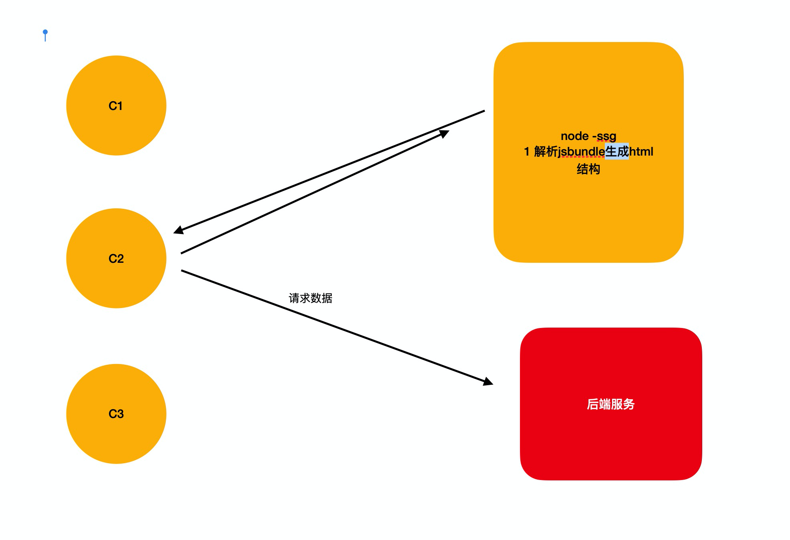

#  Javascript

## 认识Javascript

> 认识JS 
>
> *  html 结构层，页面中都有什么
> * css 样式层，页面中内容的样式
> * JS 行为层，出现一些该有的样子

> JS 的三大核心
>
> * ECMAscript  定义JS 语法，该如何书写
> * BOM Browser Bbject Model   操作浏览器的属性和方法
> * DOM Document Object Model 操作文档流的属性和方法

---

### 书写位置

1. 行内式

> a 标签

语法： 直接写在href属性值的位置，书写 JavaScript：js代码；

<font color=green>禁用超链接的默认跳转 '<a href='javascript:void(0)'></a>'</font>

> 非a标签

需要赋予一个行为属性, 再来是写 js 代码

onclick: 当你点击在这标签上的时候

2. 内嵌式

> 书写在 script 标签内， 会按照从上到下的顺序依次执行

3. 外链式

> 把JS 代码书写在 .js的后缀文件内，通过script标签的src属性引入

外链标签不能在当内嵌式使用，标签里写的代码不会执行

<script src='引入路径' async/defer> </script>
<font color=green> 添加 async, 将引入的标签变成异步,其他同步标签执行完毕以后再执行, 添加 defer, 将引入的标签变成异步标签,是等渲染树完成以后再执行,肯定会在 async 之后执行</font>

### 注释书写

1. 单行注释

> // 注释内容

2. 多行注释

> /* 注释内容 */

### 输出语法

1. alert（‘输出内容’）
2. document.write（‘输出内容’）
3. console.log（‘输出内容’）

> 纯数字不需要包裹，不是纯数字需要引号（单双都可）包裹

### 流程控制

#### 条件分支语句

>  不能重复执行

1. if 语句

> if (条件) { 代码段 }

2. if else 语句

> if (条件) { 代码段 } else { 代码段 }

3. if ... else if 语句

>  if (条件1) { 代码段1 } else if (条件2) { 代码段2 } ...

- 三元表达式

4. 条件 ? 成立时执行 : 不成立时执行

```javascript
var sex = 0
var gender = sex === 0 ? '女' : '男'
//嵌套需要加括号
var age = 25
    age >= 22 ? console.log('可以结婚') : (age >= 18 ? console.log('成年') : console.log('随便'))
```

5. switch分支语句

> switch (要判断的变量) {
>             case 情况1:
>               情况1满足的时候执行的代码
>               break
>             case 情况2:
>               情况2满足的时候执行的代码
>               break
>             default:
>               所有情况都不满足的时候, 执行的代码 可以不写
>           }

#### 循环分支语句

##### for循环

> 循环三要素： 开始、结束、步长

- 语法： for (初始变量; 条件判断; 修改变量) { 代码段 }
  - 条件判断不写,就是死循环, 初始遍历和修改变量的参数不局限于一个
- 死循环: for(;;){ 代码段 }

##### while 

1. while循环

> while (条件) { 代码段 }

<font color=green>while 循环里面要用 continue 的时候, i++ 这种条件需要写在 continue 的前面,continue 跳出哪一层循环  哪一层循环 的 ++ 条件就应该移到对应循环最前面 和 break 的区别是 break打断对应层整个循环</font>

2. do while 循环

> do { 代码段 } while (条件)

- 区别:
          => 当初始变量就在条件以内的时候, 两个循环是一样的
          => 当初始变量在条件以外的时候,
            -> while 循环一次都不执行, 因为先判断后执行
            -> do ... while 循环会执行一次, 因为先执行后判断

##### for in 循环

- 语法: for (key in obj) {代码段} 
- 遍历的是键,遍历数组的时候其实是把下标当成了键
- <font color=green> 遍历的是所有可枚举属性,遍历数组的时候,原型上的直到顶级原型上的可枚举属性都会遍历到,数组中[1,2,,3]这种空会遍历到,不会像for循环 从新赋值给 undefined</font>

```javascript
for 循环会 把 数组中 空值 赋值为  undefined 的解决方法
var arr = [1,,2,,,4]
let arr1 = []
for(let i = 0; i < arr.length ; i++){
    if(!( i in arr)) continue
    arr1[i] = arr[i]
}
```

##### for of 循环

- 语法: 语法: for (key of arr) {代码段}
- 遍历的是值,无法遍历不可迭代对象,(对象不可迭代)
- 可迭代对象包括: `Array，Map，Set，String，TypedArray，arguments`等等

```javascript
var a = ['A', 'B', 'C'];
var s = new Set(['A', 'B', 'C']);
var m = new Map([[1, 'x'], [2, 'y'], [3, 'z']]);
for (var x of a) { // 遍历Array
    console.log(x);
}
for (var x of s) { // 遍历Set
    console.log(x);
}
for (var x of m) { // 遍历Map
    console.log(x[0] + '=' + x[1]);
}
```


##### 循环控制语句

1. break

> 当循环内遇到 break 的时候, 会直接结束整个循环

2. continue

> 当循环内遇到 continue 的时候, 会结束循环的本次, 直接去到下一次

##### 求质数,输出三角形,九九乘法表

1. 什么是质数? 除了 1 和 自己本身 以外, 没有其他约数

```JavaScript
var n = prompt('请输入一个数字 !') - 0
for (var i = 2; i <= n / 2; i++) {
      if (n % i === 0) break
    }
if (i <= n / 2) {
      console.log(n + ' 不是质数')
    } else {
      console.log(n + ' 是质数')
    }
```

2. 思路是先输出一个正方形

```JavaScript
for (var j = 1; j <= 9; j++) {
          for (var i = j; i <= 9; i++) {
            document.write('&nbsp;')
          }
          for (var k = 1; k <= j; k++) {
            document.write('* ')
          }
          document.write('<br>')
    }
```

3. 思路是先输出一个三角形

```javascript
for (var j = 1; j <= 9; j++) {
      for (var i = 1; i <= j; i++) {
        document.write( i + ' * ' + j + ' = ' + i*j )
      }
      document.write('<br>')
    }
```


## 数据类型

### 基本数据类型

1. Number 数值类型

整数

浮点数

科学记数法

> e5 = 10^5

其他进制数字

> 十六进制： 0x 开头
>
> 八进制： 0 开头
>
> 二进制： 0b 开头 ...

2. String 字符串类型

> 一切被引号包裹的内容

3. Boolean 布尔类型

>true  === 1
>
>false === 0

4. 空 类型

Null

> 值是null 给变量赋值为null 才会得到null

Undefined

> 本该有一个值，但是没有，声明了没有赋值

---

### 复杂数据类型

#### 函数(function)

```javascript
      分清两个内容
   + fn
     => 就是一个变量名(函数名) 而已
     => 不会进行函数内部代码的执行
     => 表示函数体本身
     => 例子: var a = fn
       -> 把 fn 存储的函数赋值给
       -> 换个角度, 就是向本身 fn 这个盒子上再加一个标签, 叫做 a
       -> 从此以后, fn 和 a 两个变量操作的都是一个 函数盒子 
	+ fn()
      => () 也是一个运算符, 叫做调用运算
      => 会把函数以内的代码从上到下的执行一遍
      => 把该函数的 返回值 赋值给变量
      => 例子: var b = fn()
        -> 会把 fn 函数先执行一遍
        -> 把 fn 函数的返回值赋值给 变量
```
1. 认识函数

1-1 定义函数

>声明式函数
>
>function 函数名() {}

> <font color=green>匿名函数</font>
>
> var 变量名 = function () {} <font color=green> document.onclick = function(){ } , (function(){})() , ~/+/-/!function(){}</font>

<font color=green>构造函数方式创建, let fn = new Function('a','b','return a + b'), 就是 fn(2,3) 得到5</font>

- 构造函数生成,前面的参数就是函数的参数,最后一个参数是函数的代码块
- 优点: 机动,灵活 | 缺点: 运行速度慢

1-2 调用函数

> 声明式函数, 可以先调用, 可以后调用

> 赋值式函数, 只能后调用, 先调用会报错

2. 函数的参数

2-1 形参

> 就是一个只能在函数内使用的变量,可以定义多个, 中间使用 逗号(,) 分隔
>
> 命名需要符合变量的命名规则和规范

2-2 实参

> 书写在函数调用阶段的小括号内,按照顺序一一给每一个形参赋值的内容

函数参数之间的个数关系
        => 一样多: 按照从左到右的顺序依次给每一个形参
        => 形参多: 前面的一一赋值, 多出来的形参没有实参赋值, 那么你在函数内使用的时候, 就是 undefined
        => 实参多: 前面的一一赋值, 多出来的实参没有对应的形参接收, 那么在函数内不能 **直接使用**, 但是不会报错
          -> 如果需要使用, 那么要利用 arguments

<font color=red> 参数的种类 :</font>

- function fu(必填参数,默认值参数,可选参数,不定量参数)

```javascript
默认值参数:
function fn(a,b = 0 ){ //方法3
    if(b === undefined) b = 0 // 方法1
    b = b ? b : 0 // 方法2
    b = b ?? 0 //  ?? 只有当值 是 null 或 undefined 的时候才会使用??后的值
}
不定量参数:
function fn(a,b,c,...arg){
    console.log(arg) // arg是一个数组 由实参当中第四位往后的数据组成
}    
```

2-3 arguments

存储的是函数调用的时候, 传递的所有实参

<font color=green> arguments.length 是实参长度, 函数名.length 是形参长度, arguments.callee 是当前函数, arguments.callee.caller 是当前函数上下文的函数, 如果在 window中调用,就是null</font>

```javascript
function fn(a,b,c,d){
    arguments.length //3
    fn.length //4
    arguments.callee // fn
    arguments.callee.caller // window ES6 禁用了次方法 但是可以用 fn.caller 同样使用
}
fn(1,2,3)
function res(f){
    f()   // 这个函里面的 arguments.callee.caller 是 res() this 是 window 
}
res(fn)
```

3. 函数的return

 3-1 返回值

通过调用函数, 得到的内容,书写在 return 关键字后面的内容, 就是这个函数的返回值(结果)

 3-2  跳出函数

return 后面行书写的内容是不会执行的 , 但是会执行预解析

- <font color=green>return 同时也可以跳出条件语句,和执行default</font>
- 使用return只能返回一个内容,当要返回多个内容的时候,可以使用对象或者数组(根据返回的数据是否需要说明属于谁的,如果需要就使用对象,不需要就使用数组)

```javascript
function fn(n){
    if(!n) return
    switch(n){
            case:1
            case:2
            case:3
            return n + 10;
            case:4
            return n + 20
    }
    return n + 100 // 这里就相当于执行了上面switch的default
}
```

##### 变量的三个机制(重点)

    变量定义机制
            => 在哪一个作用域下定义的变量
            => 就是哪一个作用域的私有变量
            => 只能在该作用域及其后代作用域内使用
    变量访问机制
        => 当需要获取一个变量的值的时候
        => 首先在自己作用域内查找, 如果自己作用域内有, 那么直接使用, 停止查找
        => 子代和父代有同名变量,只用子代的
        => 如果自己作用域内没有, 那么去到父级作用域查找
        => 以此类推
        => 直到全局作用域都没有, 那么直接报错: xxx is not defined
    变量赋值机制
        => 当需要给一个变量赋值的时候
        => 首先在自己作用域内查找, 如果有, 给自己的赋值, 停止查找
        => 如果没有, 去父级作用域查找, 如果有, 给父级作用域的变量赋值
        => 以此类推
        => 直到全局都没有, 那么把该变量定义为全局变量再赋值 

##### 预解析

-  概念

  > 在所有代码执行之前, 对代码进行通读并解释

  > 在所有 JS 代码中, 值解析两个内容: var 关键字,声明式函数

- 预解析的重名问题

  - 1. 变量名和变量名

       > 第二次的声明没有意义

  - 2. 函数名和函数名

       > 谁写在后面以谁为准

  - 3. 函数名和变量名 

       > 预解析阶段以函数为准

- 预解析的无节操

  -  不管 if 条件是否成立, 代码块内的代码会进行预解析
  - 函数内 return 后面的代码虽然不执行, 但是会进行预解析

##### 回调函数 callback

> 将函数当作参数传入一个函数的形参,并在一个合适的地方调用

- 一种函数的使用方式

- 把函数A 当做实参传递到 函数B 内

- 在函数B 内以形参的方式调用 函数A

  <font color=blue> 把函数A 叫做函数B 的回调函数</font>

- <font color=green>回调函数中的this</font>

  回调函数如果使用 arguments 调用,在执行的回调函数中的this 指向调用当前函数上下文环境中函数的 arguments
  
- <font color=green>回调函数无法传参的解决方法</font>

  1.把回调函数当成对象,将参数定义成回调函数的属性.

  2.直接在回调函数里面使用外部函数的形参

```java
function fn(f,a,b,c){
    arguments[0]() // 这个下标可以不是0,是当前函数的下标 这里的this就是fn的arguments
    f() // 这里的this 指向 window
}
function fun(){
 	console.log(this)   
}
fn(fun,1,2,3) // 打印的结果就是 fn 的 arguments  fun,1,2,3 伪数组
```

**回调地狱**:

- 当使用回调函数的形式封装好了的异步代码的时候,多次使用这的代码进行嵌套操作
- 回调函数嵌套回调函数,嵌套多个就会出现回调地狱 
1. 案例:1. 发送一个请求, 到 first 地址
           2. 在第一个请求结束以后, 发送第二个请求到 second 地址
               3. 在第二个请求结束以后, 发送第三个请求到 third 地址

解决方案: 1.利用ES6 promise语法,在ES6 目录中 2.使用函数式编程

#### 对象数据类型(Obejct)

> => 官方: 无序的数据集合
>  => 私人: 是一个 "盒子", 存储数据的 "盒子"
>             -> 是一个 键值对 的集合
>
> 键也叫key  key:"value",是一对 

<font color=green>key 是唯一的,且 key 必须是字符型, 不是字符型会强制转换成字符</font>

##### 基本操作

- 1. 创建对象

  - 字面量方式

    > var obj = { 键值对, 键值对, 键值对, ... }

  - 内置构造函数方式

    > 创建空对象: var obj = new Object()

- 2. 操作对象

  > 增: 向对象内增加一条数据
  >
  > 删: 删除对象内的某一条数据
  >
  > 改: 修改对象内的某一条数据
  >
  > 查: 获取对象内某一条数据的值
  >
  > 暂时操作符合变量命名规则和规范的 key

  -  点语法
  -  数组关联语法
  
- 3. 对象命名

  - 可以书写符合变量命名规范的名字
  - 可以写带有特殊符号或纯数字的名字,但必须用引号包裹 '  ' 

##### 常用方法

- 1. 点语法

     > 1.  增:
     >
     >       ``` 
     >     => 对象名.键名 = 值
     >       ```
     >
     >   2. 删:
     >
     >          => delete 对象名.键名
     >
     >   3. 改:
     >
     >          => 对象名.键名 = 值
     >          => 因为对象有一个键名不重复的特点
     >          => 当你给同一个键名进行第二次赋值的时候就是修改
     >          => 原先有就是修改, 原先没有就是增加
     >
     >   4. 查:
     >
     >          => 对象名.键名
     >          => 获取对象内指定键名对应的值
     >            -> 如果有这个键名, 那么拿到的就是值
     >            -> 如果没有这个键名, 那么拿到的是 undefined

- 2. 数组关联语法

     > 对象名['键名'] = 值  方法和点语法相同

     - 如果你操作的对象内的 key 是符合变量命名规则和规范的 key
          => 两个语法没有任何区别
- 如果你操作的对象内的 key 是带有一些特殊符号或者纯数字的key
       => 只能使用数组关联语法, 不能使用点语法
   
     - 涉及到变量的时候, 只能使用数组关联语法

##### 遍历对象

- for in 循环 遍历对象

  > for (var 变量 in 对象) { 代码段 }

  - 对象内有多少个成员, 这个代码段执行多少回
  - 随着循环, 这个变量每一次分别是对象内的每一个 key(键名)

##### 时间对象new Date()

> 专门用来记录和保存时间相关信息的数据类型

- 创建语法

  - 内置构造函数创建 `var time = new Date()` 获取当前终端的时间

- 创建指定时间的时间对象

  - `var time = new Date(数字)`

  1. 传递数字

     - 至少传递两个数

       > 当你传递一个数字的时候, 表示的是 毫秒数
       >  => 表示从 格林威治时间 向后顺延的 毫秒数
       >  => 格林威治时间: 1970 年 1 月 1 日 0 点 0 分 0 秒

     - 传递参数(两个数字以后)

       > ​		=> 第一个: 表示年
       > ​          => 第二个: 表示月
       > ​            -> 0 表示 1 月, 11 表示 12 月
       > ​          => 第三个: 表示日
       > ​          => 第四个: 表示时
       > ​          => 第五个: 表示分
       > ​          => 第六个: 表示秒
       > ​          => 第七个: 表示毫秒
       > ​          => 注意: 所有参数位置都可以自动进位

  2. 传递字符串

     > var time = new Date('2021-8-26 13:35:22')

     - 按照通用日期格式书写

       > => '2021-8-26 16:34:25'
       > => '2021/8/26 16:34:25'

     <font color=blue>注意: 中间有空格,月份1表示1月...</font>

- 时间对象的常用方法

  > 通用语法: 时间对象.xxx()

  - ​				获取                  设置
    ​          getFullYear()         setFullYear()
    ​          getMonth()            setMonth()
    ​          getDate()               setDate()
    ​          getHours()             setHours()
    ​          getMinutes()          setMinutes()
    ​          getSeconds()          setSeconds()
    ​          getMilliseconds()     setMilliseconds()
    ​          getDay()                      -
    ​          getTime()             setTime()

  

#### 数组数据类型(Array)

> 是一个 JS 中的数据类型, 是一个复杂数据类型
>         + 官方: 有序的数据集合
>                 + 私人: 就是一个 "盒子", 一个承载数据的 "盒子"

##### 基本操作

- 1. 创建数组

  - 字面量方式创建

    > `var arr = [ 数据1, 数据2, 数据3, ... ]`

  - 内置构造函数创建

    > `var arr = new Array(数据1, 数据2, 数据3, ...)`
    >
    > 只有一个数字的时候是长度

- 2. length

  - 数组名.length = 数字

  - 情况: 

    > -> 你设置的 length 和数组本身的 length 一样
    >  -> 你设置的 length 大于数组本身的 length, 多出来的位置使用 empty 补齐
    >  -> 你设置的 length 小于数组本身的 length, 会从后面开始删除数据

- 3. 索引

  - 数组名[索引]

  - 获取:

    > -> 如果数组有该索引位置, 那么就是该索引位置的数据
    > -> 如果数组没有该索引位置, 那么就是 undefined

  - 情况:

    > -> 你设置的索引是数组内的索引, 那么就是修改该索引位置的数据
    > -> 你设置的索引刚好和 length 一样, 那么就是在数组后面追加
    > -> 你设置的索引大于 length, 那么就是在指定索引位置设置数据, 中间的使用 empty 补齐
    >
    >               + 最后一位的索引永远是 length-1

##### 常用方法

> 通用语法: 数组名.方法()

- 1. push()

  - 作用: 在数组的最后面追加一个或一组数据,用逗号隔开
  - 返回值: 追加数据以后数组最新的长度

- 2. pop()

  - 作用: 删除数组的最后一个数据
  - 返回值: 被删除的数据

- 3. unshift(数据)

  - 作用: 在数组的最前面插入一个或一组数据,用逗号隔开
  - 返回值: 插入数据以后数据的最新长度  也就是length

- 4. shift()

  - 作用: 在数组的最前面删除一个数据
  - 返回值: 被删除的数据

- 5. reverse()

  - 作用: 反转数组
  - 返回值: 反转后的数组

- 6. splice(开始索引,个数,插入的数据1,2,3,,,,,)

  - 作用: 删除指定数据并插入新数据

    > 从哪一个开始删除,就从哪个开始插入

  - 返回值: 删除的数据组成的新数组,没有删除则是一个空的新数组

- 7. sort()

  - 作用: 对数组进行排序  只看数据第一位排序大小
  - `sort(function (a, b) { return a - b })` 按照正序排列
  - `sort(function (a, b) { return b - a })` 按照倒序排列
  - 返回值:  排序好的数组
  
- 7.1 fill(val,起始位置,结束位置)

  - 作用: 用 val 替换数组中指定数据, 起始位置和结束位置不写,默认替换全部
  - 如果val 是复杂数据类型, 则传入的是引用地址, 指向相同位置

<font color=red>============以上七个方法都会改变原始数组 =============</font>

<font color=red>=============以下方法都不会改变原始数组 ==============</font>

- 8. concat(数据,数组,数据,,,)

  - 作用: 把括号内参数从后组装到数组内,如果是数组,则拆开后组装
  - 返回值: 组装好的新数组

- 9. join('连接符')

  - 作用: 把数组使用连接符,链接成为字符串

  - 返回值: 链接好的字符串

    > 空连接符和空格连接符效果不同

    > 不传递参数,默认使用逗号链接,分隔所有字符

- 10. slice(开始索引,结束索引)

  - 作用: 截取数组内容 
  - 特点: 包前不包后, 可以书写负整数,表示倒数第几个,也就是 length + 负整数
  - 返回值: 截取的数据组成的新数组,没有截取就是空数组

- 11. indexOf(数据,开始索引)

  - 作用: 从开始索引位置从前向后查找该数据第一次出现的索引位置

  - 返回值: 

    > 如果查找到了该数据,就是该数据第一次出现的索引位置

    > 如果没有该数据,就是 -1

- 12. lastIndexOf(数据,开始索引)

  - 作用: 从开始索引位置从后向前查找该数据第一次出现的索引位置
  - 返回值: 同indexOf

<font color=red>=================以下方法是数组的遍历 =================</font>

> 语法: 数组.方法(function (item, index, ary) {})
>        -> item: 随着循环分别是数组内的每一个数据
>        -> index: 随着循环分别是数组内的每个索引
>        -> ary: 每一次都是原始数组
>
> <font color=green> 数组方法中, 带开始,结束位置参数的, 填入的只要是非数字,就会默认转换成0</font>

- 13. forEach()

  - 作用: 用来循环遍历数组,取代for循环
  - 返回值: undefined

- 14. map()

  - 作用: 映射数组

  - 返回值: 一个和原始数组长度一致的新数组

    > 返回新数组的数据是对原始数组中每一个数据加工后的结果

    > 以return 的形式 书写加工条件

- 15. filter()

  - 作用: 过滤数组

  - 返回值: 所有满足条件的数据组成的新数组

    > 以return 的形式书写过滤条件

- 16. every()

  - 作用: 判断数组中的每一个是否都满足条件

  - 返回值: 布尔值

    > 所有项都满足 就是ture 否则就是false

    > 以return 的形式书写判断条件

- 17. some()

  - 作用: 判断数组中是否有某一个满足条件

  - 返回值: 布尔值

    > 有任何一个满足条件,就是ture  否则就是false

    > 以return 的形式书写判断条件

- 18. find()

  - 作用: 查找数组中第一个满足条件的项
  - 返回值: 找到的
  
- 19. **reduce(callback,初始值)**

  - 作用: 叠加数组
  - 用 return 的形式书写返回值 返回值其实就是给到下一次的prev
  - 有两个参数,第一个参数是回调函数,第二个参数是初始值,可以不写
  - callback = funciton(prev,cur,index,arr)
    - arr 表示原数组
    - prev 表示上一次调用回调时的返回值,或者初始值
    - cur 表示当前正在处理的数组元素
    - index 表示当前正在处理的数组元素的索引,若写了初始值,nidex为0,若没有写初始值,index为1,prev是下边为0的元素
    - 常用的就是 prev 和 cur 

```javascript
// reduce 常用方法
//!数组求和,求乘积/计算数组中每个元素出现的次数/数组去重/数组扁平化
var arr = [1,2,3,4,2,3,1]
var arrw = [1,2[1,67[2]],3,4]
// 求和
arr.reduce(function(prev,cur){return prev + cur})
// 计算数组中每一个元素出现的次数
arr.reduce(function(prev,cur){
    if(cur in prev){
        prev[cur]++
    }else{
        prev[cur] = 1
	}
    return prev
},{ })
// 数组去重
arr.reduce(function(prev,cur,index,arr){
    if(!pre.includes(cur)){
            return pre.concat(cur)
        }else{
            return pre
        }
},[])
//数组扁平化
const newArr = (arr) => {
    return arr.reduce((pre,cur){
      return pre.concat(Array.isArray(cur) ? newArr(cur) : cur) 
    },[])
}
```

- 20. Array.isArray(数组)

  - 判断传入的参数是否是数组, 返回布尔值

- 21. Array.from(伪数组,cb)

  - 将伪数组(有Iterator 迭代器就可以 比如字符串,set,map结构)转换成为数组,回调函数可以不写
  - cb(item,index) 相当于 map 只有两个参数, 会将伪数组当成数组执行, return 书写返回条件, 返回新数组

#####  数组塌陷

- 当你删除数组数据的时候, 如果这个位置后还有数据, 那么后面数据的索引值会塌陷

  > 例子:
  >           => 原始数组: [ 10, 20, 30, 40 ]
  >                         0   1   2   3
  >           => 删除数据: [ 10, 30, 40 ]
  >                         0   1   2

  > 当你在循环内删除数组数据的时候, 会受到一些影响
  >           => 并且删除后还需要继续使用循环
  >           => 就会因为塌陷出现一些问题

  - 当想删除重复数据的时候,如果这两个数据挨着,有可能只删除一个数

- 解决方法

  - 1. 倒着循环数组
  - 2. i--, 只要执行了 splcie 就是执行一遍 i--

##### 数组空位

- 数组的空位 [1,2, ,3, ,,]这种就是空位,加不加空格都一样

- 空位不是 undefined 但是 用for循环遍历的时候会解析成 undefined, 不同的方法解析结果不用

- 跳过空位的情况:
  - forEach(),filter(),reduce(),every(),some(),for in 循环,
  - map() 会跳过空位,但是会保留这个值,也就是会保留这个空位
  - `join()`和`toString()`会将空位视为`undefined`，而`undefined`和`null`会被处理成空字符串。
  
  ```javascript
  ['a',,undefined,null,'b'].join('#') // 'a###b'
  [,'a',undefined,null,'b'].toString() // ',a,,b'
  ```
  
- 不跳过空位的情况:(会将空位处理成undefined)
  
  - for循环,join(),toString(),Array.from(), ...扩展运算符,fill(),for of 循环,entries(),keys(),values(),find(),findIndex()

```javascript
Array.from([1,'a', , 'c']) // [1,'a',undefined, 'c']
//for 循环的空位处理办法
arr = [1, ,2]
res = [ ] 
for(let i = 0; i < arr.length; i++){
    if(!(i in arr)) continue
    res[i] = arr[i]
}    
```

#### 字符串(String)

> 在 JS 中还是包装数据类型
>           => 存储的时候, 按照 基本数据类型 的规则存储
>           => 当你使用的时候, 瞬间转换成 复杂数据类型 的样子让你使用
>           => 使用完毕以后, 瞬间转换成 基本数据类型 的样子存储

- 字符集

> ASCII
> + 最早的电脑有 128 个字符
>   => 每一个字符对应一个独立编码
>   => 为了电脑的统一和使用
>   => 做了一个对照表, 叫做字符集
>
> + 随着电脑的发展
>   => 各个国家讨论, 在 ASCII 的基础上向后延伸
>   => 也发展了一个对照表, 就是一个新的字符集
>   => 叫做万国码(统一码/unicode编码)
>
> + 中国有一个国标的通用编码
>   => GBK 编码
>   => 前 128 个也是 ASCII 编码
>   => 后面的就都是中文汉字
>
> + 在 web 网络的发展过程中
>   => 全世界统一了一个编码格式
>   => 8 位的 unicode 编码
>   => 名字叫做 UTF-8

##### 基本操作

- 1. 创建方式

  > 字面量方式创建

   `var str = 'hello world'`

  > 内置构造函数创建

   `var str = new String('hello world')`

- 2. length 属性

  > 字符串.length, 只读, 空白字符也算一个字符

- 3. 索引 属性

  > 字符串[索引] ,如果字符串没有该索引位置, 那么就是 undefined

- 4. 遍历

  > 可以使用循环进行遍历

##### 常用方法

> 语法都是字符串.方法

> 都不会改变原始字符串,都是以返回值的形式给出结果

- 1. chasrAt(索引)

  > 返回值: 该索引位置的字符, 如果没有该索引位置, 那么是 空字符串('')

- 2. charCodeAt(索引)

  > 返回值: 该索引位置的字符的编码

- 3. toUpperCase()

  > 返回值:把字符串中所有字母转换成大写

- 4. toLowerCase()

  > 返回值:把字符串中所有字母转化成小写

- 5. substr(开始索引,个数)

  > 返回值: 截取出来的部分字符串

- 6. substring(开始索引,结束索引)

  > 包前不包后 

  > 返回值: 截取出来的部分字符串

- 7. slice(开始索引,结束索引)

  > 和substring一样,区别是可以是负数  负数的位置也就是 .length-索引

- 8. replace('换下片段','换上片段')

  > 返回值: 替换好的字符串   只能替换出现的第一个片段

- 9. split('分隔符')

  > 使用分隔符分隔字符串 

  > 返回值:分隔开来的新数组 数组内是按照分隔符分开的每一段字符串

- 10.indexOf(字符串片段,开始索引)

  > 从前向后检查该字符串出现的第一次的索引位置

  > 返回值: 有该片段,则是首字母位置的索引
  >
  >    	  	没有该片段则是-1

  + lastIndexOf() 是从后向前

- 11. concat(字符串,...,...,)

  > 返回值:拼接好的字符串

- 12. trim()

  > 返回值: 去除首尾空白以后的字符串

- 13. trimStart()/trimLeft()

  > 返回值: 去除前面空白以后的字符串

- 14. trimEnd/trimRight()

  > 返回值: 去除后面空白以后的字符串

##### 格式

- 1. 一般格式

  - 普通字符串: 'asdasdasduv#$%^&*收电费把计算'
  - 纯数字字符串: '1234567890'
  - html 格式字符串: '<p>hello world</p>'
  - 查询字符串(queryString): 'key=value&key2=value2'

- 2. josn格式字符串

  -  定义

    > 字符串内必须是长得像 对象 或者 数组 的内容

    > 字符串内所有 key 和 vlaue 必须使用 双引号 包裹, 纯数字和布尔除外

    > 在 key 和 value 以外的位置, 除了 {} [] : , 以外不允许别的符号

    > 集合内数据的最后一项后面不允许书写多余的逗号

  - 作用

    > 用于前后端交互的时候使用

  - 转换方法

    > 把 js 的数据格式转换成 json 格式字符串
    >           => 语法: `JSON.stringify`(js 的数据结构)
    >           => 返回值: json 格式字符串

    > 把 json 格式转化昵称 js 的数据类型
    >           => 语法: `JSON.parse`(json 格式字符串)
    >           => 返回值: js 的数据结构

- 3. 模板字符串

     > 一种定义字符串的方式

  - 使用 反引号(``) 定义字符串 功能和效果与单双引号一样

  - 特点

    > 可以直接换行书写

    > 可以直接在字符串内解析变量
    >             => 当你需要解析变量的时候, 书写 ${ 变量 }

#### 正则表达式(Regular Expression)

> 是一个专门用来检测 字符串 是否符合规则的表达式

##### 创建方法

- 1. 字面量方式创建

     - 语法: `var reg = /abcd/` 意义:检测的字符串内必须包含一个 'abcd' 字符串片段

  2. 内置构造函数方式创建

     - 语法: `var reg = new RegExp('abcd')`

       > 可以省略new 括号里可传两个参数('abcd', 'gi') i或g写在后面

- 两种表达式的区别

  - 字面量方式不接受字符串拼接

    > 内置构造函数: 可以拼接字符串, 因为第一个参数就是以字符串的形式书写正则内容

  什么是拼接字符串?

  ```javascript
  var a = [ 'HH', 'NN', 'MM' ]
  a.join('|')  =>  HH|MM|NN
  var reg2 = new RegExp('(' + a.join('|') + ')')
   console.log(reg2)
  ```

  

  - 书写基本元字符
    - 字面量方式 直接书写 \s\d\w
    - 内置构造函数 需要书写 \\\s\\\d\\\w

  ```html
  字符串
  + 有一个特殊符号叫做 转义符号(\)
  + 可以吧有意义的转化成没有意义的文本, 把没有意义的文本转换成有意义的符号
  => 例子: \n
  => n 本身是没有意义的文本
  => \n 表示换行的意思
  + 当你在字符串内书写 \s
  => 会把没有意义的 s 文本转换成有意义的符号
  => 但是字符串内没有 \s 这个符号
  => 其实就是还是 s 文本
  正则
  + 第一个参数一字符串的形式书写正则内的内容
  + 你书写的是 '\s\d\w', 因为在字符串内确实没有 \s\d\w 这三个符号, 所以其实就是 sdw 文本
  + 当你书写 '\\s' 的时候
  => 第一个 \ 是转义符号, 把第二个 \ 给转换了
  => 转换成了一个没有意义的 \ 文本
  + 你给出的 '\\s\\d\\w' 其实才是一段合法的元字符文本
  ```

##### 常用方法

- 1. 匹配方法

     - 语法: 正则.test(字符串)
     - 返回值: 布尔值, 有就是true 没有就是false
   - 用一个正则表达式不要连用 test
  
   ```javascript
     let reg = /a/g // 不加g 没影响
   console.log(reg.test('fasdg')) // true
     console.log(reg.test('fsasdg')) // 当a在前两位的时候是 false 第三位开始才是 ture
   ```
  
2. 捕获方法
  
   > 从一段完整字符串中获取出一部分满足正则表达式的内容片段
  
   - 语法: 正则.exec(字符串)
   
   - 返回值:
   
     如果原始字符串中没有符合的片段,就是null
   
     如果原始字符串中有符合的片段,那么就是一个数组
   
     2-1 没有() 也没有全局标识g
   
     ​	[0] 就是捕获出来的第一个片段,有且仅有第一个满足规则的片段
   
     2-2 有全局标识g
   
     ​	[0] 就是捕获出来的第一个片段
   
     ​	第二次捕获的时候会从第一次捕获结束的位置开始检索
   
       ​	每一次捕获返回的[0]都是新的片段,直到捕获不到内容为止,返回null后再下一次捕获又从字符串开始位置检索
   
       2-3 有() 
   
       ​	在返回值数组中,从[1]开始,依次是每一个()的单独内容
   
       
     
     - 匹配但不捕获
     
       - 语法: (?:)  写在冒号后面
     
         > 这种就是需要用到括号,但是还不想捕获括号里面的内容的时候要用
         >
         > 比如(?:\d|x) 这种需要或的情况的时候

##### 标识符

> 用来修饰整个正则表达式的

- 标识符位置

  - 字面量方式: var reg = /abcd/(写在这里,顺序任意)
  - 内置构造函数方式: var reg = new RegExp('abcd', 'gi') 第二个参数

- 标识符种类

  1. i  忽略大小写
  2. g  全局匹配,多用于重复执行
  3. m  换行匹配 => 如果匹配字符串遇到换行,那么重新开始计算行首

  `例如/^\d/gm    替换的话如果有多行,是替换每一行的第一个数字`

- 

##### 元字符

> 填写在正则表达式内的规则符号

- 基本元字符
  1. \d 表示 一位 数字
  2. \D 表示 一位 非数字
  3. \s 表示 一位 空白内容(空格,缩进,换行...)
  4. \S 表示 一位 非空白内容
  5. \w 表示 一位 数字(0-9)字母(a-zA-Z)下划线(_)都行
  6. \W 表示 一位 非数字字母下划线
  7. .  表示 一位 非换行以外的任意内容
  8. \  转义符,把有意义的符号转化成没有意义的文本,把没有意义的文本转换成有意义的符号

- 重复元字符

  \n 表示重复出现第n个小括号的内容,必须和之前出现的一样

  \1 表示在 \1 位置重复出现一次第一个小阔内的内容内容而且必须和 第一个小括号出现的内容一模一样

  \1* 表示重复第一个括号里面的内容至少重复1次  \1+ 表示至少重复两个  使用\1 这种的方法 前面的东西必须放在群组里 ([a-z])\1*

- ##### 边界符

  - 1. ^  表示字符串开头
    2. $  表示字符串结尾

    <font color=blue>注意: 当 开头和结尾 一起使用的时候, 表示从开头到结尾</font>

    ```javascript
    var emailX = /^[^_]\w{4,11}@(qq|163|sina)\.(com|cn)$/
    =>邮箱验证,开头到结尾有5-12个\w组成
    ```

- **限定符**

  > 用来修饰出现多少次的符号  注意: 一个限定符只能修饰前面一个符号

  1. \*  表示0~多次(包含0)

  2. \+  表示1~多次

  3. ?  表示0~1次(没有或只有1次)

  4. {n}  表示n次

     => {0,} 等价于 * , {1,} 等价于 +

     <font color=red>注意点：想要使用这个，正则表达式中必须含义结尾，否则大于n的次数也是可以测试通过的，只不过捕获的时候还是捕获n个</font>

     <font color=green>{0} 匹配空字符,不论前面有什么,都匹配的是空, 如'abc' 匹配到 4个空字符串</font>

  5. {n,m} 表示n~m次

     => {0,1} 等价于 ?

- **特殊符号**

  1. () 组

     含义1: 表示一个整体 

     含义2: 表示单独捕获

  2. |     | |中间如果没写,查的是空字符, 两侧任意一边没有写,查的是空字符

     表示左边或者右边的任意一个都行

     ```javascript
     let reg = /^18|29$/ 匹配的是：以18开头或者以29结尾的都可以
     let reg = /^(18|29)$/ 匹配的是：18或者29中的一个 只能出现一次
     ```

  3. []

     表示 [] 内的任意一个都行 , 相同字符无意义 如[aba] 只匹配a或b 

     . 在中括号内是字符点, 不再是通配符 中括号内再匹配 [] () {} 时需要 \ 转义

  4. [^]

     表示 [^] 内的任意一个都不行

     <font color=blue>以上两个中括号都是只占一个字符位置,括号内可以写多个字符</font>

  5. -

     表示从一个字符到一个字符, 必须要 ASCII 编码连着的 和 [] 或者 [^] 连用
  
     - [0-9] 等价于 \d
       [0-9a-zA-Z_] 等价于 \w
       [ ^0-9] 等价于 \D
       [^0-9a-zA-Z_] 等价于 \W

##### 断言和重复筛选

- 重复筛选

  - ()\1+  ()\1* 表示括号里面的内容需要重复最大的次数 贪婪匹配  1+ 至少有两次   1* 至少有一次

  ```javascript
  let str = 'asdfsdfsadfsafdsagwhhtrhgdvg'
  function strTimes(str){
      return str.split('').sort().join('').replace(/(a-zA-Z)\1*/g,function(item){
          return item[0] + '{' + item.length + '}'
  	})
  }
  ```

- 断言

  > 断言语句不占位,且不会出现在返回值当中, 只是判定前后是否存在

  1. 后置肯定断言
     - 语法: ?= 表示前面的内容后面必须包含后面这个内容 存在则匹配前面的内容
  2. 后置否定断言  语法: ?!
  3. 前置肯定断言  语法: ?<= 判定后面的内容前面是否存在这个内容  存在则匹配后面的内容
  4. 前置否定断言  语法: ?<!

  ```javascript
  console.log("《西游记》,《三国演义》,《水浒》,《红楼梦》".match(/(?<=《).*?(?=》)/g)) 返回不包含《　》组成的数组
  ```

##### 两大特性

- 1. 懒惰

     每当使用正则去捕获字符串的时候,每次都是从开始位置检索,一般只返回一个值

     - 解决: 使用全局标识符g

  2. 贪婪

     在使用了区间写法的时候,在捕获的时候会尽可能多的去捕获内容,也就是捕获满足条件的最长组合,这种就是默认的贪婪匹配

     - 解决: 非贪婪匹配(捕获满足条件最小长度) 在限定符后面加上?

       .\*?   .+?   这两个前后都必须有条件 如 a.*?b 有起始和结束
       
       ??   =====  {0,2}
       
       {n,}?   {n,m}?

##### 和字符串的组合方法

- 1. replace()
     - 语法: 字符串.replace(正则表达式,换上字符),字符串.replace(正则表达式,函数)
     - 这里的函数(参数1,参数2,...,参数3,参数4) 参数1 是每次找到的内容,参数二是使用()后筛选后的内容,倒数第二个参数是下标,最后一个参数是原字符串,  函数可以简写'$1****$2'$1 就是群组1 表示原本第几个() 里面的内容是啥 返回的就是啥
   - 返回值: 不填写全局g替换一个,填写g有多少替换多少
  

用此方法替换关键字:

  ```javascript
  var str = 'fXXfdHHsMMgNNfHHdNNhHHgfsMMdsNNgsdb'
  var a = [ 'HH', 'NN', 'MM', 'XX' ]
  var r3 = str.replace(new RegExp('(' + a.join('|') + ')', 'g'), '**')
  console.log(r3)
var str="2[2[2[ab]2[cd]]3[c]]"  // 拆开成对应次数
  function pares(str){
 if(!/(\d+)\[(a-zA-Z)+\]/g.test(str)) return str
  str = str.replace(/(\d+)\[(a-zA-Z)+\]/g , function(item,$1,$2){
 return $2.repeat($1)
  })
 return pares(str)
  }
  ```

2. search()

- 语法: 字符串.search(正则表达式)
  
- 返回值: 有满足条件的片段,就是索引位置
  
  没有满足条件的片段,就是-1
  
3. match()

- 语法: 字符串.match(正则表达式)
  
- 返回值: 没有全局g,和exec方法一样
  
  有全局标识g,返回一个数组,捕获全部满足条件的片段组成的数组
  
  ```javascript
  // match 使用组匹配
  console.log("1234567890".match(/^(\d{3})(\d{4})(\d{3})$/).slice(1)) 
  
  ```
  
  4. split()
  
  - 语法: 字符串.split(正则表达式)
  
  - 返回值: 分割剩下的子串组成的数组
  
    <font color=blue> 这里正则可以不用写g,因为split方法自己会匹配全局,这个和字符串本身方法的区别是可以写或</font>

#### 数字的常用方法 (Math)

> 通用语法: Math.xxx()

- 1. Math.random()

     - 返回值: 是一个[ 0 , 1) 之间的随机小数

  2. Math.round(数字)

     - 返回值: 对该数字进行四舍五入取整

     ```javascript
     对负数进行操作的时候
     小数部分: 没有负数, 在数轴上, 该数字和负方向最近的整数的 距离
      整数部分: 数轴负方向上最近的整数
      数字整体: 整数部分 + 小数部分 得到的
      数字    整数部分     小数部分
      -10.6    -11          0.4     舍     -11
      -10.5    -11          0.5     入     -10
      -10.4    -11          0.6     入     -10
     ```

  3. Math.ceil(数字)

     - 返回值: 对数字进行向上取整

  4. Math.floor(数字)

     - 返回值: 对数字进行向下取整

  5. Math.abs(数字)

     - 返回值: 对数字进行去绝对值

  6. Math.sqrt(数字)

     - 返回值: 该数字的算术平方根

  7. Math.pow(底数,指数)

     - 返回值: 取幂运算的结果

  8. Math.max(数字1,数字2,,,,)

     - 返回值: 该组数字中最大数

  9. Math.min(数字1,数字2,,,)

     - 返回值: 该组数字中最下数

  10. Math.PI 

      - 返回值: 一个近似π的值

- 进制转换

  1. 十进制转换成其他进制
     - 语法: 数字.toString(你要转换的进制数)
     - 返回值: 以字符串的形式给你转换好的进制数字
  2. 其他进制转换成十进制
     - 语法: parseInt(数字, 你把数字当做几进制)
     - 返回值: 一个转换好的十进制数字

- 保留小数

  - 语法: toFixed(你要保留几位小数)

  - 返回值: 以字符串的形式给你返回结果

    <font color=red> 注意: 当小数位不够的时候, 会用 0 补齐</font> 

---

### 数据类型检测

> typeof 连用的时候必然得到的是字符串

``` javascript
//第一种方式
var n1 = 100;
console.log（typeof n1）； number
//第二种方式
var n2 = 'abc';
console.log(typeof(n2));  string
console.log(typeof(n2) n1)  得到string
```

> 判断一个变量是不是数字

可以使用 `isNaN` 这个方法来判断一个变量是不是数字

```javascript
// 如果变量是一个数字
var n1 = 100;
console.log(isNaN(n1)); //=> false
// 如果变量不是一个数字
var s1 = 'Jack'
console.log(isNaN(s1)); //=> true
```

### 数据类型判断

- 1. typeof 方法 (在上面)
     - 准确判断基本数据类型,对于复杂数据类型不准确
     - 底层封装使用的 便是 Object.prototype.toString.call 方法
  2.  constructor 方法
     - 利用了原型的属性,对象的访问机制
     - 语法: ***.constructor
     - 返回值: 构造这个实例对象的构造函数
  3.  instanceof 方法  // `下面对象方法中 已重构`
     - 判断前面的是否是后面的实例化对象,判断不了基本数据类型
     - 语法: 对象 instanceof 构造函数
     - 返回值: true 是后面的构造的 false 不是后面的构造的
     - 前面的对象必须是后面的构造函数的实例化对象
  4. Object.prototype.toString.call() 方法
     - 利用顶级原型对象上的toString方法,用call(apply)调用
     - 语法: Object.prototype.toString.call(***) 
     - 返回值: [object 类型]
     - **每一个简单数据类型都有一个自己的 toString方法, 如使用 XX.\_\_proto\_\_.\_\_proto\_\_.toString() 方法 则返回的是[object Object], 因为是 XX.\_\_proto\_\_.\_\_proto\_\_ 调用的 toString() , 原定对象肯定是对象,  所以需要使用 call语法 =======> Object.prototype.toString.call(\***)  ==== \*\*\*.toString()  只是用的是 顶级原型上的 toString 方法而已**  顶级原型上的 toString 方法 实际上是返回的构造器

```javascript
Object.prototype.toString.call(123)---------------> [object Number]
Object.prototype.toString.call('')----------------> [object String]
Object.prototype.toString.call(ture)--------------> [object Boolean]
Object.prototype.toString.call(undefined)---------> [object Undefined]
Object.prototype.toString.call(null)--------------> [object Null]
Object.prototype.toString.call(new Date())--------> [object Date]
Object.prototype.toString.call({})----------------> [object Object]
Object.prototype.toString.call([])----------------> [object Array]
Object.prototype.toString.call(function(){})------> [object Function]
```

### 数据类型转换

1. 其他数据类型转换成数值

- Number（你要转换的数据）

> ​     -> 把你要转换的内容当做一个整体
> ​      -> 如果整体可以转换为一个合法数字, 那么就是这个数字
> ​      -> 如果整体不可以转换为合法数字, 那么就是 NaN(not a number)

> true 会转换为 1  false 会转换为 0 

- parseInt（）

> ​          -> 不管你要转换的是什么数据, 都一位一位的看待
> ​          -> 如果第一位就不能转换成合法数字, 那么直接给出 NaN, 停止转换
> ​          -> 如果第一位可以, 那么继续转换第二位
> ​          -> 以此类推, 直到遇到不能转换的为止
> ​        => 注意: 不认识小数点

- parseFloat（）

> 和 parseInt 唯一区别是认识一位小数点

- 非加法运算

> 只要不是加法，都可以转换为数字

2. 其他数据类型转字符串

- `String`（）

> 所有数据类型都可以转换

- `toString`（）

> 除了 `null` 和 `nudefined` 都可以转换

- 加法运算

> - 进行字符串拼接: 只要符号任意一边是字符串, 就会进行字符串拼接
>
> - 数学运算: 只有符号两边都是 数字 或者 布尔 的时候, 才会进行数学运算

3. 转布尔值

-  Boolean（） 只有五个数据转换完是false，其余都是true，

> `0`、`NaN`、```‘ ’```、`undefined`、`null`

## 浏览器操作

### 定时器

> JS 提供给我们一个可以延时执行代码的机制(语法)
>
> <font color=green>没有写时间的定时器 默认时间是 1ms, 最小时间是 1ms </font>

- 延时定时器

  > 在一段固定时间时候, 执行一段 js 代码

  - 开启定时器 setTimeout(函数, 数字,参数)  数字单位ms

- 间隔定时器

  > 每隔一段固定时间, 执行一遍 js 代码

  - 开启定时器 setInterval(函数, 数字,参数) 数字单位ms

- 定时器的返回值

  - 返回值不区分定时器种类, 只是表示你是页面上的第几个定时器
  - 用来关闭定时器使用的

- 关闭定时器

  -  clearTimeout(定时器返回值)  /  clearInterval(定时器返回值)
  - 关闭定时器不区分定时器种类 这两种方法都能关闭每一种定时器

---

### 代码的异步执行

- 同步(非异步)执行
  - 按照书写顺序, 从上到下依次执行代码, 上一行没有结束, 不会执行下一行代码
- 异步执行
  - 当代码执行遇到异步的时候, 会先不执行异步代码, 把异步放在 队列 内等待,  等到所有同步代码执行完毕, 再去查看 队列 内是否有异步代码, 如果有执行掉
- 异步执行种类
  1. 两种定时器
  2. promise resolve后的 .then 或 rejact 后的.cache 或finally
  3. async await
  4. script 标签加了 async 或 defer 的

---

### BOM

> Browser Object Model 浏览器对象模型

> 通用语法; window.xxx 可以省略 window. 不写

#### 浏览器可视窗口尺寸

- 语法

  - window.innerWidth    可视窗口的宽度
  - window.innerHeight   可视窗口的高度

  <font color=blue>注意: 获取到的是包含滚动条在内的尺寸</font>

#### 浏览器弹出层

- 1. 提示框

  > 语法: window.alert(提示文本)

  - 表现: 一段提示文本 + 一个确定按钮
  - 返回值; undefined

- 2. 询问框

  > 语法: window.confirm(提示文本)

  - 表现: 在提示框的基础上多了一个取消按钮

  - 返回值: 布尔值 

    > 点击确定,返回true,点击取消,返回false

- 3. 输入框

  > 语法: window.prompt(提示文本)

  - 表现: 在询问框的基础上多了一个文本框

  - 返回值:

    > 点击取消,返回null

    > 点击确定,返回的是文本框输入内容 

#### 浏览器地址栏

> window 下有一个成员叫做 location 是一个对象数据类型

> 内部存储的都是和地址相关的内容

<font color=orange>url(统一资源定位符)实际上是 协议://IP(域名)/:端口号/路径/?查询字符串#锚点</font>

- url 地址栏解析<font size=5px>(通过返回值获取)</font>

  - location.protocol 浏览器协议 

    > file: 本地获取地址

    > http: 服务器获取地址
    >
    > https: 证书认证协议

  - location.hostname 主机名 IP(全球范围内你当前网络地址)

    > 网址的域名就是IP的别称

  - location.port 端口号(默认隐藏)

    > 是当前电脑中使用网络的软件,随机分配的一个编号 (0~65536)

    - `hostname:port` 定位当前使用的网络程序

    > 使用频率较高的都有默认端口号

    > 浏览器 8080
    >
    > http 80
    >
    > https 443

  - location.pathname 路径

  - location.search  查询字符串 (前后端交互)

  - location.hash 锚点

- 1. href 属性

     > 是一个 读写 的属性

     - 读: 获取

     语法: `window.location.href`

      获取到的就是当前页面地址栏内的完整地址(必须是 url 编码)

     - 写: 设置

     语法: `window.location.href = '值'`

     把当前地址栏的地址设置成指定值(本页面跳转)

     <font color=blue>		一般用于点击事件</font>

  2. reload() 方法

     - 语法: `window.location.reload()`

     > 作用: 重新加载当前页面(刷新)

     > location.reload(true)` 传ture 是 不经过浏览器缓存强制从服务器重载
     
     <font color=red>注意: 千万不要写在打开页面就能执行的位置</font>
     
  3. assigin(url)
  
     - 语法: `window.location.assigin(url)`
  
     > 在当前窗口跳转到这个url
     >
     > 会产生新的历史记录 点击上一个页面可以返回
  
  4. replace(url)
  
     - 语法: `window.location.replace(url)`
  
     > 在当前窗口替换到这个url
     >
     > 不会产生历史记录,不能返回

#### 浏览器的常见事件

> 依赖浏览器行为去触发的一些事件

- 1. onload 加载顺序

     - 语法: `window.onload = function () {}`
     - 时机: 是在页面所有资源(html, css, js, 图片, 视音频等, ...)加载完毕后触发

     <font color=blue>当你把 js 代码书写在 head 标签内并且操作了页面元素的时候, 需要一个 onload 事件</font>

  2. onresize 可视窗口

     - 语法: `window.onresize = function () {}`

     - 时机: 当可视窗口改变的时候触发, 不管横向还是纵向, 只要变就会触发

       <font color=blue>特殊作用: 判断手机横屏</font>

  3. onscroll 滚动条

     - 语法: `window.onscroll = function () {}`
     - 时机: 当滚动条滚动的时候触发, 不管横向还是纵向, 只要动就触发
     
  4. onbeforeunload
  
     - 语法: window.onbeforeunload = function(){}
     - 时机: 浏览器关闭时触发

#### 浏览器卷去的尺寸

> 卷去的高度: 浏览器可视窗口上边隐藏起来的部分页面高度
>
> 卷去的宽度: 浏览器可视窗口左边隐鲹起来的部分页面宽度

- 1. 获取卷去的高度 
     + 语法:
           => document.documentElement.scrollTop
                 -> 在页面有 DOCTYPE 标签的时候能获取到值
           => document.body.scrollTop
                -> 在页面没有 DOCTYPE 标签的时候能获取到值
             + 兼用:
               => 我们使用 或(||) 运算符, 进行短路表达式
               => var scrollTop = document.documentElement.scrollTop || document.body.scrollTop
  2. 获取卷去的宽度:
     - 把上面的Top 改成 Left即可

#### 浏览器滚动到

> 设置浏览器卷去的高度和宽度(定位滚动条的位置)

- 1. 传递数字

     - 语法: `window.scrollTo(x, y)` 
     - 特点: 只能瞬间定位, 不能平滑滚动

     <font color=blue>注意: 如果你传递的是数字, 那么必须传递两个参数, 一个会报错</font>

  2. 传递对象

     - 语法: 语法: `window.scrollTo({top: yyy,left: xxx})` X横向 Y 纵向

     - 特点: 默认是瞬间定位

       > 如果想平滑移动,给对象内添加第三个键值对:`behavior: 'smooth'`

     <font color=blue>注意: 传递的如果是对象, 那么对象内可以写一个也可以写两个</font>

#### 浏览器的标签页

- 1. 开启新的标签页 window.open(参数1,参数2,参数3)

  - 只写参数1, 写的是新地址,每一次都开启一个新标签页到新地址
  - 第二个参数是新窗口的名字,写两个参数的话,只会开一个新标签页,每一次从新打开的话,都是在那个窗口打开地址
  - 第三个参数是浏览器属性,可以设置`height,width,top,left`等属性,加上第三个参数,浏览器会在本浏览器外,也就是桌面上从新开启一个窗口,打开所设置的地址

  2. 关闭本标签页 window.close()

  - 关闭当前打开的标签页

#### 浏览器的历史记录

> window 下有一个成员, 叫做 history, 是一个对象数据类型,内部存储的就是和操作历史记录相关的内容

- 1. 历史回退

  - 语法: window.history.back()
  - 作用: 回到上一条历史记录页面,等价于浏览器的 ← 按钮
  - 前提: 需要有上一条历史记录

  2. 历史前进

  - 语法: window.history.forward()
  - 作用: 去到下一条历史记录页面,等价于浏览器的→ 按钮
  - 前提: 需要有下一条历史记录

  3. 历史跳转

  - 语法: window.history.go(数)  任意整数或者0
  - 正整数 是前进, 0 刷新页面, 负数 回退
  
  4.<font color=green> 使用 history 实现历史记录</font>
  
  - 1. 使用 history.pushState(参数1,参数2,参数3) 存储对应参数, 参数1是要存的数据,是字符串格式,参数2和参数3是字符串格式,对应的名字
    2. history.pushState() 事件绑定给需要拿到历史记录的事件中, 将对应的数据存入第一个参数
    3. history.state 得到pushState中存储的第一个参数
  
  - 1. 使用window 监听 'popstate' 事件, 当点击上一页或下一页的时候触发这个事件
    2. 事件触发以后会得到 histort.state, 就是每一次历史记录, 也就是对应事件触发的时候存储的数据
  
- location.hash,使用锚点实现历史记录

  1. 使用window 监听 'hashchange' 事件, 当点击上一页下一页的时候,触发这个事件
  2. 触发事件以后,能够拿到上一页对应的锚点信息,使用锚点后面的信息处理页面,如轮播图
  3. 使用location.hash.slice(1) 拿到对应锚点的 id 值, 第一位是#,第二位是数字

#### 浏览器的本地存储

> 通过 JS 语法, 在浏览器本地存储一些内容(数据)

- 1. localStorage

  > 存储的内容永久保存,除非手动删除,或清除缓存,卸载浏览器等. 最大可以存储5M. 隐私模式不可读取,不能被爬虫获取.

  - 设置
    - 语法: window.localStorage.setItem(名字,值)
    
      也可以写成`localStorage.名字`或`localStorage.['名字']`
    
    - 只能存储字符串类型,自动转换字符串
  - 获取
    
    - 语法: window.localStorage.getItem(名字)
  - 返回值: 这条信息对应的值,没有就是null
  - 删除
  
  - 语法: window.localStorage.removeItem(名字)
  
  2. sessionStorage
  
  > 存储的内容是会话级别,关闭浏览器就没有了
  
   <font color=blue>一个会话就是指浏览器打开到浏览器关闭的一次过程</font>
  
  - 功能和语法 同localStorage 相同
  
  3. cookie
  
  > 可以设置过期时间,过期后自动清除,最大存储4kb
  >
  > 每一个域名下最多存储50条
  
  - 可以在同一个域的客户端和服务端进行传递,当网页访问或者跳转到服务器的程序中,cookie会自动携带,因为同域访问都能获取到该域中存储的cookie
  
  - 关闭浏览器时,会话级的cookie会被清除,有时间设定的数据会被保留
  
  - 不用域中的cookie是不能互相访问的,可以从低级域访问到高级域的数据,不能从高级域访问到低级域的数据
  
  - 使用 域名 和 ip 地址只能二选其一, 域名不能解析映射 ip 中的cookie, 两者是不同域的
  
  - 是明文发送,不安全,存储数据时需要加密
  
    > 顶级域,一级域,二级域... 如 163.com 就是顶级 163.com/news/ 一级  163.com/news/article/index.html 二级 ......


---

###  DOM 

> Document Object Model 浏览器文档流模型

#### 回流和重绘的情况

- 1. 操作属性

  - 任何标签都是 HTML 超文本,在页面创建的时候会将超文本转换为 DOM 树, 对象属性就是直接作用于 DOM 树的对象结果,不会作用于结构中,标签属性是作用于超文本内容.
  - 设置标签属性是通过设置 DOM 引起 DOM 对象属性的改变,直接作用于标签,修改标签内容,会引起回流或重绘.
  - 设置对象属性只改变结果,对 HTML 结构标签不影响,如(自定义属性,checked...) 不会引起回流或重绘.
  - 用对象属性方法设置系统标签属性,一些会作用到标签上,则会引起回流或重绘如(title,className,disabled...)
  - HTML超文本(标签)---->DOM对象---->DOM对象渲染树, 修改标签属性是第一步,修改对象属性是第二步.

- 2. 操作样式

  - 页面渲染完成后,获取宽高和位置,都需要重新将渲染树拆开,从新计算 CSS 样式后得到结果.
  - 只获取样式,会引起重绘.
  - 设置样式,会引起回流.

#### 文档流和可视窗口尺寸

<font color=green>任何没有放到页面中的元素,都无法获取到它的宽高</font>

- document.documentElement.clientWidth 
- document.documentElement.clientHeight 

<font color=blue>注意: 获取到的是不包含滚动条在内的可视窗口尺寸</font>

- document.body.clientWidth  = 浏览器的宽度 - 滚动条的宽度 - 2*margin = document.body.offsetWidth
- document.body.clientHeight 由内容撑开 最小为0,最大超过可视窗口高度,就是正常body高度 = document.body.offsetHeight
- 实际html的内容宽度,高度 document.documentElement.offsetWidth/Height
- 实际body的内容宽度,高度 document.body.scrollWidth/scrollHeight
- 实际html的内容宽度,高度(如果高度小于视口,则等于视口) document.documentElement.scrollWidth/scrollHeight

#### 获取元素

##### 获取非常规元素标签

- 1. html: `document.documentElement`
  2. head: `document.head`
  3. body: `document.body`
  4. title: `document.title`

##### 获取常规元素标签

- 1. 根据id名获取

  - 语法: `document.getElementById('id名')`
  - 返回值: 对应元素,如果没有对应元素,就是null

  ---

  2. 根据类名获取

  - 语法:`document.getElementsByClassName('类名')`
  - 返回值: 一个<font color=orange>伪数组</font> ,没有对应类名就是一个空数组

  3. 根据标签名获取

  - 语法: `document.getElementsByTagName('标签名')`
  - 返回值: 一个<font color=orange>伪数组</font>,没有对应标签名就是一个空数组

  4. 根据 `name` 属性进行获取

  - 语法: `document.getElementsByName('name属性')`
  - 返回值: 一个<font color=orange>伪数组,一般用来获取表单属性</font>,没有对应name属性则是一个空数组

  5. 根据选择器获取一组元素

  - 语法: `document.querySelectorAll('选择器')`
  - 返回值: 一个<font color=orange>伪数组</font>,页面上如果没有选择器对应元素,则是一个空数组

  <font color=red> 以上四种方法,获取到的都是伪数组,所以在使用的时候需要通过下标获取元素</font>

  ```javascript
  //例 可以在获取的时候在结尾加上下标,也可以在获取后使用的时候,在变量后加上下标
  var eles = document.querySelectorAll('ol > li')[1]
  console.log(eles[0])
  ```

  ---

  6. 根据选择器获取一个元素

  - 语法: `document.querySelector('选择器')`
  - 返回值: 获取的值页面上第一个对应的元素,没有的话就是null

#### 操作元素

##### 操作元素属性 

> 书写在标签身上, 一个 key=value 的键值对, 叫做一条属性
>
> ```html
><div id="box" class="box box2" style="width: 100px; height: 200px;"></div>
> // id,class,style就是key 属性值就是value
> ```
> 
> <font color=green>设置的标签属性必须是字符串,如果不是,隐式转换成字符串.标签属性名和属性值使用 - 链接</font>

- 1. 对象属性

     - 获取: 元素.属性名
     - 设置: 元素.属性名 = 属性值
     - <font color=green> 可以携带参数, 如果标签名和属性名相同, 对象属性是通过布尔值来设置,如果设置了标签属性和对象属性产生冲突,则以对象属性为准 </font>

  2. 标签属性

     - 获取: **元素.getAttribute(属性名)**

     - 设置: **元素.getAttribute(属性名,属性值)**

     - 删除: 元素.removeAttribute(属性名)

  3. H5 自定义属性

     - 只是 H5 自定义属性会以 data- 开头, 直观的看出来是自定义属性

     <font color=blue>每一个元素身上自带一个属性, 叫做 dataset, 是一个类似于对象的数据结构,里面记录的是该元素身上所有的 data- 开头的自定义属性</font>

     - 获取: **元素.dataset.属性名**
   - 设置: 元素.dataset.属性名 = 属性值
     - 删除: delete 元素.dataset.属性名

##### 操作元素类名

> **操作元素类名,能够批量修改样式**

- 1. className

     > 和原生属性一个道理, 只是为了避开 class 关键字

     - 获取: 元素.className 得到的是一个字符串
     - 设置: 元素.className = '值'  会完全覆盖
     - 追加: 元素.className += ' 值'  值前要加空格,不能识别重复类名

  2. classList

     > 每一个元素标签身上自带一个属性叫做 classList

     > 是一个长得像数组的数据结构, 里面存储着所有的类名

     - 获取: 元素.classList

       <font color=red>得到的是一个伪数组!! 把class的每一个名字拆开组成的数组,也可以用下标获取每一个类</font>

     - 添加: 元素.classList.add(类名) 从后面追加

       <font color=blue>classList这里特点是不追加重复类名</font>

     - 删除: 元素.classList.remove(类名)  删除指定类名

     - 切换: 元素.classList.toggle(类名)

       <font color=red>本身有,就删除,没有就添加</font>

##### 操作元素样式

- 1. 获取行内样式

     - 语法: 元素.style.样式名 
     - 遇到样式名涉及(-),要使用驼峰命名法,或数组关联语法
- 只能获取到通过js和行内设置的样式,style中设置的样式获取不到
  
     ```javascript
     box.style.backgroundColor = 'skyblue'
     box.style['background-color'] = 'skyblue'
box.style = 'background-color:red;width:50px;height:50px;'
     ```

  2. 设置行内样式

     - 语法: 元素.style.样式名= 样式值

  3. 获取非行内样式(也能获取行内样式)

     - 标准浏览器: window.getComputedStyle(元素).样式名
     - IE低版本: 元素.currentStyle.样式名

  
  <font color=blue>以上方法都是针对某一个 DOM 元素的</font>
  
- **CSS样式**

  <font color=green>js 获取 css 样式表: `document.styleSheets` 这个列表中是到 这里为止之前所有 style 标签设置的 css 和 link 引入的 css 列表样式内容</font>

  1. 得到的是一个对象型列表,包括对象属性和索引下标,可以根据下标找到已经设置的属性名,根据属性名获取到对应的属性值或设置属性值.

  2. 例: `document.styleSheets[0].cssRules[0].style`第0个style列表中，第0个css列表中，所有设置样式.

  3. 这种方法获取不到计算后的样式,也获取不到行内样式.

  4. 可以通过修改 这个 css 样式表 达到修改 css 样式 和添加 新的 css 样式.

     - 添加新的 css 样式需要创建 style 标签插入,可以通过创建的这个标签操作样式
     - 任何 DOM 元素只有放入在页面中,才可以通过获取DOM 获取到, 所以先插入 head标签,再来获取样式来操作

     - 添加新的css样式语法: 对应样式.addRule(选择器,样式,下标)

```javascript
// 例:修改 css 样式
for(let i = 0; i < document.styleSheets[0].cssRules[0].style.length; i++){
    let key = document.styleSheets[0].cssRules[0].style[i] // 这里拿到的就是当前选择器的所有样式属性名,css设置都是用 - 链接 这里也是
   if(key === 'background-color'){
       document.styleSheets[0].cssRules[0].style[key] = 'green' // 这里就修改了当前选择器的css样式
   }
}    
// 添加 css 样式
let style = document.createElement('style')
document.head.appendChild(styles); // 这里我们把这个style标签插入到了 head 的最后, 获取样式的时候可以通过 length - 1下标获取到
let stylesheet = document.styleSheets[document.styleSheets.length - 1]; // 这里拿到的就是插入的 style 标签通过 addRule 方法插入式
stylesheed.addRule('.div2','color:blue;font-size:40px;',stylesheet.cssRules.length) //这里插入的下标 是length 长 每次都插入最后一个位置相当于
```

##### 操作元素文本内容

- 1. innerText

     - 获取: 元素.innerText  返回值:所有文本内容,解析空格和换行,不解析标签
     - 设置: 元素.innerText = '值'   会完全覆盖式的书写,不认识html格式字符串

  2. innerHTML

     - 获取: 元素.innerHTML 返回值: 以HTML结构字符串返回
     - 设置: 元素.HTML = '值' 完全覆盖式的书写,识别html格式字符串

  3. value

     - 获取: 表单元素.value
     - 设置: 表单元素.value = '值'

     <font color=red> select 比较特别, 下拉菜单里面的值需要连接value获取</font>

     ```html
     <select name="" id="">
         <option value="10选项">10</option>
         <option value="20选项">20</option>
         <option value="30选项">30</option>
     </select>
     <script>
     var select = document.querySelector('select')    select.value
      // 这里获取到的就是当先选中的下拉选项
     </script>
     ```

##### 获取元素的尺寸

> 获取的都是数值类型没有单位

- 1. offset

     - 语法: 元素.offsetWidth / 元素.offsetHeight
     - 获取: 该元素 内容 + padding + border 区域的尺寸

  2. client

     - 语法: 元素.clientWidth / 元素.clientHeight

     - 获取: 该元素 内容 + padding 区域的尺寸

       > 在文档流不占位时,获取的是0

##### 获取元素的偏移量

- 1. offset

     - 语法: 元素.offsetLeft / 元素.offsetTop

       > 参考元素: 该元素的定位父级

     - 获取: 该元素 和 参考元素 之间 上边和左边 的距离

  2. client 

     - 语法: 元素.clientLef / 元素.clientTop

       > 参考元素: 该元素自己的边框的左上角

     - 是左边框和上边框的宽度

#### 获取节点

> 什么是节点?  指组成页面的每一个部分(html结构, 文本, 注释, ...)

- 元素节点

  > 页面上的每一个标签

  1. 获取元素节点

     - 非常规标签
     - 常规标签    此方法在上面获取元素处

  2. 获取节点

     - 父节点.childNodes

     > 获取: 是一个伪数组, 内部是该父节点下的所有 子节点

     - 父节点.children

     > 获取: 是一个伪数组, 内部是该父节点下的所有 子元素节点

     - 父节点.firstChild

     > 获取: 是父节点下的第一个子节点

     - 父节点.firstElementChild

     > 获取: 是父节点下的第一个子元素节点

     - 父节点.lastChild

     > 获取: 是父节点下的最后一个子节点

     - 父节点.lastElementChild

     > 获取: 是父节点下的最后一个子元素节点

     - 节点.previousSibling

     > 获取: 是该节点的上一个兄弟节点

     - 节点.previousElementSibling

     > 获取: 是该节点的上一个兄弟元素节点

     - 节点.nextSibling

     > 获取: 是该节点的下一个兄弟节点

     - 节点.nextElementSibling

     > 获取: 是该节点的下一个兄弟元素节点

     - 节点.parentNode

     > 获取: 该节点的父节点

     - 节点.parentElemen

     > 获取: 该节点的父元素节点

     - 元素.attributes

     > 获取: 该节点的所有属性节点

- 文本节点

  > 页面上的每一段文本(包含换行和空格)

- 属性节点

  > 页面上的每一段注释(包含换行和空格)

- 注释节点*(不作为独立节点出现, 只是用来描述标签, 不和任何节点产生父子关系)*

  > 书写在标签上的每一个属性

#### 操作节点

- 1. 创建节点

     > 用JS 造一个节点 使用的时候再插入

     - document.createElement('标签名')

       返回值: 一个创建好的元素节点

     - document.createTextNode('文本内容')

       返回值: 一个创建好的文本节点
     
     - 创建文档碎片 document.createDocumentFragment()

       返回值: 一个文档碎片

     <font color=blue>document.createDocumentFragment()说白了就是为了节约使用DOM。每次JavaScript对DOM的操作都会 改变页面的变现，并重新刷新整个页面，从而消耗了大量的时间。为解决这个问题，可以创建一个文档碎片，把所有的新节点附加其上，然后把文档碎片的内容一次 性添加到document中。</font>

     ```javascript
   var oFrag=document.createDocumentFragment();
     for(var i=0;i<1000;i++)
   {
         var op=document.createElement("P");
       var oText=document.createTextNode("test2");
         op.appendChild(oText);
       oFrag.appendChild(op);
     }
   document.body.appendChild(oFrag);
     ```

     

  2. 插入节点

     > 把一个节点放入另一个节点的子级位置

     - 父节点.appendChild(子节点)

       作用: 把 子节点 放在 父节点的内部, 并且排列在最后的位置

     - 父节点.insertBefore(要插入的子节点, 谁的前面)

       作用: 把 子节点 放在 父节点内部, 并且排列在一个本身的子节点前面

  3. 删除节点

     - 父节点.removeChild(子节点)

       作用: 从父节点内, 删除某一个子节点
  
     - 节点.remove()
  
       作用: 直接把自己移除
  
  4. 替换节点
  
     - 父节点.replaceChild(换上节点, 换下节点)
  
       作用: 在父节点内, 使用 换上节点 替换掉 换下节点
  
  5. 克隆节点
  
     - 节点.cloneNode(参数)
  
     - 参数: 选填 
  
     - 返回值: 被复制好的新元素
  
       > 默认是 false, 表示不克隆后代元素
       >
       > 选填是 true, 表示克隆后代元素

#### 文档碎片

##### 测试代码完成时间

- console.time

```javascript
console.time('text1');
// 这里开始测试,括号内是给本次测试起的名字
for(var i = 0; i < 100000 ; i++){
    var newDiv = document.creatElement('div');
    document.body.appendChild(newDiv);
}
console.timeEnd('text1');
//这里是结束测试,在两个标签之间执行的就是需要测试的代码,会在控制台输出代码完成用时.
```

<font color=red>上面的方法是每创建一个节点,插入一个节点,占用内存较大,下面的方法是先创建10W个节点,将10W个加点插在一个节点上,然后再插入页面</font>

```javascript
for(var i = 0; i < 100000 ; i++){
    var newDiv = document.creatElement('div');
    node.appendChild(newDiv);
}
 document.body.appendChild(node);
//这种方法就是文档碎片操作,效率比上面的方法快一倍左右.
```

#### offset/clinet/scroll

- offset

  1. 和元素相关,主语都是元素

     - 元素.offsetWidth/元素.offsetHeight

       > 获取的是元素 内容 + padding + border 区域的尺寸 (包含滚动条)

     - 元素.offsetLeft/元素.offsetTop

       > 获取的是元素相对于定位父级 左边和上边 的距离 会一直向上寻找定位的父级,直到 html

  2. 和点(光标点)相关, 主语都是事件对象

     - 事件对象.offsetX/事件对象.offsetY

       > 获取的是光标相对于 事件目标 左上做的坐标位置

- client

  1. 和元素相关, 主语都是元素

     - 元素.clientWidth/元素.clientHeight

       > 获取到的是 元素 内容 + padding 区域的尺寸 (不包含滚动条)

     - 元素.clientLeft/元素.clientTop

       > 获取到的是 元素(内容+padding)区域 距离 元素 边框左上角的尺寸(就是左边框和上边框的宽度)

  2. 和点(光标点)相关, 主语都是事件对象

     - 事件对象.clientX/事件对象.clientY
  
       > 获取到的是 光标相对于 可视窗口左上角的坐标位置
  
- scroll

  - 元素.scrollWidth/元素.scrollHeight

  <font color=green>获取到的是容器内容的实际宽高,包括溢出隐藏的,不包含滚动条,如果内容区宽高小于 元素的宽高, 就是元素的宽高-滚动条的宽度(有滚动条的话)</font>

  - 元素.scrollLeft/元素.scrollTop

  ```javascript
  // 滚动条参数计算
  滚动条高度/clientHeight = clientHeight/scrollHeith  滚动条高度 = clientHeight/scrollHeight * clientHeight
  y = 滚动条在盒子内的滚动距离(如滚动条相对于窗口的top值) 
  y/scrollTop = clientHeight/scrollHeight
  ```

## Js事件

> 认识事件:
>
> 程序员: 和页面中的某一个内容约定好一个行为 => 事件绑定, 不会执行对应的函数的
>
> 用户: 当用户在页面上触发某一个行为的时候执行代码 => 事件触发, 会执行对应的函数

### 事件绑定与解绑

- DOM 0级 事件的绑定

  - 语法: 事件源.on事件类型 = 事件处理函数

    <font color=blue>当给同一个事件源的同一个事件类型绑定第二个事件处理函数的时候,会把第一个覆盖</font>

- DOM 0级 事件的解绑

  - 语法: 事件源.on事件类型 = null

- DOM 2级 事件的绑定 **<font color=red>事件监听</font>**

  - 标准浏览器语法: 事件源.addEventListener('事件类型',事件处理函数)

    <font color=blue>可以给同一个事件源的同一个事件类型绑定多个事件处理函数,执行顺序按绑定顺序执行</font>

  - IE低版本: 事件源.attachEvent('on事件类型',事件处理函数)

    <font color=blue>可以给同一个事件源的同一个事件类型绑定多个事件处理函数,执行顺序按绑定顺序执行</font>

- DOM 2级 事件的解绑

  - 标准浏览器: 事件源.removeEventListener('事件类型',事件处理函数)
  - IE低版本: 事件源.detachEvent('事件类型',事件处理函数)

### 事件的侦听和派发机制

> 任何继承或者实例化EventTarget类型的对象都可以做事件的处理

- 1. 先创建侦听事件
  2. 实例化 Event 对象
     - Event 是所有事件类型的基础, MouseEvent 是所有鼠标事件类型的基础
     - 实例化的事件类型需要和 前面侦听事件的类型相同
  3. 派发事件
     - 语法: 对象.dispatchEvent(参数) 参数就是 Event 的实例化对象
     - 派发事件的对象 与侦听事件的对象是同一个

```javascript
// 例 这里 2 能拿到 1 的参数, 而 删除1 对2 没有影响不会报错 这就是 低耦合
let obj1 = {
    a:function(){
        let abc = 10;
        let evt = new Event('ele'); // 实例化 事件对象
        evt.abc = abc;
        document.dispatcheEvent(evt); // 派发事件 派发的时候默认触发
	}
}
let boj2 = {
    a:function(){
        document.addEventListener('ele',this.b) // 事件侦听器 
	},
    b:function(e){
        console.log(e.abc)  // 这里的 e 其实就是 ele 事件实例化以后的 evt  所以能拿到 1 里面的 abc 打印 10
	}
}
obj2.a()
```

### 事件类型

> window 事件在 BOM 中的浏览器常见事件里

#### 鼠标事件

> 依赖鼠标行为触发的事件

- 1. click: 鼠标左键单击

  2. dblclick: 鼠标左键双击

     > 一个双击必然包含两个单击

  3. contextmenu: 鼠标右键单击

  4. mouseup: 鼠标按键抬起

  5. mousedown: 鼠标按键按下

  6. mousemove: 鼠标移动事件

  7. mouseover: 鼠标移入  mouseout: 鼠标移出

     > 在移入和移出后代元素的时候也会触发

  8. mouseenter: 鼠标移入 mouseleave: 鼠标移出

     > 在移入和移出后代元素的时候不会触发

#### 键盘事件

> 所有元素都可以绑定键盘事件, 但是不是所有元素都能触发
>
> 一般绑定在 window 或者 document 或者 可选中元素 身上

- 1. keydown: 键盘按下事件
     - 任何一个键按下都会触发
  2. keyup: 键盘抬起事件
  3. keypress: 键盘键入事件
     - 按键按下的时候触发
     - 只有可以键入内容的按键和回车键可以触发

#### 表单事件

- 表单行为

  - 1. form标签的重置行为

       > 让该form标签内的所有文本框内容清空  `reset`

    2. form标签的提交行为

       > 会采集该form标签内文本框内容,提交到指定位置  `sunmit`

 表单事件

- 1. focus: 聚焦事件

  2. blur: 失焦事件

  3. change: 改变事件

     - select 标签的事件使用change获取 

       ```javascript
       <select>
             <option value="4">4</option>
             <option value="6">6</option>
             <option value="8">8</option>
             <option value="12">12</option>
       </select>
       selectBox.onchange = function () {
           selectBox.value 通过这样的方式获取每次改变的值!
       }
       ```

       > 保证你聚焦和失焦的时候, 内容不一致才会触发
       >
       > 时机: 失焦以后

  4. input: 输入事件

     - 随着输入和删除内容实时触发

  5. reset: 表单重置事件 submit: 表单提交事件

     - 这两个事件需要绑定给form,点击相应的按钮触发

#### 触摸事件

> 依赖屏幕触摸行为触发事件

- 1. touchstart: 触摸开始,手指接触到屏幕瞬间
  2. touchmove: 触摸移动,手指在屏幕上移动
  3. touchend: 触摸结束,手指离开屏幕瞬间

#### 其他事件

- selectstart: 选择开始

  > 主要用来禁止用户框选内容

  ```javascript
  document.onselectstart = function () { console.log('你竟然向框选内容, 你充钱了吗') }
  ```

### 事件对象(e)

> 当事件触发的时候, 对本次事件的所有描述信息 以下开始就用e代表事件对象

#### 获取事件对象

- 1. 标准浏览器

     - 直接在事件处理函数位置接受一个形参
     - 浏览器会在你触发事件的时候,把它记录的所有信息自动传递进来
     - 拿到的就是事件对象

  2. IE低版本

     - 直接访问 window.event 

  3. 兼容

     - 使用 || 运算符

     <font color=red>什么情况下可以使用||运算符进行兼容? 有一个值拿不到,或者拿到的一直是0的时候都可以使用</font>

     - e = e || window.event

#### 事件对象内信息

- 鼠标事件

  - 1. e.clientX e.clientY
       - 光标距离浏览器可视窗口左上角的尺寸
    2. e.pageX e.pageY
       - 光标距离文档流左上角的尺寸
    3. e.offsetX e.offsetY
       - 光标距离事件目标左上角的距离

- 键盘事件

  - 1. e.keyCode
       - 按下的每一个按键的编码
    2. e.altKey, e.ctrlKey, e.shiftKey, e.metaKey(win: 表示 win 键, OS: 表示 command 键)
       - 以上信息的值都是布尔值, true表示按下,false表示没有按下

    ```javascript
    if (e.keyCode === 65 && e.shiftKey && e.ctrlKey && e.altKey) {
            console.log('您按下的是 shift + ctrl + alt + a')
    }
    ```

    

### 事件传播

> 概念: 当行为发生的时候,会按照**结构父级**的顺序传递**时间行为**,直到window

**定义**

1. 事件目标: 当行为发生的时候, 那个准确触发事件的元素叫做 事件目标
2. 事件冒泡: 在事件传播过程中, 从 事件目标 到 window 的过程
3. 事件捕获: 在事件传播过程中, 从 window 到 事件目标 的过程

#### 事件传播机制

- 我们只能在一个阶段执行时间
  - IE 低版本只能在 冒泡阶段触发
  - 标准浏览器默认在 冒泡阶段触发, 保留了在捕获阶段触发的能力
- 执行顺序
  - 事件的捕获
    - window=>document=>html=>body=>outer=>center=>
  - 到达事件目标
    - inner(事件目标)响应事件
  - 事件的冒泡
    - 响应事件=>center=>outer=>body=>html=>document=>window

#### 按照捕获阶段触发事件

- DOM 0级绑定事件, 不能在捕获阶段触发

- DOM 2级绑定事件, 才可以设置捕获阶段触发

  - 在 addEventListener 的第三个参数 默认是false,表示冒泡,选填true,表示捕获

    `inner.addEventListener('click', function () { console.log('inner 的点击事件') }, true)`

#### 阻止事件传播

- 标准浏览器

  - 语法: 事件对象.stopPropagation()

    > 作用: 事件不管是 冒泡机制 还是 捕获机制 到自己位置, 不在继续传播了

- IE低版本

  - 语法: 事件对象.cancelBubble = true

    > 作用: 取消事件冒泡

- 兼容写法

  - 用 try {} catch () {} 语法

    `try { e.stopPropagation() } catch(err) { e.cancelBubble = true }`
    
    > => 首先执行 try 内部的代码, 如果不报错, 那么 catch 就不执行了
    > => 如果 try 内部的代码执行报错了, 执行 catch 内的代码, 并且传递报错信息 err
    >
    > 更多的用在代码调试和后期维护

#### 阻止默认行为

> 什么是默认行为? 不需要我们自己绑定, 浏览器自带的行为 
>
> 如: 右键单击,表单提交,a 标签...

- 需要在同类事件内进行阻止,右键单击: 在右键单击事件内阻止,表单提交: 表单提交事件内阻止,a 标签: 在 a 的点击事件内阻止...

- 如何阻止?

  - 标准浏览器: 事件对象.preventDefault()

  - IE 低版本: 事件对象.returnValue = false

  - 通用: return false

    > return false 这句代码必须写在最后面而且必须保证前面代码百分百不会报错

  - 兼容: 使用 try catch 语法

  `try { e.preventDefault() } catch(err) { e.returnValue = false }`
  
  ```javascript
  阻止超链接的默认行为
  window.onload = function(){
      var a0 = document.querySelector('a')
      a.onclick = function(){
          return false;
          这里用第三种方法阻止事件的默认行为 也可以修改如下
          return confirm('你确定要离开当前页面么?');
          这样提示框有两个返回值,确定返回true,就会执行超链接的跳转,取消返回false,会阻止
      }
  }
  ```
  
  

#### 事件传播注意事项

- 1. 如果子级没有绑定事件,点击子级的时候,父级的事件还是会触发,因为传递的不是函数,传递的是事件行为.
  2. 如果中间某一级结构没有绑定事件,还是会继续向上传递.
  3. 如果把子级定位到外面,点击子级,事件还是会传递到父级上,因为是按照结构而不是定位传递的.
  4. 如果把其他并列元素拉到内部,点击,则不会触发,因为结构父级不是.

### 事件委托(target)

> 把自己应该做的事情交给结构父级

<font color=blue>什么是事件目标? 当你点击 ul 触发 ul 的事件的时候, 事件目标是 ul
当你点击 li 触发 ul 的事件的时候, 事件目标是 li, this的主人始终都是ul</font>

- 如何拿到事件目标

  - 标准浏览器: 事件对象.target

  - IE 低版本: 事件对象.srcElement

  - 兼容: 使用 或(||) 运算符兼容

    `var target = e.target || e.srcElement`

- 事件委托的优点

  - 对于动态添加的元素比较友好
  - 不管多少个元素, 我都是始终给一个元素绑定了一次事件,只要把事件绑定给结构父级

## this指向(重要)

- 概念: 只要封装函数,任何一个函数系统都会内置一个叫this的变量,this存储的是当前函数主人的地址

<font color=blue> this 永远指向当前函数的主人,也就是最直接的调用对象,函数的主人要通过当前上下文去判断</font>

### 在函数内使用的情况

> <font color=red>this 指向和 函数定义在哪里没有关系, 和函数怎么定义没有关系, 只和函数如何调用有关系(箭头函数除外)</font>

1. 函数直接执行

   function show(){} 

   调用的时候使用 show()  这种情况下this指向window, **严格模式下指向 undefined**

   - 回调函数

     1. 通过别的函数内执行回调函数 || requestAnimationFrame(函数) || 默认状态下,数组的部分遍历方法,回调函数中的this指向 || 方法同上↑
     2. **部分数组方法中(forEach,flatMap,filter,map,some,every,find,findIndex),第二个参数,是改变的this指向**, 第二个参数不填, 数组方法中默认的this指向的是 window

     ```javascript
     arr.forEach(函数,参数) 参数就是需要改变的this指向
     ```

2. 对象

   对象属性中的this,指向对象外上下文环境的this

   对象名.函数名()  this 就是 点前面的 对象

   对象里面的函数的this指向这个对象,如下 (谁执行该方法,就指向谁)

   ```javascript
   var person = {
       name: '钢铁侠',
       user: this.name,  这里的this是window, window.this=null
       show: function(){
           person.name
           this.name
           这里面的tihs是person,上面两个拿到的值都是钢铁侠
        	let obj = {
               e: this.name 
               这里的 this 是当前对象外的 this 这里就是 钢铁侠
           } 
       }
   }    
   ```

3. 事件处理函数

   事件源.on事件类型 = 函数 

   事件源.addEventListener('事件类型', 函数)

   this 就是 事件源(绑定在谁身上的事件)

   指向函数的主人,不会因为点击事件目标的改变而改变 如下

   ```javascript
   <ul>
       <li></li>
   </ul>
   这里我们给ul设置点击事件
   当点击在ul身上的时候,this指向的是ul,target事件目标是ul
   当点击在li身上的时候,this指向的还是ul,target事件目标是li
   var obj = { 
       fn: function(){
           this
       }
   }
   obj.fn() 这里的this 指向obj
   var ul = document.querySelector('ul')
   ul.onclick = obj.fn 这里的this指向ul
   ul.onclick = function a(){
       this 这里的this指向ul
       obj.fn() obj里得this指向obj
       function res(){
           this 指向window
       }
       res() res里得this指向window
   }
   ```

4. 定时器

   setTimeout(函数,数字) setInterval(函数,数字) 

   严格模式和非严格模式: this 指向 window <font color=blue> 这个和定时器源码的内部调用有关,定时器内部是通过apply进行绑定的this对象,并且绑定的是window</font>

   ```javascript
   setTimeout(function a(){
       this 这里的this 指向window
       obj.fn() 对象obj里面的this 指向obj
   },2000)
   ```

5. 箭头函数中this的指向是上一层函数的主人,就是外面函数的this, **严格模式和非严格模式相同**

6. arguments 中的  this

   arguments[回调函数下标]\()  如果用这种方式 使用回调函数,在执行的时候,回调函数中的this指向调用当前函数上下文环境中的 arguments !!

   ```javascript
   function fn(){ console.log(this) };
   function fn1(){ arguments[0]() }
   fn1(fn) // 这里的this 指向 fn1 函数的 arguments
   ```

7. 匿名函数中的this: 匿名函数的执行环境具有全局性，`this`通常指向`window` ,可以通过变量的形式指定this

   ```javascript
   let flag = 'window'
   let obj = {
       flag:'local',
       say:funciton(){
       	let that = this; // 此处的this是object
       	return function(){
               console.log(that.flag,this.flag) // 分别是 lacal 和 window
           }
   	}
   }
   ```

8. 类中的this
   - 构造函数中的this指向实例当前类所产生的实例化对象
   - 类中实例化方法中 this, 谁调用这方法, this指向谁
   - 类中静态方法总的 this,指向该类
   - 类中实例化箭头函数中的this,仍然指向当前的实例化对象
9. 原型对象中的this
   - 指向实例化对象
   - 箭头函数指向window

### 改变this指向的方法

> 第一个传入的参数是null或undefined时,非严格模式下指向window,严格模式下传入什么指向什么.

#### call方法

- 语法: 函数名.call() 对象名.函数名.call()
- 参数: 第一个参数就是函数内的this指向,第二个参数开始依次给函数进行形参的赋值
- 特点: 会立即调用函数,即使写在事件里,也是马上执行

#### apply方法

- 语法: 函数名.apply() 对象名.函数名.apply()
- 参数: 第一个参数就是函数内的this指向,第二个参数是一个数组或伪数组,数组内的数据依次给函数进行形参赋值
- 特点: 会立即调用函数,即使写在事件里,也是马上执行

- 小技巧

  使用Math.min() 和Math.max()的时候,只能传入展开的数据,不能传入数组,如果使传入数组,除了使用...展开,也可以使用apply

  ```javascript
  var arr = [1,2,3,432,4,234,1,24321]
  console.log(Math.min(...arr))
  console.log(Math.max.apply(null,arr))
  这里apply后面的括号第一个参数随便写,因为第一个参数只是改变this指向的参数,不参与计算和返回值
  ```

  把伪数组转换成数组
  
  ```javascript
  假设有5个li lis是一个伪数组
  var lis = document.getElementsByTagName('li')
  var span = document.querySelector('span')
  var a = []
  ;[].push.apply(a,lis) 这里的; 实际上应该是上一行结尾的字符,因为语法里不能用括号作为开头
  a 拿到的就是一个新数组 也可以直接用a来push
  a.push.apply(a,lis)
  a.push(span)
  ```
  

#### bind方法

- 语法: 函数名.bind() 对象名.函数名.bind()
- 参数: 第一个参数就是函数内的this指向,第二个参数开始依次给函数进行形参赋值
- 特点: 不会立即调用函数,有返回值
- 返回值: 是一个全新的函数,是把原来的函数复制了一份,地址不一样,this指向被锁定且不能改变

## ES6的新增语法

### let和const

let是生成块级作用域,在给循环声明次数的时候,每一次都是创建一个块级作用域

var let const 三者中 const因为储存的是不变的常量,在调用的时候小消耗的内存最少

- let/const 与 var 的区别

  1. 预解析

     let/const 是没有预解析的,没有变量提升,也就是需要先声明,后使用,先使用报错

  2. 变量重名

     let/const 不允许重复声明变量名

  3. 块级作用域

     var 没有块级作用域

     let/const 每一个可以书写代码段的{}都能限制变量的使用范围(<font color=blue>对象的{}不算,因为里面书写的是键值对</font>),这两个在只能在{}里面使用,也就存在了暂时性死区,不能在外面调用

- let 和 const 的区别

  1. let定义的变量可以修改值,const不能修改

  2. let定义的变量可以不赋值,const定义的必须立即初始化,不能留着以后赋值

  3. const定义的复杂数据类型可以修改里面的值

     ```javascript
     const obj = {}
     obj.name = 'jack'
     这里面obj的地址并没有改变,只是往地址里新添加了内容
     obj = {}
     这里会报错,因为想要从新给obj赋值,但是obj是const定义的
     const a = [];
     a.push('Hello'); // 可执行
     a.length = 0;    // 可执行
     a = ['Dave'];    // 报错
     ```

     **注意:** ES5 只有两种声明变量的方法：`var`命令和`function`命令。ES6 除了添加`let`和`const`命令，后面章节还会提到，另外两种声明变量的方法：`import`命令和`class`命令。所以，ES6 一共有 6 种声明变量的方法.

### symbol数据类型


- ES6 新增的一种原始数据类型,表示独一无二的值,是JS的第七种数据类型,前六种依次是, undefined,null,Boolean,String,Number,Object
- Symbol 值通过`Symbol`函数生成。这就是说，对象的属性名现在可以有两种类型，一种是原来就有的字符串，另一种就是新增的 Symbol 类型。凡是属性名属于 Symbol 类型，就都是独一无二的，可以保证不会与其他属性名产生冲突
- Symbol 不是对象,可以接收一个字符串作为参数,表示对Symbol实例的描述,主要是为了在控制台显示
- 如果Symbo的参数是一个对象 就会强制转化成字符串

为什么独一无二? 存储在栈内存中, 本质上是一个独一无二的哈希值


<font color=red>Symbol 不能使用 new 命令</font>

### 箭头函数

> ES6 语法规范中新提出的一种定义函数表达式(匿名函数)的方式  其实就是  bind 的语法糖

什么是匿名函数? 如下:

=> var fn = function () {}
=> obj = { fn: function () {} }
=> xxx.forEach(function () {})
=> xxx.onclick = function () {}
=> xxx.addEventListener('click', function () {})
=> setTimeout(function () {}, 1000)
=> ...

- 语法: () => {}  () 书写形参的位置, => 箭头函数的标志,{} 函数的代码段
- 箭头函数的特点:
  1. 箭头函数中this的指向是上一层函数的主人,就是外面函数的this
  2. 小括号可以不写,当只有一个形参的时候,小括号可以省略,没有或者有两个以上的时候必须加
  3. 大括号可以不写,当函数只有一句话的时候,大括号可以省略,并且会自动返回结果
  4. 箭头函数没有arguments
  5. 不可以当作构造函数
  6. 不可以使用yield命令
  7. 箭头函数中的this在定义的时候就已经指定

### 模板字符串

- 特点是可以换行书写,换行和空格都会保留

  ```javascript
  var str = `
  <ul>
      <li>
  		这里的空格和换行以及标签都会读取
      </li>
  </ul>
  `.trim() 结尾加上trim可以去除首位的换行
  
  ```

  

- 可以读取标签
  可以直接解析变量 ${变量}

### 解构赋值

> 作用: 快速从对象或者数组中获取成员

window.name变量的特殊性

name是window自带变量, 给name赋值会自动转换成字符串,没有赋值的手打印name就是空,不是报错,赋值数值,打印是字符串.

#### 数组解构

- 用于等号左边和右边对应参数赋值

```javascript
var [x,y,z] =[10,20,30]  分别给xyz赋值
var [x,[a,b],y] = [10,[20],40] 分别赋值,b没有赋值也能输出,显示的就是undefiend
```

- 语法: var [变量名] = 数组  按数组索引给变量赋值
- 结构多维数组: 数组怎么写, 解构就怎么写, 把数据换成变量

#### 对象解构

- 语法1: var {解构的键名,键名,...} = 对象

  使用的时候对象会直接把键名对应的属性值赋值给这个键名

  其实就相当于{解构的键名:键名,键名:键名,...} = 对象

- 语法2: var {解构的键名:别名,键名:别名,...} = 对象

  这里用别名来接收了对象里面对应键名的值,所以使用的时候使用别名

- 解构多维对象:原先对象怎么写, 解构就怎么写, 把数据换成变量

#### 字符串解构

- 字符串也可以解构赋值。这是因为此时，字符串被转换成了一个类似数组的对象。

  ```javascript
  const [a, b, c, d, e] = 'hello';
  a // "h"
  b // "e"
  c // "l"
  d // "l"
  e // "o"
  ```

  类似数组的对象都有一个`length`属性，因此还可以对这个属性解构赋值。

  ```javascript
  let {length : len} = 'hello';
  len // 5
  ```

  

#### 数值和布尔值的解构赋值

- 解构赋值式如果等号右边是数值和布尔值,则会先转换为对象

```javascript
let {toString: s} = 123;
s === Number.prototype.toString // true

let {toString: s} = true;
s === Boolean.prototype.toString // true
```

上面代码中，数值和布尔值的包装对象都有`toString`属性，因此变量`s`都能取到值。

- 解构赋值的规则是，只要等号右边的值不是对象或数组，就先将其转为对象。由于`undefined`和`null`无法转为对象，所以对它们进行解构赋值，都会报错。

#### 圆括号问题

> ES6 的规则是，只要有可能导致解构的歧义，就不得使用圆括号。

- 不能使用圆括号的情况:

  1. 变量声明语句

  ```javascript
  // 全部报错
  let [(a)] = [1];
  
  let {x: (c)} = {};
  let ({x: c}) = {};
  let {(x: c)} = {};
  let {(x): c} = {};
  
  let { o: ({ p: p }) } = { o: { p: 2 } };
  
  ```

  2. 函数参数 函数参数也属于变量声明，因此不能带有圆括号.

  ```javascript
  // 报错
  function f([(z)]) { return z; }
  // 报错
  function f([z,(x)]) { return x; }
  ```

  3. 赋值语句的模式

  ```javascript
  // 全部报错
  ({ p: a }) = { p: 42 };
  ([a]) = [5];
  上面代码将整个模式放在圆括号之中，导致报错。
  [({ p: a }), { x: c }] = [{}, {}];
  上面代码将一部分模式放在圆括号之中，导致报错。
  ```

- 可以使用圆括号

  > 可以使用圆括号的情况只有一种：赋值语句的非模式部分，可以使用圆括号。

  ```javascript
  [(b)] = [3]; // 正确
  ({ p: (d) } = {}); // 正确
  [(parseInt.prop)] = [3]; // 正确
  ```

#### 解构赋值用途

- 1. 交换变量的值

  ```javascript
  let x = 1; let y = 2;
  [x, y] = [y, x];
  ```

  2. 从函数返回多个值

     函数只能返回一个值，如果要返回多个值，只能将它们放在数组或对象里返回。

  ```javascript
  返回一个数组
  function example() {
    return [1, 2, 3];
  }
  let [a, b, c] = example();
  返回一个对象
  function example() {
    return {
      foo: 1,
      bar: 2
    };
  }
  let { foo, bar } = example();
  ```

  3. 函数参数的定义

  ```javascript
  参数是一组有次序的值
  function f([x, y, z]) { ... }
  f([1, 2, 3]);
  参数是一组无次序的值
  function f({x, y, z}) { ... }
  f({z: 3, y: 2, x: 1});
  ```

  4.提取JSON数据

  ```javascript
  let jsonData = {
    id: 42,
    status: "OK",
    data: [867, 5309]
  };
  let { id, status, data: number } = jsonData;
  console.log(id, status, number);
  // 42, "OK", [867, 5309]
  ```

  5.函数参数的默认值

  ```javascript
  jQuery.ajax = function (url, {
    async = true,
    beforeSend = function () {},
    cache = true,
    complete = function () {},
    crossDomain = false,
    global = true,
    // ... more config
  } = {}) {
    // ... do stuff
  };
  ```

  指定参数的默认值，就避免了在函数体内部再写`var foo = config.foo || 'default foo';`这样的语句。

  6. 遍历Map解构

  ```javascript
  const map = new Map();
  map.set('first', 'hello');
  map.set('second', 'world');
  
  for (let [key, value] of map) {
    console.log(key + " is " + value);
  }
  // first is hello
  // second is worl
  // 获取键名
  for (let [key] of map) {
    // ...
  }
  // 获取键值
  for (let [,value] of map) {
    // ...
  }
  ```

  7.输入模块的指定方法

  加载模块时，往往需要指定输入哪些方法。解构赋值使得输入语句非常清晰。

  ```javascript
  const { SourceMapConsumer, SourceNode } = require("source-map");
  ```


### 对象简写形式

- 1. 当对象内的key和value一样的时候,并且value是一个变量

     value不可以是字符串,布尔值等其他形式

  2. 当对象内 key 保存的值是一个 函数数据类型, 并且不是箭头函数的时候可以省略 function 和 冒号(:) 不写

  ```javascript
  var obj = {
      day: day, => day,
      hours: hours => hours,
  }
  var res = {
      f1: function (){ } => f1: (){}
  }
  ```

  

### 展开合并运算符

> 语法: ...

- 合并
  - 使用在形参,数组解构的时候, ...的位置在最后
  - 应用: 箭头函数
- 展开
  - 使用在实参,对象和数组数据内

```javascript
const arr = [100,2,44,22]
const [a,...b] = arr 第一个参数给了a 第二个之后所有参数给了b这个数组
const fn = (...arg) => { console.log(arg)}
fn(100,200,330)
```

### 模块化开发

> 作用: 把不同的js文件里面的方法进行一个调用,在各个文件内进行数据的通讯
>
> 一个模块不管都少次引用, 都只会执行这个模块代码一次, 因为第一次执行的时候就已经把这个模块的结果存入了缓存, 第二次再次引用这个模块的时候, 只会走缓存, 不会再去执行这个模块内的代码

- 概念:

  - 把一类JS方法放在一个单独的JS文件里 方便使用,引入的时候引入需要用的方法就可以了

    <font color=blue>把这样一个封装好的JS文件叫做一个模块</font>

  - 多个 JS 文件之间的相互配合来实现效果

  - 一个 JS 文件里面只封装一类内容

- 导入 引入其他文件

  1. 语法: import XXX from url

     - 可以按需引入和整体引入
     
     ```javascript
     import utils from './utils.js'
     utils 是引入的时候用来接收的变量名  ./utils.js 是引入地址,整体引入
     export default banner 一个参数的时候不需要加 {} 导出 
     
     // 也可以在导出的时候声明 可以多次导出
     export const testName = testNamer(reg)
     export const testPassword = testPwd(rem)
     这里是单个导出的时候,可以不加 default 后面是一个闭包函数
     // 在接收的时候用解构方法 筛选
     import { testName } from '上面导出的js地址'
     这样就能从导出的文件里筛选要用的方法过来,按需引入
     ```

- 导出 把自己文件的内容向外暴露

  1. 语法: export default
  2. 可以使用{} 括号包裹,只有一个参数的时候可以不用括号

- 引用 

  1. 因为你使用了模块化语法, script 标签必须添加一个 type="module" 的属性

  2. 你的页面必须在服务器上打开, 本地打开不能执行模块化语法

     > 如何在服务器打开
     >       + 借助一个 vscode 的插件来完成
     >             + live server
     >             + 打开页面的时候

- 在需要多个JS文件相互依赖时不使用模块化的缺点:
  1. 没有办法维护
  2. 全局变量污染
  3. 依赖关系不清
- 问题解决:  (IIFE最初的自执行函数能解决2,3)
  1. 文件引入顺序
  2. 文件之间互相依赖不清晰
  3. JS文件内部的变量会污染全局

#### IIFE 模块化标准

> **（Immediately-invoked function expression）**

- 概念: 
  1. 所有内容放在一个自执行函数里面,但是外界不能使用
  2. 可以把想让外界使用的内容暴露出来
- 语法:
  - (function(){ 代码段 })()
- 作用: 
  1. 解决了各个js文件依赖不清的关系,直接在自执行参数位置,就能看到依赖了哪些模块
  2. 解决了变量全局污染
- 问题:
  1. 文件顺序不能动
  2. 具体是哪个模块在哪个文件不是很清晰

```javascript
例:  a b c 文件在同一目录下 且都已经引入到同一html文件
这是 a.js 文件
/
    (function(){  //这个就是一个自执行函数
    var num = 100
    var flag = frue  //这里声明的变量不会造成全局污染,因为每一个都是一个局部作用域,外界也不能使用
    function resa(){   // 想让 resa 方法让别人使用,就要暴露给外界 用window方法暴露  因为同一 DOM 下的 文件使用一个 window
        console.log('a里面的'+ num)   
	}
    window.modA = {  // 其他文件可以通过 接受modA这个实参 访问 modA.resa 方法
        resa,
	}
})()      
/
这是 b.js 文件
/
    (function(){ 
	var num = 200
    function resb(){
        console.log('b里面的'+ num) 
    }
    function resb2(){
        console.log('b里面的另外一个方法') 
    }
    window.modB = {
        resb,
        resb2
	}
})()
/
这是 c.js 文件
/
    (function(modA.modB){
    //这里就可以使用和执行 a,b两个 js文件里暴露出来的方法
    modA.resa()
})(modA.modB) //这里传入 window 上的模块
    
/
```

#### CommonJS 模块化标准

- 2009年,node.js出现, 随之出现的 CommonJS
- 使用 js 去做服务端语言
- 缺点: 只能在后端JS使用   
- 运行时加载, CMD 也是 , 加载的是一个对象, 在脚本运行时就生成

```javascript
导出 两种方法 

let res = 1
setTimeout(()=>{ res = 2 },2000)  // 这里虽然改变了, 但是导出以后得到的 还是 1 , 引导导出以后得到的是值的复制, 不是原值, 但是如果改变的是一个对象里面的值, 则是可以感应到的, 因为导出的复杂数据类型是地址
exports.b = 2
module.exports = {
	a:1,
  res
}
```

#### AMD 模块化标准

> Async Module Definition 异步模块定义  特点: **依赖前置**

- 2011年出现,由社区发起,因为非官方,所以没有关键字

- 大家书写了一套叫做 require.js 的第三方文件来实现模块化标准

- 实现:

  1. 把每一个 js 文件独立出来
  2. 使用了导入导出的语法来实现模块化
  3. 在 js 文件里面引入另一个 js 文件 不在 html 里面引入js 标签

- 方法:

  > 必须先引入 require.js 文件 , 然后调用 define 的方法

  1. 独立模块定义
     - 每一个模块文件开始的时候 执行 define()
     - 不依赖其他文件,就是一个单纯的模块
     - 向外暴露的内容直接return出去
     - 语法: define( 代码段 在结尾把需要暴露的 return{ 放在这里即可 })
  2. 依赖其他模块的模块
     - 也是一个模块文件,但是依赖了其他模块的内容或方法
     - 语法: define([ 依赖文件1,依赖文件2,...], function( 模块1,模块2,...){  这里也可以return 向外暴露方法})
  3. 导入其他模块
     - 一个模块整合文件,直接使用引入文件里的方法
     - 语法: `**require([ 依赖文件1,依赖文件2, ... ],function( 模块1,模块2 ){ 代码段 })**`
  
- 解决问题

  1. 依赖关系清晰
  2. 没有全局污染
  3. 顺序关系不影响

- 特点:

  1. 依赖前置: 不管多少行以后使用的东西,都会在打开页面的时候就加进来

     > 例如如果在 a.js 里面 执行一个 100000次的循环, 循环结束之后才会继续加载后面的js文件

     - 首次加载时间长
     - 但是后期操作流畅 ( 也就是一次加载 后期不会再加载,直接使用)

```javascript
以下为示例,一共三个js文件a,b,c,html最终只引入c,就有了a,b里面向外暴露的方法
a.js
define(
    var num = 100
    var a = 10
    function resa1(){ '我是方法a1' }
    function resa2(){ '我是方法a2' }
	return{
        resa1,resa2
	}
)

b.js
define([./a.js],function(modA){
    var num = 200 //变量不会全局污染, 因为都是局部作用域
    function resb(){'我是方法b'}
    //这里就可以用a暴露的方法  resa1,resa2
    modA.resa1()
    modA.resa2()
    return{
        resb
    }
})

c.js
require([./a.js,./b.js],function(modA,modB){ // 这里的参数和前面导入的文件对应
    这里可用 a b 向外暴露的方法
    modA.resa1()
    modB.resb()
})
```

#### CMD 通用模块定义

> Common Module Defineion 解决了依赖前置

- 是一个人开发的,2011年左右,淘宝'玉伯',开发了一个 CMD 的模块化标准

- 依赖于一个 sea.js 的文件来实现的模块化标准 ,使用之前引入

- 1. 独立模块定义

     - 语法: define( function( require, exports, module){ })
     - require() 用来导入其他文件
     - exports 是 module.exports 的别名 用来暴露内容

  2. 依赖其他模块

     - 需要的时候再导入,不需要依赖前置

     - 语法: define( function( require, exports, module){ 

       在需要的位置 用require()的方法导入 

       `var modA = require('地址')`  }) 

       这个叫**即时依赖**  

  3. 资源整合

     - 整合文件不能用即时依赖
- 语法: seajs.use(['需要依赖的模块'],function(模块A){})

#### ES6 模块化

- 静态导出, 导入的时候是先把一个模块 初始化, 在相互引用的过程中,不可以导入一个未初始化的模块, 只有当 模块解析完成以后,才能在另一个地方引用

### class 类

> 声明构造函数的一种方式

#### 语法

- constructor 构造器
- 特点: 不适用new不能调用 会报错, 构造函数不用new也可以用

```javascript
class Person{ 
    _count = 0 // 属性也可以写在这里,写这里不需要加this,和方法平级,都可以调用
    constructor(name,sex,job){ //constructor 构造器 用来写属性
        this.job = job;
    } 
	方法的调用可以在这里,也可以在构造器内
    move(){ //方法直接写这里 其他用法和构造函数一样
        
    }
}
```

- 和普通构造函数的区别:
  1. 必须和new连用,不连用会报错
  2. 添加属性和方法的位置有变化
  3. 类和模块内部默认是严格模式
  4. 不存在变量提升

#### 继承方法

```javascript
class Work extends Person{ // 当下Work 要继承之前的Person的属性和方法 用extends
    constructor(name,sex,job){
        super(name,sex); // super用来继承属性
        this.job = job;
    } 
    //方法已经通过extends全部继承过来了 不需要额外添加
}
```

### Proxy

> 用于创建一个对象的代理，从而实现基本操作的拦截和自定义（如属性查找、赋值、枚举、函数调用等）。

- 语法: new Proxy(源对象,{代理设置}) , 实例化的对象称为代理对象,拥有代理设置中的操作和拦截方法
  - 可以代理对象,数组,函数都行
- 实例化的代理对象的所有操作都会触发代理设置中的方法,源对象的操作不会触发
- 使用代理 执行 set 和 get 方法

```javascript
var obj = {}
var p = new Proxy(obj,{
  set(o,key,value){
    // 固定三个参数,第一个参数是原对象,第二个参数是在p中设置的key,第三个参数是值 p.c = 10 触发
    o[key] = value
  },
  get(o,key){
    return o[key] // 固定两个参数,第一个参数是原对象,第二个参数是需要获取的key p.c 触发
	}
de})
```

- 使用代理执行 apply 方法
- 在代理设置中添加apply方法,包含三个参数,第一个参数是原函数,第二个参数是传入的第一个参数,需要改变this指向的对象(函数),第三个参数是一个数组,也就是代理对象传入的第二个参数
- 使用call方法也会触发这里的 apply, call第二个参数开始组成的数组,就是apply中的第三个参数
- 直接执行代理函数,也会执行这里的apply,但是直接执行代理,传入的所有参数组成的数组是apply中的第三个参数,不能设置第二个参数了

```javascript
function fn(a,b,c){console.log(this);}
var p = new Proxy(fn,{
  apply(f,m,k){  // f 原函数, m 需要改变 this指向的对象,k参数
    console.log(f,m,k);
    f.apply(m,k)  }})
let obj = { res:10,
           fun(org){
             console.log(org);
           } } 
p.apply(obj,[10,20,30])
p.call(obj,10,20,30)
p(1,2,3)
```

### 新增运算符

- 1. 空值运算符

     - 语法: ??
  
  `async = async ?? true` ( = 号在对象里面就是 : 号) 如果 ?? 前面的是空或者是undefined 就用后面的给async赋值,否则就直接用 ?? 前面的 async 赋值
  
- 2. 链判断运算符

     `?.`有三种写法。

     - `obj?.prop` // 对象属性是否存在
     - `obj?.[expr]` // 同上
     - `func?.(...args)` // 函数或对象方法是否存在

### Promise 对象

> 用来解决回调地狱, 就是换一种形式对异步代码进行封装, 属于内置构造函数

- Promise 状态:
  - pending 继续
  - fulfilled 成功
  - rejected 失败
  - 状态之间只能进行一次转换,且不能回退状态
    - 一种是 pending 转换到 fulfilled
    - 一种是 pending 转换到 rejected
  - 默认状态是pending,当执行resolve函数时,状态被修改为fulfilled状态,这时候如果再执行reject函数时,判断当前状态是否是pending,如果不是pending状态就不再执行reject函数. 如果当前状态是pending状态,执行reject方法时,状态会被修改为rejected状态,再次执行resolve方法时,确认状态是否是pending,不是pending就不会执行resolve函数.
- 基础语法: 
  - const p = new Promise(function () { 你要执行的异步操作 })
  - 返回值: 一个Promise 实例对象 
- Promise的方法
  - Promise 是一个构造函数,他的原型上面默认添加了方法供于使用
  - Promise.prototype.then()
    - 注册成功的函数 连续.then的时候,如果不写 return 默认返回一个新的promise
  - Promise.prototype.catch()
    - 注册失败的函数

```javascript
案例:
function fn(options){
    const p = new Promise((resolve,reject) => {
        //成功的时候会调用 resolve
        //失败的时候会调用 reject
        ajax({
          url: options.url,
          // dataType: 'json',
          success (res) {
            // 表示本次 ajax 成功了
            resolve(res)
          },
          error (err) {
            // 表示本次 ajax 失败了
            reject(err)
          }
    })
    return p
}
const res = fn()  这里拿到的是 p 也就是Promise的实例对象
    // res.then 就是去自己所属构造函数的原型上去找这个方法 then
    Promise的原型上 then的方法是执行 成功以后的函数,catch的方法是执行失败以后的函数
res.then( function(res){
    console.log('成功',res)
})
res.catch( function(res){
    console.log('失败了',res)
})
```

### async await

> 是ES7 和 ES8 出现的语法, 用来让promise的语法连续调用的时候 代码阅读性和可维护性更高
>
> 作用是让异步代码看起来像同步代码

- async

  1. 书写在函数的前面
  2. 会把这个函数变成异步函数 (和函数体外的代码执行无关)
  3. 使在这个函数内能够使用 await 关键字

- await

  >  必须写在一个有 async 关键字的函数内

  >  后面必须跟随等待的是一个 Promise对象

  1. 让该函数内的代码停止在这里等待
  2. 等到这个Promise 对象内的异步代码执行完毕,再继续执行函数内接下来的代码
  3. 本该在then内接受的结果,可以定义一个变量来接受

  <font color=blue>只能影响到该函数内的代码,不会影响函数外的代码</font>

```javascript
console.log('start')
async function fn(){
    const r1 = await pAjax({ url: '请求地址'})
    //上面的代码不执行完,下面的代码不会执行
    console.log('第一个请求结束')
    // r1 便是then应该拿到的请求结果 
    // 第二个请求开始
    const r2 = await pAjax({ url: '请求地址' })
    第二个请求结束 r2 拿到结果以后 再继续执行
}
fn()
// 函数里面的代码执行顺序以及结果,不会影响外面代码的执行
console.log('end')
```


## 面向对象

### 面向过程&面向对象

- 面向过程
  - 面向过程是在开发中,关注每一个细节步骤顺序,一步一步的书写
- 面向对象
  - 直接找到一个可以完成功能的对象数据类型
  - 面向对象是对面向过程的高度封装
  - 对象内需要有属性有方法, 相似但不一样(key 一样, value 有区别)
  - 批量创建对象

### 工厂函数

> 可以批量创建对象

- 特点是需要手动创建对象,手动书写属性,书写return

```javascript
//一个工厂函数
function createObj(name,age){
    const obj{} //手动创建对象
    obj.name = name //手动添加属性
    obj.age = age 
    return obj //书写return
}
// 上面的代码可以简化成以下形式
function createObj(name,age){
    return{name,age}
}
```

### 构造函数

> 可以批量创建对象,调用的时候需要写new

- 特点是不需要手动创建对象,需要手动书写属性,不用写return

```javascript
//一个构造函数
function CreateObj(name,age){
    //自动创建对象
    this.name = name //手添加属性
    this.age = age 
    //不需要写return
}
//使用的时候需要加new
const o1 = new CreateObj('xiaoming',12)
```

- 构造函数书写规范
  1. 首字母大写
     - 目的: 为了和普通函数做区分
  2. 构造函数内不写return
     - 如果return一个基本数据类型, 那return无效
     - 如果return一个复杂数据类型,那构造函数白写
  3. 必须和new关键字连用
     - 不和new连用,就是普通的函数
     - 加了new才有自动创建对象能的能力
     - 加了new就把函数内this指向这个自动创建出来的this
  4. 构造函数内的this指向
     - 因为和new关键字连用,所以构造函数this指向实例对象
     - 会自动return这个对象,所以this指向本次new调用者
  
  > 创建实例对象的过程叫做实例化过程

- 构造函数内方法的缺点
  
  - 当直接把方法书写在构造函数体内的时候,每一次调用的时候,都会在堆内存额外开辟一个空间,每一次这个函数的地址都不一样,会造成额外的资源浪费

#### 构造函数的继承

> 当 构造函数A 的实例使用了 构造函数B 的属性和方法
>
> A就是继承了B A 叫子类 B 叫父类

- 原型继承

  - 核心: 让子类的原型指向父类的实例

  - 代码: 子类.prototype = new 父类

  - 优点: 父类构造函数体内的属性和原型上的方法都可以实现继承

  - 缺点: 

    1. 继承下来的属性不在自己身上,在自己的原型上

    2. 一个构造函数的实例,需要再两个地方传递参数
    3. 所有子类的实例继承于父类的属性都一样
    4. 子类和父类方法的地址一样,没有分离

- 借用继承(call或apply继承)

  - 核心: 把父类构造函数当作普通函数使用,改变其this指向,指向子类的实例对象

  - 代码: 在子类构造函数体内书写

    ​	 父类.call(this,参数,参数...)

  - 优点: 

    1. 子类所有继承下来的属性都在自己身上
    2. 子类所有参数都在一个地方传递
    3. 子类所有实例给继承下来的属性赋值 互不影响

  - 缺点: 父类的原型上的方法没有继承

- 组合继承

  - 核心: 把 原型继承 和 借用继承 一起使用
  - 优点: 
    1. 属性和方法都能继承下来
    2. 属性在自己身上,每一个子类实例都可以自己操作
  - 缺点:  属性在子类的原型上还有一套,没有使用价值,但是占位

- ES6 类继承

  - 核心: 就是组合继承的升级版,子类原型上继承下来那套属性做了处理
  - 语法:
    1. class 子类 extends 父类 {  }
       - 继承父类原型上的方法
    2. 在子类 constructor 内 书写super(实参)
       - 继承父类的属性
  - <font color=red>注意: extends 和 super 必须都写, 在 constructor 内 super 必须写在最前面</font>

- 示例

```javascript
//一个构造函数
function CreateObj(name,age){
    this.name = name //手添加属性
    this.age = age 
}
CreateObj.prototype.move = function(){
    console.log('我是一个方法')
}
// 继承属性  call 继承
function Work(name,age,job){
    CreateObj.call(this,name,age); //这类用apply和bind都可以继承
    this.job = job
}

// 原型继承
//继承方法1
for(let funcName in CreateObj.prototype){
    Work.prototype[funcName] = CreateObj.prototype[funcName]
}
//继承方法2
Work.prototype = Object.create(CreateObj.prototype)
//继承方法3
Work.prototype = new CreateObj()
```

**寄生继承:**

```javascript
Function.prototype.extends=function(superClass){
  // this  继承的子类
  function F(){}
  // 这里来使用一个函数,来继承父类的原型,避免直接使用 父类实例,使得父类在 new 的时候,去执行一次父类内部的代码,而后面还需要使用 apply 借用继承去执行一次父类,再去继承父类的属性和方法, 这样就避免了 执行两次父类,继承两次父类的属性和方法.
  F.prototype=superClass.prototype;
  //通过if判断函数原型的构造器是否是自己,不是自己,重新设置会自己,来继承超类
  if(superClass.prototype.constructor!==superClass){
    Object.defineProperty(superClass.prototype,"constructor",{
      value:superClass
    })
  }
  // 先把子类的原型存一下,以继承了父类的原型以后,让子类原来的原型恢复
  var proto=this.prototype;
  // 原型继承 继承父类原型上的属性和方法
  this.prototype=new F();
  // 获取子类原来的原型中所有的key,通过遍历key,得到原型中对应的这个key的描述对象,将子类原有的原型中的属性恢复
  var names=Reflect.ownKeys(proto);
  for(var i=0;i<names.length;i++){
    var desc=Object.getOwnPropertyDescriptor(proto,names[i]);
    Object.defineProperty(this.prototype,names[i],desc);
  }
  // 借用继承 ---> 给实例化的原型上添加一个 super 的方法,子类当中直接使用实例对象上的 super方法执行, 相当于这里执行, arguments就是子类中构造函数的 arguments,通过参数传入这里,this就是实例化对象,执行父类的函数体内的代码.改变this指向,传入参数 ---> 继承父类的属性和方法
  this.prototype.super=function(arguments){
    superClass.apply(this,arguments);
  }
  //向子类的原型上添加一个属性,这个属性继承了父类的原型,使得子类能够通过改变this指向的方式从写父类原型上的方法
  this.prototype.supers=superClass.prototype;
}
// Box 是父类
Ball.extends(Box);
        
function Ball(a){
  this.super(arguments);
}
Ball.prototype.run=function(){
  console.log("run")
}
Ball.prototype.play=function(){
  //  需要在函数里使用 this, 就需要直接找到父类原型上的方法,改变this指向传参
  this.supers.play.apply(this,arguments)
  console.log("aaa")
}

var b=new Ball(5);
Ball.__proto__.num = 10
b.play();
```

#### instanceof

- 作用:判断某一个对象是否是构造函数构造的 只要在原型链上就可以
- 语法:对象 instanceof 构造函数 
- 返回值: 布尔值, true是, false不是
- 字面量创建的简单数据类型是不准确的(因为字面量方式的简单数据类型在使用的时候进行了包装对象), 必须是一个函数的实例对象才好使!  字面量方式创建的对象 , instanceof Object 是true 哦!!
- `原理:` 两个参数, 第一个参数是判断的类型, 第二个参数是需要判断的构造函数, 也就是判断这个对象的原型链中 任何一个原型的构造器 是否是 第二个参数,  参数1.__proto\_\_.constructor === 参数2   也是 参数1.\_\_proto\_\_ === 参数2.prototype

```javascript
obj instanceof Object  // 这里也可以是自己创建的构造函数
// 重构1
function myInstanceof(left, right) {
  let prototype = right.prototype // 首先获取类型的原型
  left = left.__proto__ 	// 然后获得对象的原型
  while (true) {
    if (left === null || left === undefined)
      return false
    if (prototype === left)
      return true
    left = left.__proto__ // 然后一直循环判断对象的原型是否等于类型的原型，直到对象原型为 null，因为原型链最终为 null
  }
}
// 重构2 
function myInstanceof(left,right){
	while(left.__proto__){
    if(left.__proto__.constructor === right) return true
    left = left.__proto__
	}
  return false
}
```

### 原型

> 函数天生自己带的`prototype`对象存储空间,就是为了向里面添加方法,给所有实例对象使用

- 当把方法书写在原型上的时候,所有构造函数创造出来的实例对象都可以在函数的原型上去找这个方法使用,这个方法不会浪费多余内存空间

- prototype原型是函数的一个默认属性，在函数的创建过程中由JS编译器自动添加

- 原型上的this指向
  - 因为书写在原型上的方法就是为了给 所有实例 使用的,实例在调用方法的时候,this自然就会指向当前实例

### 原型链

> 从任何一个数据类型出发,使用\_\_proto\_\_串联起来的对象链状结构

- 作用: 为了对象访问机制服务

#### 对象访问机制

- 当访问一个对象成员的时候,访问顺序:

  **自身查找,如果有直接使用 没有 -----> 到\_\_proto\_\_上查找,有直接使用,没有 -----> 就按照原型链结构继续去\_\_proto\_\_上查找 ...... -----> 最终一定能找到顶级原型(Object.prototype),有就使用,没有返回undefined**


- 万物皆对象
  - Object 纯粹的对象数据类型
  - Array 本身是一个数组数据类型,也是对象数据类型
  - Function 本身是一个函数数据类型,也是对象数据类型

只有null和undefined 没有原型链

#### 概念

- 1. 每一个函数天生自带一个属性,叫prototype,是一个对象数据类型
  2. 每一个对象天生自带一个属性,叫做\_\_proto\_\_,指向所属构造函数的prototype
  3. 纯粹的对象数据类型,都是Object内置构造函数的实例

**包装数据类型, 基本数据类型在使用的一瞬间,转换成复杂数据类型,使用完毕后,销毁堆里面的数据,继续存在栈里.**

### 对象方法
- 不可枚举的定义: 不可遍历,不可修改,当作自主属性的一种,控制台查看是灰色.

- 1. `hasOwnProperty`
     - 作用: 用来判断是不是自己的属性,只会判断对象对象 属性,不会判断原型属性
   - 语法: 对象.hasOwnProperty(需要检测的属性名)
     - 返回值: true 是自己身上的 false 不是自己身上的 
  
  2. `contructor`
  
  - 语法: 对象.contructor, 用来查找属于这个对象的构造函数(可以应用于字面量方式创建的简单数据类型) , 返回值 对应的构造函数
  
  3. `isPrototypeOf`
  
  - 语法: 验证对象.`isPrototypeOf`(对象) 判断这个对象的原型链上是否有前面的验证对象, 返回布尔值
  
  ```javascript
  function Foo() {}
  function Bar() {}
  function Baz() {}
  Bar.prototype = Object.create(Foo.prototype);
  Baz.prototype = Object.create(Bar.prototype);
  var baz = new Baz();
  console.log(Baz.prototype.isPrototypeOf(baz)); // true
  console.log(Bar.prototype.isPrototypeOf(baz)); // true
  console.log(Foo.prototype.isPrototypeOf(baz)); // true
  console.log(Object.prototype.isPrototypeOf(baz)); // true
  ```
4. `propertyIsEnumerable` 
   
   - 语法: 对象.propertyIsEnumerable(属性) 判断这个对象中的属性是否可以枚举,返回布尔值 , 属性就是对象的属性,字符串格式
   
5. `toLocaleString`
   - 返回一个该对象的字符串表示。此方法被用于派生对象为了特定语言环境的目的（locale-specific purposes）而重载使用。
   - 对应的 Data Numnber Array ...上的这个方法都都重载, 以Data为例:Date.prototype.toLocaleString(参数1,参数2),根据当地语言规定返回代表着时间的字符串。 参数1是当地语言简写编码中国时间是'en-GB',参数2是对象 {timeZone: 'UTC'} ,指时间格式,返回的是对应时区时间所对应的格林尼治时间,如 data.toLocaleString('en-GB',{timeZone: 'UTC'}) 返回的就是北京时间对应的格林尼治时间
   
6. `toString`
   - 每个对象都有一个 `toString()` 方法，当该对象被表示为一个文本值时，或者一个对象以预期的字符串方式引用时自动调用。默认情况下，`toString()` 方法被每个 `Object` 对象继承。如果此方法在自定义对象中未被覆盖，`toString()` 返回 "[object *type*]"，其中 `type` 是对象的类型。
   - 数值中的 toString 方法是被重构了的,因为可以传入参数,对象的 toString方法不能传参
   - 需要隐式转换为字符串时,会自动调用该方法
   
7. `valueOf`
   
   - 需要隐式转换为值时调用该方法,Number 的 valueOf() 方法被重构, 指定情况会将字符串转换为数值 
   
8. set和get

   > 如果试着改变一个属性的值，那么对应的 setter 将被执行。setter 经常和 getter 连用以创建一个伪属性。不可能在具有真实值的属性上同时拥有一个 setter 器。

   - set
     - set方法中必须有一个参数,且只能有一个参数,在给set设置的属性赋值的时候会执行setter 执行 set 方法里面的代码
     - 如果只写一个set,不写get,则表明这个属性是只写属性,不能获取到
     - set方法和get方法 都必须要有一个临时变量,来存储value的值,临时变量属于直接在对象里面设置的变量,是可枚举的,用 for in 可以遍历的到
   - get
     - get方法不能有参数,在对get设置的属性获取的时候,会调用 getter 执行get方法里面的代码
     - get方法必须有return, return 的就是 临时变量的值
     - 如果只写一个get,不写set,则表明这个属性是一个只读属性,不能写入

   ```javascript
   let obj = {a:1,_b:0,set c(value){this._b = value},get(){return this._b}}
   ```

   - 使用 Object.defineProperty()设置对象中某些属性为 set 和 get

     - 语法Object.defineProperty(参数1,参数2,参数3)

       参数1是对象,参数2是set和get的方法名(也是对象中的属性),参数3是描述对象,使用描述对象,可以设置这个属性是否是可枚举和可删除的

   - 使用 Object.defineProperties()设置对象中某些属性为 set 和 get

     - 语法 Object.defineProperty(参数1,参数2)

       参数1是对象,参数2是一个对象,里面是属性及描述对象

     - 这种方法可以这是对应的临时变量是否可以被枚举,可以很好的防止临时变量被遍历以及修改

   - 构造函数中的 set 和 get 的设置

     - 在构造函数中给实例设置一个临时变量,用来存储set和get 的值
     - set 和 get 的方法和设置构造函数中的方法一样,区别是需要在方法名前加对应的 set 和 get

   ```javascript
   class Box{
     constructor(){
       this._m = 0  // 这里的临时变量不能设置 不可遍历,不可写,不可删除了
     }
     set num(value){
       if(this._m >= 100) return
       this._m += value
     }
     get num(){
       return this._m
     }
   }
   ```

### 对象的方法(静态)

1. *Object.create()*

   - **`Object.create(参数1,参数2)`**方法创建一个新对象，使用现有的对象来提供新创建的对象的\_\_proto\_\_
   - 参数2不传,参数1必须是一个对象,可以是空对象,或者null,如果是null,则创建一个空对象,如果是一个对象,则创建的对象的原型上,会继承这个对象身上的所有属性和方法----------> 也就是 新建对象.\_\_proto\_\_=== 参数
   - 参数2类似于 `Object.defineProerties` 的第二个参数, 是一个对象, 对象里面是 {属性{描述对象},属性{描述对象},...},则创建的对象属性上会直接继承参数2上的属性,对应的描述对象的属性也直接继承

   <font color=red>注: 参数1 出现在创建对象的原型上,参数2直接是创建对象身上的属性,参数1写null,或{},则是创建参数2对应属性的对象</font>

2. `Object.defineProperty()` **数据劫持**

  - 一种给对象添加属性的方法,第三个参数里面的value必填,其他值默认为false,也就是不可枚举,不可删除,不可修改
- 可以给一个我设置的属性设置各种行为状态
  
  - 语法: Object.defineProperty(给哪一个对象添加,key,{描述对象})
- 描述对象:
    - enumerable: 布尔值(是否可枚举) configurable: 布尔值(是否可以删除属性及修改描述对象) writable:布尔值(是否可修改属性值) value:1(这个属性的属性值,可以是函数) 当不写前面的描述对象时,所有属性值默认为 false(不可枚举,不可删除,不可修改)
    - set和get函数如果设置了,就不能同时设置 writable和value
    
    <font color=red> 底层框架双向数据绑定的原理就是 数据劫持 + 观察者模式</font>
  
  ```javascript
  var obj = { name: 'li' , age: 18 }
  Object.defineProperty(obj,'gender',{
      fonfigurable:true, // 可删除
      enumerable: true , // 是否可枚举, false 不可枚举
      // value 的值 也可以用get的方法来进行设置
      get() {
          return '女' // return 后面写 需要设置的值,可以接收变量
          用了get 方法以后 控制台里面对应的值编程了 (...) 
  		也就是, gender: (...) 需要展开才可见                                 
      }
      get 设置的值默认不能修改,需要修改要用 set 方法
    set() {
      // 这里修改的时候实际上是修改 get 里 return 后面变量的值
  	}
  })
  ```
  

3. `Object.defineProperties`(参数1,参数2)
   - 参数1是原对象,参数2是设置参数1对象的属性,参数2的格式为{属性{描述对象},属性{描述对象}...},描述对象设置同上面的方法
4. `Object.getOwnPropertyNames`(对象)
   - 获取这个对象中所有属性名并且转换成数组返回,不能获取Symbol属性,能获取不可枚举属性
5. `Object.getOwnPropertySymbols`(对象)
   - 获取这个对象中所有 Symbol 属性名组成的数组

<font color=green>获取一个对象的所有属性: `Object.getOwnPropertyNames`(对象).concat(`Object.getOwnPropertySymbols`(对象)) === Reflect.ownKeys(对象)</font>

6. `Object.keys`(对象) 获取这个对象中所有属性名组成的数组,只能获取可枚举得
   - 拿到的是可枚举属性,不能拿到 symbol属性, 得到的数组 排序 是先依照 合法的数组索引属性, 0,1,2... 然后按照属性名的字母顺序排序
   - 不能获取原型上的可枚举属性, for in 可以遍历到原型上的可枚举属性
7. `Object.values`(对象) 获取这个对象中所有值组成的数组,只能获取可枚举得
8. `Object.getOwnPropertyDescriptor`(对象,属性名) 获取这个对象中对应属性的描述对象
9. `Object.getOwnPropertyDescriptors`(对象) 获取这个对象中所有字符串属性(不包括Symbol)的描述对象
   - 返回值是一个对象,对象中的key是原对象的key,key对应的值是描述对象
10. `Object.freeze`(对象)  冻结这个对象, 使这个对象无法改变, 不能删除.不能修改.不能扩展. 无法解冻,可以使用复制,修改复制以后的对象
11. `Object.isFrozen(对象)` 判断对象是否被冻结,返回布尔值
12. `Object.seal(对象)` 设置这个对象的属性为 不能删除,不能扩展,可以修改
13. `Object.isSealed(对象)` 判断这个对象是否设置了 seal
14. `Object.entries`(对象) 将对象变为迭代对象 可以使用在map中  m=new Map(`Object.entries`(对象)) 生成一个map对象
15. `Object.fromEntries`(迭代器) 将迭代器变为对象
16. `Object.hasOwn`(对象,属性) 判断对象中是否有这个属性,只能判断对象属性,对数组来说只能判断下标,返回布尔值
17. `Object.is(参数1,参数2)` 判断两个值是否相等,和 === 的区别是 这个可以判断 NaN 和 NaN 是否相等, +0 和 -0 不相等
18. `Object.getPrototypeOf(对象)` 获取对象的原型链 等同于 对象.\_\_proto\_\_
19. `Object.setPrototypeOf(对象,新对象)` 设置对象的原型链为新对象 替换原来的原型链
20. `Object.preventExtensions(对象)`  将对象设为属性可删除、可修改，但是不可增加,新添加属性不报错,但无效
21. `Object.isExtensible(对象)`   判断obj是否扩展,也就是判断是否设置了上面的preventExtensions
22. `Object.assign(target, ...sources)` 方法用于将所有可枚举属性的值从一个或多个源对象分配到目标对象。它将返回目标对象。
    - 拷贝的是（可枚举）属性值, 包括 symbol, 会合并后面参数中和前面对象的相同属性
    - 继承属性和不可枚举属性不可拷贝
    - 原始类型会被包装为对象, 如 Object.assign(obj,'abc',null,undefined,true,symbol('s'))  得到 obj = {"0": "a", "1": "b", "2": "c"} 原始类型会被包装，null 和 undefined 会被忽略,只有字符串的包装对象才可能有自身可枚举属性。

---

# 前后端交互

> 前端和后端的数据通信

## 服务器

### 概念 C/S 架构

- 服务器: 资源提供方 Sever
  - apache这个软件运行在你的电脑上,你电脑上的某一个磁盘就对外可见,别人可以通过域名访问到这个位置,现在一般用集成开发环境
- 客户端: 资源受益方 Client 
- 服务器须包含五要素：可靠性、可用性、可扩展性、易用性、可管理性

### 服务器安装

- WAMP
  - window + apache + mysql + php
- LAMP 
  - linux + apache + mysql + php
- PHPnow
  - apache + mysql + php

- 安装步骤
  - 安装node环境
  - 启动服务器
  - 关闭服务器

## ajax

### 概念

> 异步的JavaScript 和 Xml

- async + javascript + and + xml
- 可以传输xml格式json格式等字符串
- xml数据传输格式
  - 优点: 种类丰富,传输量大
  - 缺点: 解析麻烦,不太适合轻量级数据 ( 门户网站如网易,新浪等用的多 )

### 标准步骤

- 1. 创建 ajax 对象 
     
     - 语法: 声明 变量名 = new XMLHttpRequest()
     
  2. 配置本次请求信息
     - 语法: 变量名.open(请求方式,请求地址,是否异步)
     - 请求方式: 按照接口文档书写
     - 请求地址: 按照接口文档书写
     - 是否异步: 默认是true 填false表示同步 如果同步 <font color=red>响应事件需要放在发送请求的前面,因为发送请求的时候会一起接受请求,放在后面拿不到结果</font>
     
  3. 发送本次请求
     
     - 语法: 变量名.send()  发送请求是同步 ,接受后端响应式异步
     
  4. 注册一个接受响应的事件
     
     - 语法: 变量名.onload = 函数
     
     - 事件就用下面的ajax事件种类
     - 在事件内,拿到后端返回给前端的结果
       - 语法: 变量名.responseText

```javascript
例:
const xhr = new XMLHttpRequest()
xhr.open('GET'//不区分大小写这里,'http://localhost:8888/test/first',false)
xhr.onload = function(){
    const res = JSON.parse(xhr.responseText)
}
xhr.send() // 上面如果用异步,send必须写在后面,所以一般都写后面
```


### ajax事件

- 1. readystatechange 请求状态改变事件
  
  - 语法: 变量.onreadystatechange = function(){}
  - readyState 属性: 请求状态改变
    - 0 (初始化) 还没有调用 open() 方法
    - 1 (载入) 已调用send() 方法,正在发送请求
    - 2 (载入完成) send() 方法完成,已收到全部响应内容
    - 3 (解析) 正在解析响应内容
    - 4 (完成) 响应内容解析完成,可以在客户端使用
  - status 属性: 服务器请求资源的状态
    - 1** 请求收到,继续处理
    - 2** 操作成功收到,分析,处理
    - 3** 完成此请求必须进一步处理
    - 4** 请求包含一个错误语法或不能完成
    - 5** 服务器执行一个完全有效请求失败
- 2. load 请求完成后触发的事件
  
  - 语法: 变量.onload = function(){}
- 3. 事件完成后返回结果
  
  - 变量.responseText  返回以文本形式存放的内容
  - 变量.responseXML   返回以XML形式存放的内容

```javascript
xhr.onreadystatechange = function(){ //请求状态改变事件
    if(xhr.readyState == 4){ //解析完成后执行
         // 判断本次下载的状态码是多少
        if(xhr.status == 200){
            // 这里请求正确
            const res = xhr.responseText // 拿到返回数据
        }else{
            // 输入请求失败的代码
        }
    }
}
```

### 常见的请求方式

- 1. GET: 偏向获取的语义,表示向服务端获取一些信息
  2. POST: 偏向提交的语义,表示向服务器提交一些信息
  3. PUT: 偏向提交的语义,表示向服务器提交并保存
  4. PATCH: 偏向提交的语义,表示向服务器提交并修改部分信息
  5. DELETE: 偏向获取的语义,表示告诉服务器删除哪条信息
  6. HEAD: 偏向获取的语义,表示获取一些服务器的头部信息
  7. OPTION: 偏向获取的语义,表示获取服务器的设备信息
  8. CONNECT: 保留请求方式

### GET 和 POST 的区别

- 1. 携带参数位置 和 数据格式的区别

     - GET 请求是在地址后面直接拼接

       > 能携带的参数格式只能是查询字符串,地址和参数之间有一个 问号(?) 来分隔

     - post 请求是放在请求体内 send( hear ~ ~ )

       > 能携带三种格式 查询字符串格式/json格式字符串/二进制流格式字符串

```javascript
post请求的格式需要在发送之前,做一个说明
语法: xhr.setRequestHeader(名字,值)
----> 查询字符串格式: xhr.setRequestHeader(content-type,application/x-www-form-urlencoded)
----> JSON字符串格式: xhr.setRequestHeader(content-type,application/json)
----> 二进制流格式: xhr.setRequestHeader(content-type,mutilpart/form-data)
```

- 2. 容量的区别
     - GET 一般不超过2KB
     - POST 原则不限大小,但服务器可以做出限制
  3. 安全问题 
     - GET 明文发送,相对不安全
     - POST 暗文发送,相对安全

## 跨域请求

### 同源策略

- 概念

  1. 打开页面的时候,会有两个地址关系

     - 打开页面的地址(在服务器上)
     - 请求目标的地址(服务器上的接口) (数据库)

  2. 当打开页面的地址和请求的目标地址中,传输协议\域名\端口号,有任意一个不一样的时候,就会触发**浏览器同源策略**.

     浏览器不允许获取这个服务器的响应,触发了同源策略的请求,就叫跨域请求.

- 地址信息

  - http://10.9.47.221:5500/02?name=jack&age=18

  1. 传输协议: http
  2. IP地址(域名): 10.9.47.221  某一台电脑
  3. 端口号: 5500  某一软件
  4. 地址 /02?...  某一文件地址
  
- 修改访问权限

  - 在服务端可以通过修改代码,让浏览器同意返还数据:

    <font color=red> 跨域资源共享: 可以让任何请求都不会让浏览器出现跨域</font>

```javascript
// 服务器设置跨域1
const cors = require('cors')  // cors 跨域资源共享
const app = express()
app.use(cors())  // 这段代码注释掉 就不会跨域了
// // 服务器设置跨域2
var http = require('http')
const { insertDB,select,selectItem} = require('./sql')
const querystring = require("querystring");
http.createServer(async function (req, res)
{
  var type = req.url.split("?")[0];
  res.writeHead(200, { 'Content-Type': 'text/html;charset=utf-8', "Access-Control-Allow-Origin": "*" })
    // Access-Control-Allow-Origin 设置* 允许所有域名跨域, 设置单独ip 则只允许设定的 ip 跨域,如 https://www.fujieace.com
  router(type, req, res)
}).listen(4027)
```

### Jsonp

> JSON with padding（填充式 JSON 或参数式 JSON）的简写

- 原理:
  1. 利用了 src 不受同源策略影响
  2. 利用了 script 标签会把请求回来的内容当作 js 代码执行
  3. 利用了 动态创建 script 标签
- 流程:
  1. 先声明一个函数,这个函数有一个形参
  2. 在需要下载数据的时候,动态创建script标签,讲这个标签src属性设置成下载数据连接
  3. 当script插入页面的时候,调用封装好的函数,形参就是数据传输结果
- 适用:
  - 只能应用于服务器接口地址是按照 jsonp 规范设计的

```javascript
这是一段模仿百度搜索引擎的代码,搜索引擎是典型使用 jsonp 规范的设计
const input = document.querySelector('input')
  const ul = document.querySelector('ul')
  input.oninput = function(){
    const text = this.value.trim()
    //动态创建script标签,动态添加src属性
    const script = document.createElement('script')
    script.src = `https://www.baidu.com/sugrec?pre=1&p=3&ie=utf-8&json=1&prod=pc&from=pc_web&sugsid=34653,34445,31253,34551,34004,34525,34584,34107,26350,34555,34691,34677&wd=${ text }&req=2&csor=6&pwd=siqiy&cb=fun&_=1631848997864`
    document.body.appendChild(script)
      //请求一次拿到结果以后就可以删除这个标签,不然每次一都会堆叠
      //拿到结果以后我们已经在页面把结果渲染完了,数据请求完毕,标签可删
    script.remove()
  }
  function fun(res){
    if(!res.g) return ul.style.display = 'none'
    console.log(res)
    let str = ""
    res.g.forEach(function(item){
      str += `<li>${ item.q }</li>`
    })
    ul.innerHTML = str
    ul.style.display = 'block'
  }
```

### proxy(代理) 

> 通过代理服务器发送请求,避开同源策略

以下示范使用 小皮 XP.cn  集成软件的使用

如何在 nginx 上打开页面
        + 搭建代理服务器
          => 只要是服务器都可以被当做代理服务器来转发请求
          => 我们使用 nginx 服务器来当做代理服务器使用

      1. 安装 nginx 服务器
        + 我们安装的是 phpstudy 继承软件
        + 包含了一个 nginx 服务器
      2. 对 nginx 进行首次安装的配置
        + 打开 小皮面板
        + 点击 网站
        + 点击 管理 修改
          => 端口号修改为 8080
        + 点击 高级设置
          => 目录索引按钮打开
          => 网站首页写成 null
      3. 在服务器上打开页面
        + 把你需要在服务器上运行的页面
        + 放在你的 nginx 网站根目录下(WWW)
        + 在浏览器输入 localhost:你设置的端口号
        + 选择你要开启的文件了
    
      开始配置代理
        1. 打开小皮面板
          => 点击 设置
          => 点击 配置文件
          => 点击 vhosts.conf
          => 打开 localhost_你设置的端口号   文件
        2. 书写代理配置
          => 找到 server 的闭合括号
          => 在 server 的闭合括号上一行书写
          location 代理标识符 {
            proxy_pass 你跨域的地址;
          }
          => 注意:
            1. 空格问题, 英文空格
            2. 必须要有分号
        3. 重启服务器
        4. 使用代理
          => 当你发送请求的时候, 直接请求你设置的代理标识符
          => nginx 就会帮你转发到你设置的 跨域地址上了
- Query String Parameters 查询字符串参数

# JS 高级

## 闭包

### 从新认识作用域

#### 全局作用域

> 需要配合预解析理解

- 1. 全局作用域在页面打开的时候创建,页面关闭时销毁
  2. 编写在 script 标签中的变量和函数,作用域为全局,在页面的任何位置都可以访问到
  3. 在全局作用域中有全局对象 window,代表一个浏览器窗口,由浏览器创建,可以直接调用
  4. 全局作用域中声明的变量和函数会作为window对象的属性和方法保存
  5. 全局作用域中有name属性 window.name = ''

#### 全局作用域预解析

- 1. 创建 GO 对象
  2. 找变量声明 将变量名作为GO对象的属性名 值是undefined
  3. 找函数声明 值赋予函数体

#### <font color=green>块级作用域</font>

- 1. 将函数书写在块语句中,命名函数只会预解析,不会预赋值,执行块语句的时候,赋值函数

     如果块语句中出现变量和函数名相同,执行语句块内最后打印的是正常顺序赋值的结果

     在块语句中,不管有几个同名函数,都会被最后一个同名函数覆盖掉

  2. 在语句块外,变量是最后一个`同名函数上面的赋值变量`结果

     语句块中,变量和函数名相同时,只有一个变量和函数名,函数在变量之前,则打印的是函数

```javascript
console.log(a) // undefined
var a = 10
console.log(a) // 10
{
    console.log(a) // 函数a
    a = 2
    console.log(a) // 2
    function a(){}
    console.log(a) // 2
    a = 1
    console.log(a) // 1
}
console.log(a) // 2  如果块语句中没有 a = 2 则打印的是函数
```

- ES6 默认值参数形成的 单独作用域
  1. 设置了参数的默认值,函数声明在进行初始化的时候,会形成一个单独的作用域(content),初始化结束后,这个作用域就会消失.在使用的时候,优先在自身作用域查找
  2. 形参里面有,优先在自身查找,形参里面没有同名的变量,就会去外部作用域找
  3. 函数的默认值只会向上查找,不会去函数作用域查找

```javascript
// 函数形参里面使用了默认值,那么就会形成一个单独的作用域,在使用的时候,优先在自身作用域查找
var x = 1 
function f(x , y = x) { 
    let x = 10 ; // 这里的 x 定义不会影响到形参的赋值
    console.log(y) 
} // 形参里面有,优先在自身查找
f(2) // 2
// 全局变量不存在的话,就会报错
function fn(y = n , a = a) { // a = a 这种情况也会报错 因为 a = a 形成了暂时性死区,如果传参了 就不会报错
    let n= 2
    console.log(y)
}
fn() // ReferenceError: x is not defined
```

#### 函数作用域

- 1. 调用函数时,函数作用域被创建,函数执行完毕,函数作用域销毁
  2. 每调用一下函数,就会创建一个新的函数作用域,互相之间独立
  3. 在函数作用域中可以访问到全局作用域的变量,函数外无法访问函数作用域内的变量

#### 函数作用域的预解析

- 1. 创建一个 ao 对象 { }

  2. 找到形参和变量声明,将变量和形参名,当作 ao 对象的属性名,值为undefined

  3. 实参 赋值 给形参

  4. 在函数体里面 找到声明式函数, 预解析函数名当作 ao 对象属性名 值赋予函数体

     <font color=blue>这里函数名和变量名重名的话,函数体的值会覆盖变量名的值,不论变量名的值是啥</font>

     <font color=blue>赋值式函数 和 var 变量声明 预解析一样</font>

#### 作用域链

> 内层作用域能够访问外层作用域的变量, 每一个函数都存在他的一个作用域,这个作用域除了他本身作用域的变量外,还存储了外部作用域的变量,一层一层的存储下去就形成了作用域链  (函数嵌套最多64层, 一旦展开, 作用域链占用的内存就越大, 一般达到64层达到占用内存的顶峰)

- 会被保存到一个隐式的属性中去,[[scope]]  ([[ ]] 包裹的时候运行时属性) 这个属性是我们用户访问不到的,但是是存在的,是让 js 引擎来访问的,里面存储的就是作用域链 AO 和 GO的集合

- 预解析的时候

  1. 全局作用域预解析会产生一个 GO  (Global)是个对象 ,全局声明的函数在定义的时候,就会预解析,被挂载到 GO 对象里面
  2. 函数在执行的时候,预解析会产生一个 AO 是个对象,里面放的都是函数内的预解析出来的变量和函数
  3. 函数定义的时候, 函数这里的作用域链最顶端是GO
  4. 函数执行的时候, 函数这里的作用域链最顶端是AO 下面一层是GO

  ```javascript
  // 下图就是 一下函数的作用域链
  function a() {
      var a = 123
      function b() {
          var bb = 234
      }
      b()
  }
  a()
  // 当函数调用结束的时候, 作用域链被销毁
  a()
  // 从新调用函数,作用域链从新连接
  ```

  

  

### 从新认识函数

#### 函数定义阶段

- 书写函数,不会执行函数体内的代码
- 1. 在堆内存中开辟一段存储空间
  2. 会把书写在函数体内的代码,全部以字符串的形式储存,此时不会解析变量
  3. 把函数存储空间地址赋值给函数名

#### 函数调用阶段

- 使用函数,会把函数体内的代码执行
- 1. 按照变量存储的地址,找到函数存储空间
  2. 直接开辟一个新的函数执行空间
  3. 在执行空间内进行形参赋值
  4. 在执行空间内进行函数内部的预解析
  5. 把之前存储的代码在执行空间内完整执行一遍,此时才会解析变量
  6. 执行完毕,这个开辟出来的执行空间销毁

```javascript
function fn(a) {
    console.log(a)
    function a() { console.log(111)}
}
fn(100)
+ 如果控制台打印出 100, 说明 先 预解析 后 形参赋值
+ 如果控制台打印出 函数体, 说明 先 形参赋值 后 预解析
结论 打印函数体
```

#### 不会销毁的函数执行空间

- 当在函数体内返回一个复杂数据类型的时候

  - 在函数外面有变量接收这个复杂数据类型

  - 此时函数的执行空间不会销毁
- 作用:   延长了变量的生命周期
- 如何让这个空间销毁:  给变量重新赋值,或指向另外的地址


### 认识闭包

> 函数内部能够沿着作用域链 访问外部的变量, 这种特性叫做闭包
>
> 函数套函数是利用闭包的特性 形成闭包的作用域 

- 概念:
  1. 函数嵌套函数 (函数内直接或间接的返回一个函数)
  2. 内部函数使用着外部函数的私有变量
  3. 参数和变量不会被垃圾回收机制回收 (一个不会销毁的函数执行空间)
- 特点: 
  1. 延长了变量的生命周期
  2. 在函数外部可以操作内部的私有变量

### 闭包语法糖

- getter 获取器
- setter 设置器

```javascript
function fn(){
    let num = 100 
    return {
        // 在函数内直接返回一个对象,利用获取器来返回num
        get num () { return num },
        //利用设置器进行对num的修改,传递的值就会覆盖到里面的num
        set num (val) { num = val }
    }
}
// 在外面接受函数返回值  是一个对象
const res = fn()
res.num  // 就是拿到里面变量的值
res.num = 200  // 给里面的变量赋值
```

### 闭包循环添加事件

```javascript
// 利用 for 循环 var 声明添加事件只会执行到最后一次 
// 在 let 以前 都是用闭包 如下
var btns = document.querySelectorAll('button')
for(var i = 0 ; i < btns.length ; i++){
    btns[i].onclick = (function(i){ // 自执行函数,点击之前已经执行
        return function(){ //这个函数才是添加给点击事件的函数
            // 这里用到 i 就会形成闭包 i 就是每一次点击的下标
            console.log(i)
        }
    })(i)
}
```

### 函数柯里化

> 是一种函数的封装形式,多个参数的时候,把第一个参数提取出来

<font color=blue>主要就是为模块化服务,让变量减少暴露</font>

- 都是以闭包的形式进行封装

- 正则验证

```javascript
// 例, 封装一个正则验证
function testName(reg){
    // 直接返回了一个函数,返回的函数也用了外面函数的变量 reg 
    return function (username){
        return reg.test(username)
	}
}
// 在使用的时候,定义一个变量,传进去一个参数,返回一个方法
const res = testName(/^[^_]\w{5,11}$/)
// res 得到的是一个函数 res() 就是执行 拿到return结果
如:  res('lihaibo')  这里就能够得到验证结果 是 true 或false
```

- 标准柯里化 

  **目的是分步分时去统计结果,触发结果的条件是不带参数**

  每一次调用传参都是修改一次内部状态,只有当最后一次调用且没有传参的之后,将之前所有传入的参数打包,执行回调函数

```javascript
function currying(callBack){
	let arr = []
  return function(){
    if(arguments.length !== 0){
      arr = arr.concat(Array.from(arguments)) // ES5写法: arr = [].concat.apply(arr,arguments)
      return arguments.callee // 返回这个匿名函数,使得可以连续执行
		}else{
      let value = callBack(...arr) // ES5写法: callBack.apply(null,arr)
      arr.length = 0
      return value
    }
	}
}
```

### 反柯里化

```javascript
Function.prototype.unCurring = fucntion(){
  let fn = this
  return function(...rest){
    // 这里的 rest[0] 就是执行函数fn时,替代fn函数中的this的对象
    // 这里的 rest[1...] 就是执行函数 fn 时传入的参数
    return Function.prototype.call.apply(fn.rest) // 或 fn.apply(rest[0],rest.slice[1])
	}
}
// call.apply(fn.reset) 这里的fn,是替代 call 里面的this, rest 是 依次传入 call里面 fn的参数
```

## 深浅拷贝

> 指的是一种复制 对象或者数组 的行为

- 复制这个事情上, 有三个级别 
  - 赋值
  - 深拷贝
  - 浅拷贝
- 赋值
  - 就是把一个变量存储的内容复制一份给另一个变量
  - 基本数据类型赋值以后, 两个变量没有关系
  - 复杂数据类型赋值以后, 两个变量操作一个存储空间

### 浅拷贝

- 就是按照原先的数据类型创建一个新的一样的数据类型,把原始数据中的每一个依次赋值到新的数据类型中
- 只能完全复制一层 层级结构

```javascript
const o1 = { name: 'Jack', age: 18, info: { height: 180, weight: 180 } }
const o2 = {}
for(let k in o1){
    o2[k] = o1[k]
}
// 这时候 o2 里面的简单数据类型和 o1 没有关系 但是 info 是一个对象,是复杂数据类型, o2.info 和 o1.info 地址一样
```

### 深拷贝

- 目的: 百分百拷贝一份原始数据
- 不管层级多少, 都能完全复制过来, 两个没有关系
- 方法1: 递归函数

```javascript
const o1 = { name: 'Jack', age: 18, info: { height: 180, weight: 180 } }
function deepCopy(o2,o1){
    let o2 = {}
    for(let k in o1){
        if(Object.prototype.toString.call(o1[k]) === '[object Object]'){
            let o2[k] = {}
            deepCopy(o2[k],o1[k])
        }else if(Object.prototype.toString.call(o1[k]) === '[object Array]'){
            let o2[k] = []
            deepCopy(o2[k],o1[k])
        }eles{
            o2[k] = o1[k]
        }
    }
}
```

-  方法2:

```javascript
function deepCopy(orgin,target){
  if(target === undefined){
    if(Node.prototype.isProtypeOf(orgin)){
      target = document.createElement(orgin.nodeName)
      target.style = orgin.style.cssText
    }else if(origin.constructor === Uint16Array){
      target = new origin.constructor(Array.from(origin))
    }else if(origin.constructor === Date || origin.constructor === Map || origin.constructor === RegExp || origin.constructor === Set){
      target = new orgin.constructor(origin)
		}else if(origin.constructor === Function){
      let args = origin.toString().match(/\((.*?)\)/)[1]
      let content = origin.toString().replace(/\n|\r/g,'').match(/\{(.*)\}/)[1]
      target = new Function(args,content)
		}else{
      target = new origin.constructor()
    }
  }
  let names = Reflect.ownKeys(origin)
  for(let i = 0; i < names.length; i++){
    if(names[i] === 'constructor'){ Object.defineProperty(target,'constructor',{value:target});continue}
    let desc = Object.getOwnPropertyDescriptor(orgin,name[i])
    if((typeof desc.value === 'object' && desc.value !== null)|| typeof desc.value === 'function'){
      let o = deepCopy(desc.value)
      Object.defineProperty(target,names[i],{
        value:o,
        enmuerable:desc.enmuberable,
        writable:desc.writable,
        configurable:desc.configurable
			})
    }else{
      Object.defineProperty(target,name[i],desc)
		}
	}
  return target
}
```

设计模式

> 为了解决一类问题给出的简介而优化的解决方法,不是官方发布的

### 单例模式

> 一个构造函数一生只有一个实例对象

- 主要是利用了自执行函数的空间形成闭包,在闭包空间内进行了一系列的操作
- 利用了原型上的方法 给构造函数内的 属性从新赋值,使得每一次调用都会修改一次
- 代码实现:

```javascript
// 1. 以一个闭包的形式来得到这个 singleton 函数
const singleton = (function outer() {
  // 2. 在闭包空间内, 把本身的构造函数也放进来
  function Person(name) {
    this.name = name
  }

  // 向 Person 构造函数的原型上添加了一个方法
  // 给 Person 的实例使用的
  // 作用: 传递一个参数, 把实例的 name 成员修改掉
  Person.prototype.setName = function (val) { this.name = val }

  // 3. 单例模式核心代码
  let instance = null
  return function inner(name) {
    if (!instance) instance = new Person()

    // 这个位置 instance 就是 Person 的实例
    // 可以调用 setName 方法吗 ?
    instance.setName(name)

    return instance
  }
})()
// singleton() 调用的是哪一个函数 ? inner 函数
// 在 inner 函数内, 只有 if 那一行不是每次都执行, 只有第一次的时候执行
// 剩下的代码每次都执行
```

```javascript
// 单例模式 实现登录 弹出框  
不完美 没测试 需修改
// body 里面设置了 一个id叫 loginBtn 的登录按钮
// 回调函数
let createLogin = function(a,b,c){
    let div = document.createElement('div')
    // 这里就可以利用传参 进行内容覆盖了
    div.innerHTML = '我是登录弹窗'
    div.style.display = 'none'
    document.body.appendChild(div)
    return div
}
// 单例核心
let getSingle = function (fn){
    var result;
    return function(){
        return result || (result = fn.apply(this,arguments))
    }
}
// 这里就是拿到事件处理函数 利用闭包里面返回的函数
var create = getSingle(createLogin)
// 事件
document.getElementById('loginBtn').onclick = function(a,b,c){
    let loginLay = create(a,b,c) // 传参形式自定义
    loginLay.style.display = 'block'
}
```

### 策略模式

> 一个问题匹配多个解决方案,可以弹性修改解决方案

- 把多种方案用自执行函数的闭包方法保存起来

- 对外留一个接口,可以添加或删除方案

  <font color=red>函数也是一个对象,可以把函数名当成对象,向里面添加成员,用这种方式给闭包返回的函数上添加方法,调用的时候用对象方式调用</font>

- 以购物价格的优惠为例 :

```javascript
const calcPrice = (function(){
  const sale = {
    //这里添加方案
    '100_10':function(price){
      return price -= 10
    },
    '100_20':function(price){
      return price -=20
    },
    '80%':function(price){
      return price *= 0.8
    }
  }
  function calcPrice(price,type){
    if(!sale[type]) return '没有这个折扣'
    return sale[type](price)
  }
  // 这个方法专门用来添加成员
  calcPrice.add = function(type,fn){
    // 首先判断这个折扣是不是存在
    if(sale[type]) return '折扣已存在'
    sale[type] = fn 
    return '添加成功'
  }
  // 这个方法专门用来删除成员
  calcPrice.del = function(type){
    delete sale[type]
  }
  return calcPrice
})()
const res = calcPrice(320,'100_50')
```

### 观察者模式

> 当一个对象的状态发生变化时，能够自动通知其他关联对象，自动刷新对象状态。

- 由观察者,被观察者,触发事件组成

```javascript
// 0. 准备两个观察者
const bzr = {
  name: '班主任',
  fn: function (state) { console.log('给你爸打电话, 叫来谈话, 因为 : ' + state) }
}
const njzr = {
  name: '年级主任',
  fn: function (state) { console.log('你是哪个班的, 叫你班主任过来, 因为 : ' + state) }
}
// 1. 被观察者
class Subject {
  constructor (name, status) {
    this.name = name
    this.status = status
    // 记录都有谁观察着我
    this.observers = []
  }
  // 添加观察者
  addObserver (observer) {
    // 添加到观察者队列内
    this.observers.push(observer)
  }
  // 取消观察者
  removeObserver (observer) {
    this.observers = this.observers.filter(item => item !== observer)
  }
  // 修改自己的状态
  setStatus (val) {
    this.status = val
    // 通知所有观察者触发技能
    this.trim()
  }
  // 触发技能
  trim () {
    // 让所有的 观察者 触发技能
    this.observers.forEach(item => {
      item.fn(this.status)
    })
  }
}
const cjk = new Subject('奎哥哥', '好好学习')
// 添加观察者
cjk.addObserver(bzr)
cjk.addObserver(njzr)
```

### 发布订阅模式

> 一对多的依赖关系,由发布者,订阅者,消息管理器组成

- 以去书店购书为例:

```javascript
 // 实现代码
class Observer {
  constructor (status) {
    this.status = status
    // 需要一个消息盒子
    this.message = {
    }
  }
  // 注册一个事件
  on (type, fn) {
    // type 事件类型
    // fn 事件处理函数
    // 绑定在 message 内部
    // 1. 判断 message 内是否有哦 type 这个类型
    if (!this.message[type]) this.message[type] = []
    // 2. 向对应的消息盒子内添加函数
    this.message[type].push(fn)
  }
  // 取消注册事件
  off (type, fn) {
    // 1. 判断 消息盒子内有没有该 类型
    if (!this.message[type]) return
    // 从消息盒子内剔除出去一个 函数
    this.message[type] = this.message[type].filter(item => item !== fn)
  }
  // 触发事件
  trigger (type) {
    // 1. 判断有没有该注册的事件类型
    if (!this.message[type]) return
    // 2. 触发事件
    this.message[type].forEach(item => item())
  }
}
// o 就是第三方(书店的 店员)
const o = new Observer('没有')
// 准备几个事件处理函数
function handlerA() { console.log('handlerA') }
function handlerB() { console.log('handlerB') }
function handlerC() { console.log('handlerC') }
// 向 o 注册一个事件
o.on('js', handlerA)
o.on('js', handlerB)
o.on('css', handlerC)
o.on('css', handlerB)
o.on('html', handlerA)
o.on('html', handlerC)
// 向 o 取消一个事件注册
o.off('js', handlerA)
// 由店员来触发事件
o.trigger('js')
console.log(o)
```

## JS 运行机制

### 事件队列

- js是单线程的解释性语言,在一段时间内,js只会做一件事情,完成当前事件才会去下一件
- 页面加载的时候,会先执行同步任务,再执行异步任务


- **当主线程执行完同步任务时(此时js引擎空闲),就会去读取 Event Queue中的函数,进入主线程js引擎中的`monitoring process`进程会持续去检查主线程是否空闲，如果空闲就会去`Event Queue`中检查是否有需要执行的函数。这整个循环就形成了`Event Loop`(事件循环)。**

- **宏任务和微任务**会进入对应的Event Queue，当执行一个宏任务时，会从头到尾执行完毕，期间不会执行微任务，只有当本次宏任务执行完毕后，才会执行所有的微任务；当微任务执行完毕，回去检查是否还有需要执行的宏任务，如此往复。

  <font color=green>以下情况都是在同时的情况下,也就是定时器不设置时间,并且没有同步阻塞(如没有大量的性能消耗,一个for循环10万次)</font>

- **宏任务包括**: 主体 script,setTimeout,setInterval,requestAnimationFrame

  - 当一个宏任务(任务流)执行完毕以后,会执行这个宏任务中正在等待的微任务,微任务都执行完毕以后,才会执行下一个宏任务队列
  - **整个页面相当于一个任务列,宏任务是整个任务列执行完以后,才会执行下一个宏任务,只有宏任务才会生成任务列,一个任务列当中可以包含多个任务流**
  - `requestAnimationFrame` 属于主线程队列任务,主线程同步任务执行完毕,会先执行`requestAnimationFrame` 再执行 定时器
  - 定时器当中任务列的创建,是在定时器时间到达以后创建任务列(不是在页面加载完成以后创建,只是创建,不执行),当前宏任务完成以后,再按照顺序去执行定时器创建的任务列

- **微任务包括**: Promise.then(cache,finally),process.nextTick,async,awiat,MutationObserver 

  - 微任务追加到本轮事件循环,微任务只限于一个脚本中(也就是一个script标签中,不受另一个script影响),每一个script相当于一个任务流,微任务是在当前任务流的最后执行
  
  <font color=red>promise  在 new 的时候 会执行函数体里面的代码 属于同步, 后面的 .then .catch, 是微任务</font>
  
  连续.then的时候,不写return,间隔三次一次, 有return,每一次都跳
  
  - 当两个Promise 后面都写了 连续.then,都没有写return的时候,会在这两个 then 来回跳转, 每个三次,一共执行六次,跳转三次, 之后再去执行下一个任务流中的微任务
  - 当两个Promise 后面都写了 连续.then,写了 写了return的时候, 会按顺序,执行其中一个的微任务,然后将这个then后面的then排入任务列最后,去执行下一个promise的then,然后执行这个then,执行完再把这个then后面的then放入任务列最后,效果也是来回跳转
  - 当有一个Promise 后面的连续then 写了return,另一个Promise后面的连续then没有写return的时候,在第一次跳转到没有return的Promise的时候,会直接执行三次没有return的then,再跳到另一个微任务
  
- 多个异步时间不确定时,会等所有异步都完成以后,再统一执行,如多个 script标签使用 async 异步导入的时候, 导入的脚本里面还有多个定时器,时间也不一样,就可以使用 set 每完成一个 加入一个, 查看数量,全部完成,再执行

- <font color=orange>事件驱动模式</font>

  - 异步任务的执行不取决于代码的顺序，而取决于某个事件是否发生。 注册事件的时候,会将回调函数和对应事件放入侦听列表,也就是添加侦听对象到侦听列表中

  - 当发生事件派发,会到侦听列表寻找这个派发的事件对象,然后去触发对应事件的回调函数,是将这个函数放到当前主线位置,创建一个函数执行空间执行掉

```javascript
document.addEventListener('abc',handler)
document.addEventListener('abc',handler2) // 所有事件会存储在一个 事件对象列表中,只有当发生事件的时候才会去这个对象中查找
var evt = new Event('abc')
document.dispatchEvent(evt) // 派发事件的时候就会去 事件对象列表中查找 document属性, 找到这个元素后查找对应 abc 事件, 从上至下执行所有abc 对应的事件处理函数,在对应的函数执行空间

// 下面代码执行的顺序是?
console.log('script start');
setTimeout(function() {
    console.log('setTimeout');
});
requestAnimationFrame(()=>{console.log('animation')}) 
Promise.resolve().then(function() { // resolve 是在.then的时候输出
    console.log('promise1');
}).then(function() {
    console.log('promise2');
});
console.log('script end');
```

- 1. 运行主体script代码，从头到尾运行，所以先输出script start，遇到了属于宏任务的setTimeout,将它放入Event Queue；紧接着遇到了属于微任务的Promise，也放入Event Queue（与setTimeout不是同一个），执行最后一句，输出 script end, **也就是整个页面加载完毕以后才会去执行事件队列当中等待的任务,即使定时器是1ms后执行,页面加载时间超过1ms,也不会执行定时器.**
  2. 第二步：执行完成了宏任务，紧接着执行所有的微任务，输出promise1、promise2
  3. 第三步：检查是否还有未执行的宏任务，很显然还有一个setTimeout，输出setTimeout
  4. 第四部: 输出 animation

## 性能

### 性能优化

> 性能就是从网站开始生成,到代码开始运行从浏览器到服务器所要消

#### 浏览器的缓存策略

> 浏览器的缓存是指浏览器的本地磁盘对用户最近请求过的文档进行存储,当访问者再次访问同一页面时,浏览器就可以从本地磁盘调取缓存中的数据,作用是减少网络请求次数.
>
> **ctrl + F5 浏览器页面强制刷新**


##### 强缓存(本地缓存) 

> 两种缓存使用的时间格式都是 GMT

- 强缓存利用http头中的Expires和Cache-Control两个字段来控制，用来表示资源缓存时间

  强缓存中，普通刷新会忽略它，但是不会清除它，需要强制刷新。浏览器强制刷新，请求会带上Cache-Control:no-cache和Pragma:no-cache;

- Cache-Control (数据都在响应头里面,由服务器修改) 针对 http1.1

  - public 表示响应可以被客户端和代理服务器缓存
  - private 表示响应只可以被客户端缓存
  - max-age=30 缓存30秒后过期,过期后需要从新请求
  - s-maxage=30 覆盖 max-age ,作用一样,只在代理服务器中生效
  - no-store 不缓存任何响应
  - no-cache 资源被缓存,但是立即失效,下次会发起请求验证资源是否过期
  - ...

- Expires (响应头字段)(不常用) 针对 http 1.0

  - 缓存过期时间,用来指定资源到期时间,是服务器端的具体时间.
  - 通过 Expires = max-age + 请求时间,的方式设置
  - 在请求的时候会比较当前时间与浏览器时间是否在设置的到底期间段内,如果在,则走缓存,如果不在,则需要从新请求

- 强缓存的两个状态(状态码为200)(加载时间均为0ms)
  1. `from memory cache`
     - 定义: 表示第一次加载完毕后 将这条数据缓存在浏览器内存中,下次打开页面直接从内存中加载,如果浏览器关闭,则数据清除
     - 设置了需要缓存,如果是 js 文件这类动态资源,可能会经常改变的资源,就会缓存在内存
  2. `from disk cache`
     - 定义: 不访问服务器,已经在某个时间加载过该资源,直接从硬盘上加载该缓存
     - 设置了需要缓存,如果是一些比如图片,css文件等静态资源,不会经常改变的,会缓存在磁盘中

##### 协商缓存(弱缓存)

- 由服务器来确定缓存的资源是否可用(请求状态码 304 )

  客户端与服务器要通过某种标识来进行通信，从而让服务器判断请求资源是否可以缓存访问

  普通刷新会启用弱缓存，忽略强缓存。只有在地址栏或收藏夹输入网址，通过链接引用资源等情况下，才会启用强缓存

- <font color=blue>如果设置了协商缓存,但是请求的时候没有携带通信需要的标识,此时的协商缓存不生效(状态码200),不生效的情况下正常从服务端加载资源</font>

- 可以从请求头中是否有 Etag(针对http1.1)和 Last-Modified(针对http1.0) `最后更新时间和最后请求之间做对比,第二次请求的时候会将这次请求的事件和上一次请求时携带的时间进行比较,与携带的一个**时间戳**进行比较, 如果在设置的时间戳内,则使用缓存,如果时间过期,则从新请求` 属性判定是否有协商缓存,强缓存和协商缓存同时设置的时候,优先执行强缓存

#### SEO优化

> Search English Optimization 搜索引擎优化,优化搜索引擎搜索网站的排名

##### 网站结构布局优化

> 网站结构层次越少,越容易被爬虫扒取,越容易被收录,三层目录结构最佳,也是最好的体验需要.

- 1. 控制首页链接数量
     - 对于中小型网站,建议在100个以内,链接的性质是: 导航,底部导航,锚文字链接等.
  2. 扁平化目录层次
     - 尽量不超过三层结构, 现在大部分电商网站都是二级菜单
  3. 导航优化
  4. 网站结构布局优化
     - 页面头部
     - 页面主体 圣杯布局或双飞翼布局
     - 页面底部 分页器要使用有页数显示的,输入页数跳转功能的
  5. 控制页面大小,减少Http请求,提高网站加载速度

##### CSR

> CSR(Client Side Rendering)：是一种目前流行的渲染方式，它依赖的是运行在客户端的JS，用户首次发送请求只能得到小部分的指引性HTML代码。第二次请求将会请求更多包含HTML字符串的JS文件。


- 页面由 客户端 js 渲染, js运行于浏览器端,所以称为客户端渲染

- 优缺点:

  - 优点:  前后端分离的架构,利于开发效率的提升,擅长网站交互

  - 缺点:  TTFP 首屏渲染事件较长,因为需要多次和服务器交互

    ​	   不能SEO优化,大多数搜索引擎只能爬取识别 HTML 中的内容,无法识别js中的内容

- 因为不能做 SEO 优化,所以无法达到历史记录, 都是在自己的页面上进行渲染,所以要实现历史记录就要通过js的方法实现,两种方法就是 `hashchange`和`popstate`事件

##### SSR

> (Server Side Rendering) ：传统的渲染方式，由服务端把渲染的完整的页面吐给客户端。这样减少了一次客户端到服务端的一次http请求，加快相应速度，一般用于首屏的性能优化。


- 服务器生成html--->浏览器从服务器下载html--->页面展示, 服务端解析 js 文件 , 服务端解析js 只有node 能解析

- 优缺点

  - 优点: 首屏渲染速度快,不需要多次往返于客户端和服务端

    ​     能够使用SEO,适合静态网站

  - 缺点: 受限于网速,服务器物理位置等因素,影响加载速度 

    ​     页面稍加改动就需要重新请求到一个完整的页面重新渲染

    ​     不擅长网站交互
  
- > 服务端的服务器 里面有 js 文件, js文件会有数据请求, 数据请求这一部分工作会在返回给 前端之前就已经请求完了, 就像下面这种形态, node作为中间层的架构模式, 是ssr 的一种, 好处就是 可以处理高并发(请求转发),  node 能处理高并发的原因? 异步I/O 模型+事件驱动

  

#### SSG

- https://www.nextjs.cn/docs/basic-features/pages

- 静态生成:  和 ssr 的区别就是 预渲染, 会预请求 服务器, 解析jsbundle 生成html, 然后将html返回给浏览器,  ssr 是node 作为中间层,node不仅要解析js,还要向后端请求数据,并将数据请求放到html里面, 生成的是完全静态的html,  ssg 返回给客户端的是静态页面, 具体的数据请求还是客户端发出



##### 网页代码优化

> 通过一些代码内的信息和规整的代码结构,让爬虫更容易读取到想要的内容.

- 1. title 标题 

     - 只强调重点即可,重要的关键词放前面,关键词不要重复出现,每个页面的title标题尽量不同

  2. meta 标签

     - \<meta keywords> 关键词标签,列举出几个页面的重要关键字即可
     - \<meta description> 网页描述标签,高度概括网页内容,不可太长

  3. body 标签

     - 代码语义化

     - h1 标题只能有一个,正文标题h1,副标题h2,其他地方不要乱用h标签

     - img 标签价 alt 属性加以说明

     - \<strong>,\<em> 需要强调时使用, strong 标签在搜索引擎中能得到高度重视,能突出关键词, em 强调效果仅次于 strong

       <b> <i> 标签只用于显示效果,在SEO中不会起到任何效果

     - 文本缩进不用 &nbsp, 尽量使用 CSS 进行设置

     - 重要内容不用JS输出

     - 减少使用 iframe 框架 爬虫一般不会读取其中的内容

     - nav 标签用来设置页面主导航...

  4. a 标签

     - 页内连接要加 title 属性加以说明, 外部连接要加上 el="nofollow" 属性, 声明式外部连接,这样爬虫就不会跳转.

  5. 谨慎只用 display:none, 搜索引擎会过滤掉 display:none 其中的内容.

### 精炼JS代码

> 算法的基本操作指的是重复执行的次数

- 时间复杂度

  - 概念

  - 案例:

    双层for循环的时候,复杂度相当于 O(2n) 一层循环是 O(n)

- 空间复杂度

### 静态资源加载等

- cdn 资源服务器
  
  - 在数据传输的过程中,架设了多个资源存储服务器
  
- 压缩代码 (压缩css代码,合并js代码等)

  优化关键渲染路径，尽可能减少阻塞渲染的JS、CSS, 阻塞的js 使用异步, async 或者 defer

- 减少http请求  可以的情况下尽量使用 get 请求替代 post 请求 因为get 请求可以走缓存

- 小图片使用 Base64(二进制流的一种格式),或者压缩成为雪碧图, 加载图片时可以使用百度那种色块预加载,或者loading图,或压缩图先放在页面中

- 设置 Access-Control-Max-Age 减少预检请求  

- 域名发散 多个域名请求同一个静态资源服务器, 域名收敛 多个访问的请求, 请求的资源都在一个静态资源服务器上

- 页面内跳转其他域名或请求其他域名的资源时,使用浏览器 prefetch 预解析

  < link rel="dns-prefetch" href="域名" > prefetch 预解析, 属于域名发散

- 减少请求内容的体积：开启服务器Gzip压缩,减少cookies大小，SSR直接输出渲染后的HTML

- 非重要的库、非首屏图片延迟加载，SPA的组件懒加载等

# jQuery

## 概念

- 完整的封装了一整套操作 DOM 的方法 (2006年1月上线)

- jQuery的核心特性可以总结为：具有独特的链式语法和短小清晰的多功能接口；具有高效灵活的[CSS选择器](https://baike.baidu.com/item/CSS选择器/2819686)，并且可对[CSS](https://baike.baidu.com/item/CSS/5457)选择器进行扩展；拥有便捷的插件扩展机制和丰富的插件。

- 优点:
  1. 出色的浏览器兼容
  2. 出的的DOM操作的封装,强大的选择器
  3. 可靠的事件处理机制
  4. 完善的ajax
  5. 支持链式编程
  6. 强大的隐式迭代
  7. 丰富的插件
- 缺点:
  1. 不能向后兼容
  2. 多个插件冲突

## 方法

### 选择器

> 选择器返回的都是一个元素集合,是一个伪数组

#### 基本选择器

- 语法: $('选择器')

  css 如何获取元素 选择器就如何书写

#### 特殊选择器

- 语法: 像伪类一样(但不是伪类),直接书写在选择器后面

- 例: $('选择器:first')

  1. :first 第一个

  2. :last 最后一个

  3. :eq(索引) 获取索引的第几个

  4. :odd  获取索引的奇数个

  5. :even 获取索引的偶数个

     ...

#### 筛选器

> 对选择器选出来的内容进行二次筛选,属于方法,直接调用,原生DOM不能直接调用,需要 $() 包起来

- 语法: 元素集合.方法   例: `$('ul > li').first()`
- 1. first() 第一个
  2. last() 最后一个
  3. eq(索引) 指定索引那个
  4. next() 后面的一个兄弟元素
  5. nextAll() 
     - 语法1: 元素集合.nextAll()  后面所有兄弟元素
     - 语法2: 元素集合.nextAll(选择器) 后面所有兄弟元素中满足选择器要求的
  6. nextUntil()
     - 语法1: 元素集合.nextUntil() 后面所有兄弟元素
     - 语法2: 元素集合.nextUntil(选择器) 后面所有兄弟元素直到选择器元素位置,不包括选择器元素
  7. prev() 前面的一个兄弟元素
  8. prevAll() 语法和nextAll一样
  9. prevUntil() 语法和nextUntil一样
  10. parent() 父级元素
  11. closest( 选择器 ) 
      - 参数必须写, 从自身往 各个父级依次查找,  只获取第一个符合选择器条件的元素
  12. parents() 所有父级结构,直到html
  13. parentsUntil(选择器)
      - 所有父级结构,直到这个选择器为止,不包含选择器元素
  14. siblings()  除了自己以外的所有兄弟元素
  15. find(选择器) 在所有后代元素中满足选择器要求的元素
  16. index() 获取该元素在 html 结构中的索引位置
      - 获取的是同级元素下,不分类别的所有元素

### 操作元素

#### 元素样式

- 获取样式
  - 语法: 元素集合.css(样式名)
  - 返回值: 该样式对应的值,行内和非行内都能获取
- 设置样式
  - 语法: 元素集合.css(样式名,样式值)
  - 需要单位是px的时候,可以省略
- 批量设置样式
  - 语法: 元素集合.css({ 样式名: 样式值,...})
  - `$('div').css({ width: 300, height: 500, 'font-size': 34 })`  加不加引号,用不用驼峰都可以

#### 元素类名

- 添加类名
  - 语法: 元素集合.addClass(类名)
- 删除类名
  - 语法: 元素集合.removeClass(类名)
- 切换类名
  - 语法: 元素集合.toggleClass(类名)

#### 元素属性

> 推荐使用 prop 一套操作原生属性, attr 一套操作自定义属性

注意1:删除属性的时候, removeAttr() 可以删除原生属性, 但是不建议, removeProp() 不能删除原生属性

注意2:removeAttr() 不能删除 prop() 设置的自定义属性, removeProp() 不能删除 attr() 设置的自定义属性

- attr (获取一个,设置所有)

  - 获取语法: 元素集合.attr(属性名)

    - 获取元素集合内第一个元素的属性值
    - 可以获取自定义属性或原生属性
    - 不能获取prop() 设置的自定义属性

  - 设置语法: 元素集合.attr(属性名,属性值)

    - 给元素集合内所有元素设置属性
    - 可以设置自定义属性或原生属性

    <font color=red> 设置的所有属性都会显示在标签上,不论什么数据类型,都会变成字符串类型</font>

  - 删除语法: 元素集合.removeAttr(属性名)

    - 删除某一个属性,可以是自定义属性或原生属性

- prop (获取一个,设置所有)

  - 获取语法: 元素集合.prop(属性名)

    - 获取元素集合内第一个元素的属性值
    - 不能获取不是prop设置的自定义属性,可以获取原生属性

  - 设置语法: 元素集合.prop(属性名,属性值)

    - 给元素集合内所有元素设置属性
    - 设置的原生属性会显示在标签上

    <font color=red>设置的自定义属性显示在元素对象上,设置的什么数据类型,就是什么数据类名,不改变.</font>

  - 删除语法: 元素集合.remove(属性名)

    - 删除某一个属性,不能删除原生属性

#### 元素内容

- html 内容 (读取标签)  (获取一个,设置所有)

  - 获取语法: 元素集合.html()

    得到该元素集合内的**第一个**元素的超文本内容,以字符串的形式返还

  - 设置语法: 元素集合.html(内容)

    给元素集合内**所有**元素设置超文本内容

- text 内容 (不读取标签)  (获取所有,设置所有)

  - 获取语法: 元素集合.text()

    得到元素内**所有**元素文本内容

  - 设置语法: 元素集合.text(内容)

    给元素集合内**所有**元素设置文本内容

- value 值 (获取一个,设置所有)

  - 获取语法: 元素集合.val()

    元素集合内第一个value的值

  - 设置语法: 元素集合.val(内容)

    设置元素集合内所有value的值

#### 元素偏移量

- 获取
  - 语法: 元素.offset()
    - 返回值是一个对象 { left: xxx , top: yyy }
    - 获取单个 元素.offset().left
    - 参考系是文档流左上角
- 设置
  - 语法: 元素.offset({ left: xxx, top: yyy})
    - 设置的也是距离文档流左上角
- 获取该元素的定位关系
  - 语法: 元素.position()
  - 返回值 是一个对象 { left: xxx , top: yyy }

#### 元素尺寸

> 以下只展示获取宽度尺寸,高度方法一样 (获取的都不带px单位)

- 获取 content 尺寸
  - 语法: 元素集合.width()
- 获取 content + padding 尺寸
  - 语法: 元素集合.innerWidth()
- 获取 content + padding + border 尺寸
  - 语法: 元素集合.outerWidth()
- 获取 content + padding + border + margin 尺寸
  - 语法: 元素集合.outerWidth(true)

### 事件

> 会隐式迭代 循环绑定元素集合内所有元素

#### 绑定事件

- on() 方法

  - 基础绑定
    - 语法: 元素集合.on('事件类型',事件处理函数)
  - 事件委托
    - 语法: 元素集合.on('事件类型','选择器',事件处理函数)
  - 传递参数
    - 语法: 元素集合.on('事件类型',复杂数据类型,事件处理函数)
    - 把这个复杂数据类型当作参数,传递到事件处理函数
  - 事件委托 + 传递参数
    - 语法: 元素集合.on('事件类型','选择器',参数,事件处理函数)
  - 批量绑定事件
    - 语法: 元素集合.on({ 事件类型: 处理函数, 事件类型: 处理函数,...})

- one() 方法

  - 和 on() 的方法一样 只是把 on 改成了 one 所有绑定的事件只会触发一次

- 其他事件委托方法

  - 语法: 元素集合.delegate('选择器','事件类型',参数,事件处理函数)

- 常用方法 jQuery 链式书写

  > jQuery 把一些事件做成了函数,可以直接调用 以click为例

  - 语法1: 元素集合.click(事件处理函数)
  - 语法2: 元素集合.click(参数,事件处理函数)

  <font color=red>上面所有传递的参数,都是传递到了事件对象上面的data 也就是 e.data, 访问需要通过e.data访问</font>

- 特殊事件 hover
  - 语法: 元素集合.hover(移入的事件函数,移出的事件函数)
  - 只传递一个函数,移入移出都会触发这一个

#### 解绑事件

- 语法1: 元素集合.off(事件类型)
  - 把该事件类型的所有事件处理函数全部解绑
- 语法2: 元素集合.off(事件类型,事件处理函数)
  - 把该事件类型的指定处理函数解绑

#### jQuery 触发事件

- 语法: 元素集合.trigger(事件类型)

```javascript
// 用代码的方式让事件执行, 写在定时器里效果明显
setInterval(()=>{
    $('div').trigger('click')
},1000)
```

### 全局 ajax 钩子函数

> 是一个 ajax 的生命周期  jQuery 在封装 ajax 的时候留下了几个口子,可以让我们在对应位置触发函数

​	<font color=orange>window可以修改成局部作用域</font>

- 1. ajaxStart()
     - 语法: $(`window`).ajaxStart(function () {})
     - 时机: **当前作用域**下第一个 ajax 发送之前触发
  2. ajaxSend()
     - 语法: $(window).ajaxSend(function () {})
     - 时机: 每一个请求发送之前触发
  3. ajaxSuccess()
     - 语法: $(window).ajaxSuccess(function () {})
     - 时机: 只要有一个请求成功了, 就会触发一次
  4. ajaxError()
     - 语法: $(window).ajaxError(function () {})
     - 时机: 只要有一个请求失败了, 就会触发一次
  5. ajaxComplete()
     - 语法: $(window).ajaxComplete(function () {})
     - 时机: 只要有一个请求完成了, 就会触发一次
  6. ajaxStop()
     - 语法: $(window).ajaxStop(function () {})
     - 时机: 当前作用域下的最后一个 ajax 结束之后

  <font color=blue>一般用钩子函数做loding效果,也就是加载中的动态效果,逻辑是:请求发送出去(Send)之前, 会显示 loading 效果(也就是让图片显示),请求(Complete)结束,图片隐藏.</font>

### 入口函数

> 就是指 页面加载完成时候 再加载

- 原生DOM入口: window.onload = function () {}

  - 页面所有资源加载(页面结构, 图片, 视音频, ...)完毕后触发

- jQuery 入口函数: $(window).ready(function () {})

  - 页面 DOM 结构加载完毕后触发

  <font color=red>简写形式: $(function () {})</font>

### 多库并存

- 概念: 当引入和 jQuery 或者 $ 重名的 库的时候 就有一个会被覆盖,不能使用,这个方法主要解决这个问题
- 语法: 
  1. $.noConflict()
     - 交出 $ 这个变量的控制权 也就是 $ 这个变量可以被使用
     - 不影响 使用 jQuery 
  2. $.noConflict(true)
     - 交出 $ 和 jQuery 这两个变量的控制权
     - 可以接收返回值,返回值就是重新定义的控制 jQuery 的变量

### 深浅拷贝

- 浅拷贝
  - 语法: $.extend(对象1,对象2,对象3...)
  - 作用: 把 对象2 开始的所有数据结构内容复制到 对象1 内
- 深拷贝
  - 语法: $.extend(true, 对象1, 对象2, 对象3, ...)
  - 作用: 把 对象2 开始的所有数据结构内容复制到 对象1 内

## 操作节点

### 创建节点

- 语法: $('html结构字符串')
  - $('\<span>你好 世界\</span>')

### 插入节点

#### 内部插入

- 1. append()

     语法: 父节点.append(子节点)

     把子节点插入父节点内部最后

  2. appendTo()

     语法: 子节点.appendTo(父节点)

     把子节点插入父节点内部最后

  3. prepend()

     语法: 父节点.prepend(子节点)

     把子节点插入父节点内部最前

  4. prependTo()

     语法: 子节点.prependTo(父节点)

     把子节点插入父节点内部最前

#### 外部插入

- 5. insertBefore()

     语法: 插入节点.insertBefore(已知节点)

     把 插入节点 排列在 已知节点 的上一个兄弟元素的位置

  6. before()

     语法: 已知节点.before(插入节点)

     把 插入节点 排列在 已知节点 的上一个兄弟元素的位置

  7. insertAfter()

     语法: 插入节点.insertAfter(已知节点)

     把 插入节点 排列在 已知节点 的下一个兄弟元素位置

  8. after()

     语法: 已知节点.after(插入节点)

     把 插入节点 排列在 已知节点 的下一个兄弟元素位置

### 删除节点

- remove()
  - 语法: 节点.remove()   删除自己
- empty()
  - 语法: 节点.empty()  删空自己

### 替换节点

- replaceWith()
  - 语法: 换下节点.replaceWith(换上节点)
- replaceAll()
  - 语法: 换上节点.replaceAll(换下节点)

### 克隆节点

- clone()
  - 语法: 节点.clone(参数1,参数2)
  - 两个参数都可以选填
  - 参数1 表示是否克隆自己本身的事件 默认false
  - 参数2 表示是否克隆后代元素的事件,默认是第一个的值
  - 第一个参数是false的时候,第二个没意义

## 动画

> 除了综合动画 都会切换显示和隐藏

<font color=red>没有特别说明的都是三个参数, (运动时间,运动曲线,运动结束的回调函数</font>)

- 运动曲线只有两种 默认是 swing 慢快慢 可填 linear

### 基础动画

- show() 显示
- hide() 隐藏
- toggle() 切换显示和隐藏

<font color=blue> 都是沿着左上角的动画 </font>

### 折叠动画

- slideDown() 下拉显示
- slideUp() 上拉隐藏
- slideToggle() 切换显示和隐藏

<font color=blue>都是沿着上边的动画</font>

```javascript
// 如何设置沿着下边的显示和隐藏
// 给需要设置的元素外面包一个盒子,尺寸和里面的一样,然后外面的盒子给相对定位,里面的给绝对定位,设置 bottom 为 0  即可
如下:
section{
    height: 200px;
    width: 200px;
    position: relative;
}
div{
    position: absolute;
    height: 200px;
    width: 200px;
    background-color: skyblue;
    margin-left: 20px;
    bottom: 0;
}
<section>
    <div></div>
</section>

$('button').click(function(){
   $('div').slideToggle(200)
})
```

### 渐隐渐显动画

- fadeIn() 渐显
- fadeOut() 渐隐
- fadeToggle() 切换显示和隐藏
- <font color=orange>fadeTo() 移动到指定透明度</font>
  - 四个参数 语法:元素集合.fadeTo(时间,指定透明度,运动曲线,回调函数)

### 综合动画

- 进行各个样式的运动
- 语法: 元素集合.animate({运动样式,运动样式...},时间,运动曲线,回调函数)
- 不依赖插件,jQuery 的 animate 不能运动的几种样式:
  1. 没有过渡的样式  如 display
  2. 颜色相关的样式  可以使用 ui 库 使其有渐变效果
  3. 变换先关的样式  如 transform

### 结束动画

- stop()
  - 语法: 元素集合.stop()
  - 作用: 把该元素的所有动画直接停止,运动到什么位置,停止在什么位置,再次点击,动画在停止位置继续

- finish()

  - 语法: 元素集合.finish()
  - 作用: 把该元素的所有动画直接完成,不论运动到什么位置,直接去到完成位置

  <font color=orange>以上两种停止方式,一般用在动画函数之前,元素集合之后,可以防止连续点击产生的多重动画</font>

## 扩展机制

### 扩展给 jQuery 本身

- 语法: $.extend({ 方法名: 函数 })
- 将来使用的时候  语法: $.方法名()

### 扩展给 jQuery 原型

- 语法1: $.fn.extend({ 方法名: 函数 })
- 语法2: $.extend($.fn,{ 方法名: 函数 })
- 将来使用的时候 语法: 元素集合.方法名()

```javascript
// 给 jQuery 原型上扩展方法
$.extend($.fn,{
    checked: function(type){
        //  隐式迭代 这里的this 是调用这个方法的元素集合 
        for(let i = 0 ; i < this.length ; i++){
            this[i].checked = type
        }
        // 链式编程 this 这个元素集合 return 就可以继续.链式编程了 
        return this  
    }
})
// 实现
$('input').checked(true).css({ width: 30, height: 30 })
```

## ajax

> 用了回调函数和Promise两种方式封装
>
> 所以可以直接在传参的时候传入请求结束的事件处理函数,也可以在结尾用.then方法

### ajax() 请求

- 语法: $.ajax({配置项})

- 配置项:

  1. url: 必填

  2. async: 选填, 默认是 true 异步

  3. data: 选填,默认是 '',可以填写字符串类型,也可以填写对象数据类型

  4. method: 选填,默认是 GET

  5. hearders: 选填,没有默认值, 书写{ 请求头信息,... }

  6. dataType: 选填,自动判断, 选填 'json'

  7. success: 选填,成功的回调

     <font color=red>回调函数内可以接三个参数(res,suc,xhr) xhr是jQuery封装的ajax对象,res是结果,suc是成功状态,默认一个是res</font>

  8. error: 选填,失败的回调

     <font color=red> 回调函数内可以接三个参数(xhr,err,info) xhr是jQuery封装的ajax对象,err是错误,info是基本信息,默认一个是err</font>

  9. timeout: 选填,超时时间 毫秒单位

  10. cache: 选填,在 ajax 的时候默认是true 表示可以缓存

  11. context: 选填,默认是jQuery 封装的 xhr 对象, 填写的数据用来修改回调函数内的this指向

### get() 请求

- 语法: $.get(请求地址,携带给后端的参数,回调函数,是否解析结果)

### post() 请求

- 语法: $.post(请求地址,携带给后端的参数,回调函数,是否解析结果)

```javascript
// 可以用回调函数方式处理结果 也可以用 Promise 方式处理
$.post('http://localhost:8888/test/fourth', { name: 'Jack', age: 20 }, res => console.log(res))  // 回调函数
$.ajax({
    url:'http://localhost:8888/test/first',
    success (res) { console.log(res, this) },
    error (xhr, err, info) { console.log(err) } // 回调函数方式
}) 
.then(res => { console.log(res) } ) // 也可以在这里用.then的方式
.catch(err => { console.log(err) } )
```

### jsonp 请求

- 发送jsonp请求 需要配置项里的 dataType 传 jsonp
- 在 jsonp 请求中,cahce默认是true,会自动添加一个 _=时间戳 的参数

```javascript
$.ajax({
      url: 'https://www.baidu.com/sugrec',
      // 表示发送的是 jsonp 请求
      dataType: 'jsonp',
      data: {  // data需要根据请求需要填写
        pre: 1,
        p: 3,
        ie: 'utf-8',
        json: 1,
        prod: 'pc',
        from: 'pc_web',
        sugsid: '34653,34443,34067,34552,34600,34585,34107,34662,26350,34627,22159,34691,34675',
        wd: '千锋',
        req: 2,
        csor: 4,
        pwd: 'aiq'
      },
      // 修改传递函数名的时候的 key, 默认是 callback
      jsonp: 'cb',
      // 修改函数名称, 一般不要修改
      // jsonpCallback: 'fn',
      success (res) { console.log(res) }
    })
```

# GP_JS 

## 回流和重绘

### 浏览器渲染过程

> JS 有引擎线程和渲染线程

<font color=#16a2ad>在 JS 运行的时候可能会阻止 UI 渲染，这说明了两个线程是**互斥**的。这其中的原因是因为 JS 可以修改  DOM，如果在 JS 执行的时候 UI 线程还在工作，就可能导致不能安全的渲染 UI。这其实也是一个单线程的好处，得益于 JS  是单线程运行的，可以达到节省内存，节约上下文切换时间，没有锁的问题的好处。当然前面两点在服务端中更容易体现，对于锁的问题，形象的来说就是当我读取一个数字 15  的时候，同时有两个操作对数字进行了加减，这时候结果就出现了错误。解决这个问题也不难，只需要在读取的时候加锁，直到读取完毕之前都不能进行写入操作。</font>

- HTML 解析器, CSS 解析器, V8引擎, 三个东西, V8引擎和前两者是互斥的, 解析JS的时候会停止 HTML 和 CSS 解析工作, 现在 在请求CSS 资源的时候,HTML解析器也是工作的, 谷歌浏览器内置了一个 CSS 解析器的定时, 也就是等待css解析比如 300ms, 等待事件结束以后,css如果还没有解析完, 就会直接执行HTML解析器, 所以将 css 写在上面

- 1. 解析HTML,生成DOM树,解析CSS,生成CSSOM(css规则)树
     - 在构建 CSSOM 树时，会阻塞渲染，直至 CSSOM 树构建完成。并且构建 CSSOM 树是一个十分消耗性能的过程，所以应该尽量保证层级扁平，减少过度层叠，越是具体的 CSS 选择器，执行速度越慢。
     - 当 HTML 解析到 script 标签时，会暂停构建  DOM，完成后才会从暂停的地方重新开始。也就是说，如果你想首屏渲染的越快，就越不应该在首屏就加载 JS 文件。并且 CSS 也会影响 JS  的执行，只有当解析完样式表才会执行 JS，所以也可以认为这种情况下，CSS 也会暂停构建 DOM。
     
  2. 将DOM树和CSSOM树结合,生成渲染树(Render Tree)
  
  3. Layout(回流):根据生成的渲染树，进行回流(Layout)，得到节点的几何信息（位置，大小）
  
  4. Painting(重绘):根据渲染树以及回流得到的几何信息，得到节点的绝对像素
  
     **浏览器怎么把 渲染树生成到 页面当中的? 调用了 系统给他的接口 API, 就像浏览器给js 提供的V8引擎一样.**
  
  5. Display:将像素发送给GPU，展示在页面上。


- 渲染树形成过程

  1. 从DOM树的根节点开始遍历每一个可见节点.

     <font color=blue>什么是不可见节点? <script>,<meta>,<head>,<link>,CSS隐藏了的节点: display: none, visibility和opacity隐藏的还是会展示在DOM树上</font>

  2. 对于每一个节点,找到CSSOM树种对应样式,生成CSS渲染树


#### 图层

- 可以把普通文档流看成一个图层。特定的属性可以生成一个新的图层。**不同的图层渲染互不影响**，所以对于某些频繁需要渲染的建议单独生成一个新图层，提高性能。**但也不能生成过多的图层，会引起反作用。**
- 生成新图层的方法:
  - 3D 变换：`translate3d`、`translateZ`
  - `will-change`,video,ifram标签
  - 通过动画实现的opacity动画转换,position:fixed

### 回流

- 浏览器从渲染树的根节点开始遍历,将可见DOM节点以及它对应的样式结合起来,形成渲染树, 一个页面每一次第一次打开 都会先执行一次回流
- 什么时候会发生回流?
  1. 添加或删除DOM元素
  2. 修改元素位置或尺寸的变化
  3. 页面开始的渲染
  4. 浏览器窗口尺寸变化
  5. 改变字体,盒模型
- **回流一定会触发重绘,重绘不一定会触发回流**

### 重绘

- 当节点需要更改外观,而不会影响布局的,比如改变color,透明度等.

<font color=red>重绘和回流实际上和event loop有关</font>

- 1.当 Event loop 执行完 Microtasks (任务栈,包括宏任务,微任务)后，会判断 document 是否需要更新。因为浏览器是 60Hz 的刷新率，每 16ms 才会更新一次。
 2.然后判断是否有 `resize` 或者 `scroll` ，有的话会去触发事件，所以 `resize` 和 `scroll` 事件也是至少 16ms 才会触发一次，并且自带节流功能。
3.判断是否触发了 media query
4.更新动画并且发送事件
5.判断是否有全屏操作事件
6.执行 `requestAnimationFrame` 回调
7.执行 `IntersectionObserver` 回调，该方法用于判断元素是否可见，可以用于懒加载上，但是兼容性不好
8.更新界面
9.以上就是一帧中可能会做的事情。如果在一帧中有空闲时间，就会去执行 `requestIdleCallback` 回调。

<font color=red>如何减少重绘和回流?</font>

- 1. 使用translate代替top
  2. 使用 `visibility` 替换 `display: none` ，因为前者只会引起重绘，后者会引发回流（改变了布局）
  3. 使用文档碎片进行节点操作,全部完成操作后再将节点碎片插入页面中--->createDocumentFragment()
  4. 不要把 DOM 结点的属性值放在一个循环里当成循环里的变量
  5. 不要使用 table 布局，可能很小的一个小改动会造成整个 table 的重新布局
  6. 动画实现的速度的选择，动画速度越快，回流次数越多，也可以选择使用 `requestAnimationFrame`
  7. CSS 选择符从右往左匹配查找，避免 DOM 深度过深
  8. 将频繁运行的动画变为图层，图层能够阻止该节点回流影响别的元素。比如对于 `video` 标签，浏览器会自动将该节点变为图层。

## null 和 undefined

### 内存泄漏

- 不断引用新的对象,但并没有清除不再引用的对象,造成这些对象在堆中形成无效,无法使用的情况

### 垃圾回收机制

- 属于浏览器的功能,即使没有设置 obj = null ,只要改变引用地址,就会触发,但什么时候触发,根据浏览器不同回收机制不同

- typeof null 为什么是 object?
  - 历史原因: 因为javascript中不同对象在底层都表示为二进制，而javascript 中会把二进制前三位都为0的判断为object类型，而null的二进制表示全都是0，自然前三位也是0，所以执行typeof时会返回'object。
  - 为什么不修复? 因为 null 在使用的时候,其中有一项作用是讲栈中的引用变量关系清除,同时会清除堆中引用变量的地址,触发垃圾回收机制,主动回收无用变量.
- null 的作用?
  1. 清除栈中变量的引用关系
  2. 清除堆中该对象的引用列表中该变量名 <font color=red> 是一种对象方法,所以不修复其为 object</font>
- undefined 会将栈中的数据清空, 主要用来清空基本数据类型--字符串,布尔值,数值

```javascript
let obj = { n: 1}
a = obj
obj = { n: 2 } // 这句话执行完以后,之前obj存储的对象形成了孤儿对象 不断形成孤儿对象的过程 就是内存泄漏
obj = null // 这里
```

- 标记清除法
  - 当变量进入执行环境时,将这个变量标记为'进入环境'.当变量离开执行环境时,则将其标记为'离开环境',然后销毁回收内存
- 引用计数法
  - 跟踪记录每个值被引用的次数,当被引用次数为0时,就销毁回收内存

## 一些新方法

### eval(s)

> 是一个 js 语言执行器
> 会把外部的所有游离变量 都保存在 eval 这个闭包里面, 所以不推荐使用 eval

- 1. **如果参数s不是字符串，而是整数或者是Function类型，则直接返回该整数或Function**

  ```javascript
  eval(1) // 返回1
  var fn = eval(
  	function(){
          console.log(111)
          return 2
      }
  )
  let s = f() // s=2 打印 111
  ```

- 2. **如果参数s是字符串，并且字符串中是表达式，则eval()方法会计算字符串中的表达式，返回该表达式计算的结果。**

  ```javascript
  eval("'true'");//返回字符串"true"
  eval("ture");//返回Boolean类型的true
  eval("1");//返回整数1
  eval("[0,1,2]");//返回数组[0,1,2]
  eval("2+2");//返回整数4
  eval("2+'2'");//返回字符串"22"
  // 多用于计算
  let a = 3, b = 4, c = '-'
  eval(b + c + a) //返回1
  ```

- 3. **如果参数s是字符串，并且字符串中是语句或语句块，则eval()方法会执行该语句或语句块，并且返回undefined**

  ```javascript
  eval("var x=1"); // 括号里面的代码会完整的执行一遍
  //返回undefined
  console.log(x);
  //打印字符串1
  ```


## 数据驱动显示

- 数据驱动开发是基于持久层的设计来完成整个模块开发的过程.
- 步骤: 定义持久层(数据表)---> 创建数据集(查询语句)---> 绑定数据集至表现层(渲染)
- 说白了,也就是依据数据进行的表现层渲染,而不是每次人为修改.

> 使用代理中的set 和 get 方法可以很好的完成数据驱动显示

- 1. 需要一个临时变量来存储 set 赋值的结果,get返回的结果,临时变量不可被枚举,不能被删除
  2. set 和 get 两个方法都需要成对出现

## JSON

- JSON.stringify(参数1,参数2,参数3)

  - 接收三个参数, 参数1 是将要转换成字符串的值, 参数2 是一个函数，则在序列化过程中，被序列化的值的每个属性都会经过该函数的转换和处理；如果该参数是一个数组，则只有包含在这个数组中的属性名才会被序列化到最终的 JSON 字符串中；如果该参数为 null 或者未提供，则对象所有的属性都会被序列化, 参数3 指定缩进用的空白字符串，用于美化输出（pretty-print）；如果参数是个数字，它代表有多少的空格；上限为10。该值若小于1，则意味着没有空格；如果该参数为字符串（当字符串长度超过10个字母，取其前10个字母），该字符串将被作为空格；如果该参数没有提供（或者为 null），将没有空格。

    ```javascript
    let obj = {a:1,b:2}
    JSON.stringify(a,null,2)  // 在控制台打印的时候就会换行
    JSON.stringify(a,['a']) // 输出的只有对象中包含数组中这个key的哪一项,  这里只会输出 a:1
    // 第二个参数传入的如果是函数 它有两个参数，键（key）和值（value），它们都会被序列化。
    函数应当返回JSON字符串中的value, 如下所示:
        如果返回一个 Number, 转换成相应的字符串作为属性值被添加入 JSON 字符串。
        如果返回一个 String, 该字符串作为属性值被添加入 JSON 字符串。
        如果返回一个 Boolean, "true" 或者 "false" 作为属性值被添加入 JSON 字符串。
        如果返回任何其他对象，该对象递归地序列化成 JSON 字符串，对每个属性调用 replacer 方法。除非该对象是一个函数，这种情况将不会被序列化成 JSON 字符串。
        如果返回 undefined，该属性值不会在 JSON 字符串中输出。
    
    注意: 不能用 replacer 方法，从数组中移除值（values），如若返回 undefined 或者一个函数，将会被 null 取代。
    function replacer(key, value) {
      if (typeof value === "string") {
        return undefined;
      }
      return value;
    }
    var foo = {foundation: "Mozilla", model: "box", week: 45, transport: "car", month: 7};
    var jsonString = JSON.stringify(foo, replacer); // 这里只能得到 value 不是字符串的 数据  {"week":45,"month":7}.
      
    console.log(JSON.stringify({ x: [10, undefined, function(){}, Symbol('')] })); // expected output: "{"x":[10,null,null,null]}"
    console.log(JSON.stringify(new Date(2006, 0, 2, 15, 4, 5)));
    // expected output: ""2006-01-02T15:04:05.000Z""
    ```

- JSON.stringify

  - 布尔值、数字、字符串的包装对象在序列化过程中会自动转换成对应的原始值。
  - Date 日期调用了 toJSON() 将其转换为了 string 字符串（同Date.toISOString()），因此会被当做字符串处理。
  - NaN 和 Infinity 格式的数值及 null 都会被当做 null。

  - `undefined`、任意的函数以及 symbol 值，在序列化过程中会被忽略（出现在非数组对象的属性值中时）或者被转换成 `null`（出现在数组中时）。函数、undefined 被单独转换时，会返回 undefined，如`JSON.stringify(function(){})` or `JSON.stringify(undefined)`.

  - 其他类型的对象，包括 Map/Set/WeakMap/WeakSet，仅会序列化可枚举的属性。 这里 Map 和 Set 是 Iterator 类型, Set没有key,Map默认里面添加的 数据的key是不可枚举的, 所以转换以后只能得到空对象

## lodash


## 面试

IE 引用计数法, V8 标记清除法

自研脚手架, 脚手架封装 , 后台管理系统项目多的时候, 用微前端,  低代码平台,   to B 的项目 / to C 的项目 重交互 重性能 重稳定 , 做 数据埋点,数据上报的平台, 可视化搭建, 混合开发, 
 组件库封装,写过脚手架, 地代码平台, 业务相关, 
前端工作流程建设, ES lint配置, 提交校验, 门神系统, 在本地进行代码校验, 流水线上进行代码效验,  为了方便后面的迭代和维护,  代码复杂度检查,代码规范,  简单的说是前端工程化
自我介绍, 基本信息, 技术深度, 掌握什么技术栈, 阅读过源码么, 了解组件库建设 

- 闭包?  沿着作用域链向外部查找 的一种特性,  eval() 也是会产生闭包, 基于外部游离变量的引用,  
 使用场景  防抖节流/hooks/ vue中的 Obsever 数据响应原理/ 异步情况下响应参数 
 垃圾回收机制  常驻内存 

- 架构设计能力,工作流程建设, 规划能力, 未来提升自己的哪些能力, 团队建设方向, 能给公司带来哪些效益,能带几个人的团队, 业务,产品,既有方案的设计和优化, 成为业务专家(方向) |  技术方向,  高级工程师到 资深工程师的转换 , 最终到技术专家 

- 工作流程: 需求收集--->需求评审/技术评估--->任务拆分/排期--->开发/联调--->测试/上线--->产品/业务 验收
- 调研能力? 不能浅尝辄止


react原理    组件库封装    

不要写期望薪资      不要写离职原因    个人隐私不要写

简历亮点：技术深度    研发体系  （to B  后台管理系统   antd  elementUI  但是公司一般不用，研发自己的组件库，可以写自己研发组件库    创建新的项目，自研脚手架，做脚手架封装     起一个微前端的项目   可视化搭建  可以把一个完整的技术体系、研发体系写上去 ）（TO C   重交互、数据、性能   保证稳定性，可视化搭建、混合开发、做一些埋点、上报平台   ）   掌握To b  或者是To C 的研发体系           复杂的业务、前端工作流程建设(eslint、代码校验等、代码格式规范、复杂度检查等工程化)    

自我介绍：基本信息、技术深度（掌握react技术栈、核心逻辑、底层原理）、研发体系（To C 的研发体系），进行了组件库的封装，地代码平台的建设，自己之前做过的业务 


